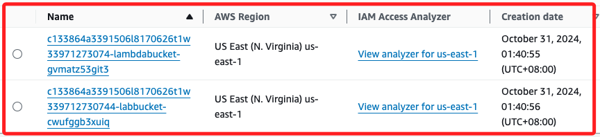
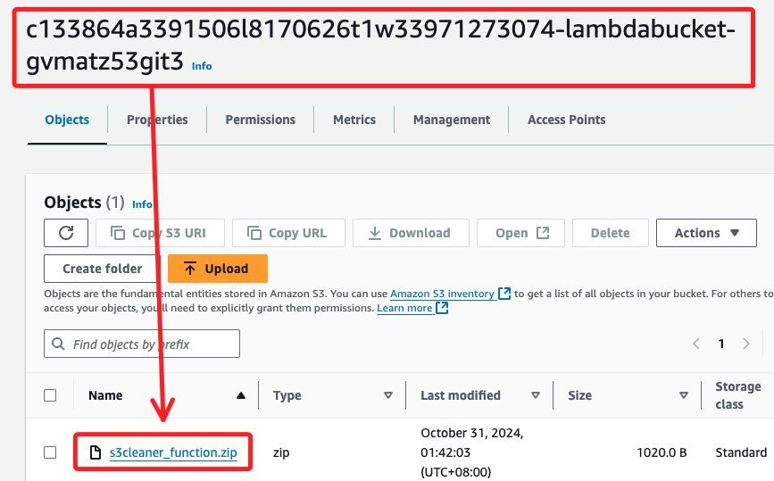
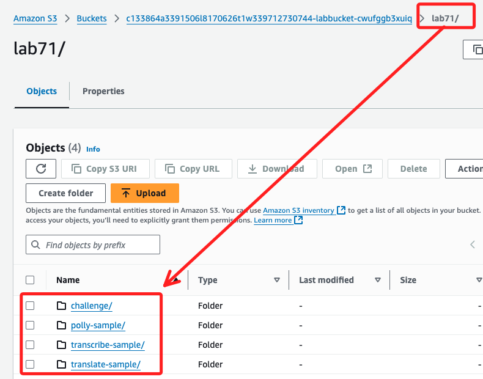
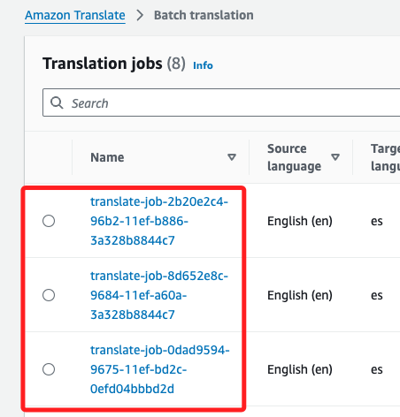

# 開始之前

_紀錄一些 Lab 中的既有資源，因為實作時發現代碼有些地方似乎怪怪的，說是說建立了什麼，但實際上卻是用現有的文件_

<br>

## S3

1. 兩個 buckets，名稱如下，這個命名是會變的，但有一定規則。

    ```bash	
    c133864a3391506l8170626t1w33971273074-lambdabucket-gvmatz53git3
    c133864a3391506l8170626t1w339712730744-labbucket-cwufggb3xuiq
    ```

    

<br>

2. 第一個 Bucket。

    

<br>

3. 第二個 Bucket。

    

<br>

## Amazon Translate

1. 在 `Translation jobs` 裡面會有之前實作的項目，關閉 Lab 並不會被刪除，包含了 `Completed` 與 `Stopped` 的部分。

    

<br>

___

_有的話再補充_