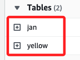
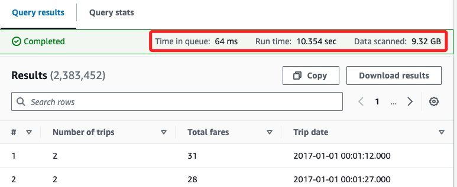
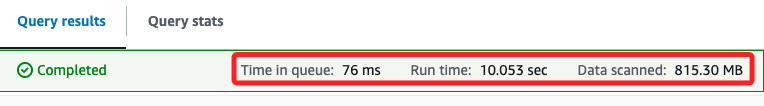

# Task 2：優化 Athena 查詢

<br>

## 步驟

1. 在 `Editor` 頁籤中，點擊右側的符號 `+` 添加新的查詢頁籤。

    

<br>

2. 貼上以下語法，並點擊下方的 `Run`；這個語法是在 `Athena` 中建立一個名為 `jan` 的外部表格，該表格讀取儲存在 `S3` 中的 `January 2017` 的 `taxi data`，並且資料格式是 `CSV`，此表格的結構會對應 S3 中文件的欄位和類型。

    ```sql
    CREATE EXTERNAL TABLE IF NOT EXISTS jan (
        `vendor` string,
        `pickup` timestamp,
        `dropoff` timestamp,
        `count` int,
        `distance` int,
        `ratecode` string,
        `storeflag` string,
        `pulocid` string,
        `dolocid` string,
        `paytype` string,
        `fare` decimal,
        `extra` decimal,
        `mta_tax` decimal,
        `tip` decimal,
        `tolls` decimal,
        `surcharge` decimal,
        `total` decimal
    )
    ROW FORMAT SERDE 'org.apache.hadoop.hive.serde2.lazy.LazySimpleSerDe'
    WITH SERDEPROPERTIES (
        'serialization.format' = ',',
        'field.delim' = ','
    ) 
    LOCATION 's3://aws-tc-largeobjects/CUR-TF-200-ACDSCI-1/Lab2/January2017/'
    TBLPROPERTIES (
        'has_encrypted_data'='false'
    );
    ```

<br>

3. 完成後在左側 Tables 中會添加一個 Table `jan`。

    

<br>

4. 再次點擊 `+` 添加查詢頁籤進行查詢與比較；先對 `yellow` 表格運行查詢，這些操作將數據按月份分割，並通過 `bucketizing` 優化查詢性能。

    ```sql
    SELECT 
        COUNT(count) AS "Number of trips", 
        SUM(total) AS "Total fares", 
        pickup AS "Trip date"
    FROM 
        yellow
    WHERE 
        pickup BETWEEN TIMESTAMP '2017-01-01 00:00:00' AND TIMESTAMP '2017-02-01 00:00:01'
    GROUP BY 
        pickup;
    ```

<br>

5. 在 `Query results` 頁籤中會看到相關的執行資訊，`Time in queue: 64 ms` 是查詢開始執行前等待的時間，也就是查詢被執行前在隊列中的等待時間為 64 毫秒（ms）；`Run time: 10.354 sec` 是查詢的實際執行時間，也就是查詢開始執行到完成所花費的時間；
`Data scanned: 9.32 GB` 表示查詢過程中掃描了 9.32 GB 的數據，這是 Athena 根據查詢條件從 S3 中讀取並處理的數據量；特別注意，`Athena` 的查詢成本是基於掃描的數據量計算，因此這個數據量會影響查詢的費用。

    

<br>

6. 接著，從 `jan` 表中檢索數據，並對其進行分組和計算。

    ```sql
    SELECT count (count) AS "Number of trips" ,
        sum (total) AS "Total fares" ,
        pickup AS "Trip date"
    FROM jan
    GROUP BY pickup;
    ```

<br>

7. 查詢資訊如下，在之前的查詢中是針對 `yellow` 表進行的，而這次查詢針對 `jan` 表，`yellow` 表包含了整個 `2017` 年的數據，且查詢的條件是 `2017/01/01` 到 `2017/02/01` 的行程數據，而新查詢的 `jan` 表只包含 `2017/01` 的數據，也就是表中的數據已經提前按月份進行了分離；特別注意，前面查詢的數據量是來自整個 `yellow` 表，雖然查詢的範圍也只限定在 `1 月`，但還是需要從整個 `2017 年` 的數據中過濾出結果，因此掃描的數據量更大。

    

<br>

___

_END_