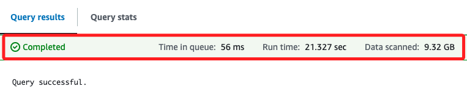
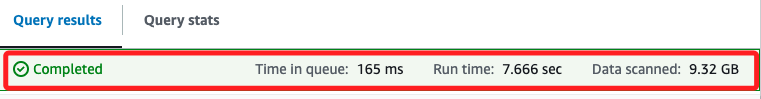
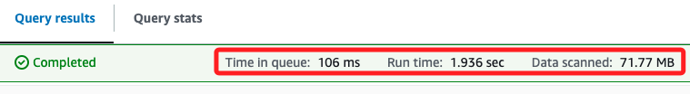

# Task 3：使用分區優化查詢

<br>

## 步驟

1. 執行以下語句建立新的分區表格 `creditcard`，將數據按付款類型進行分區。

    ```sql
    CREATE TABLE taxidata.creditcard
    WITH (
        format = 'PARQUET'
    ) AS
        SELECT * FROM yellow
        WHERE paytype = '1';
    ```

<br>

2. 執行結果如下；接下來將比較對 `yellow` 表中的 `nonpartitioned` 資料和 `creditcard` 表中的 `partitioned` 資料執行查詢的效能。

    

<br>

3. 運行以下語句進行查詢性能比較。

    ```sql
    SELECT sum(total), paytype FROM yellow
        WHERE paytype = '1'
        GROUP BY paytype;
    ```

    _查詢結果_

    

<br>

4. 若要查詢 `信用卡` 表中的分區數據，可在新的查詢標籤中執行下列查詢。

    ```sql
    SELECT sum (total), paytype FROM creditcard
        WHERE paytype = '1'
        GROUP BY paytype;
    ```

    _查詢結果_

    

<br>

___

_END_