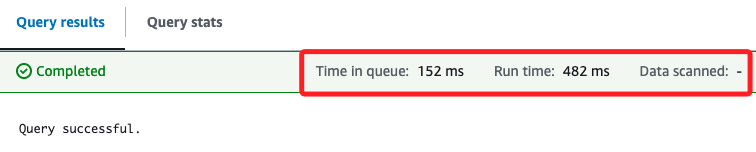
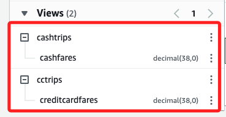
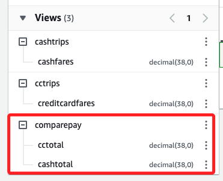
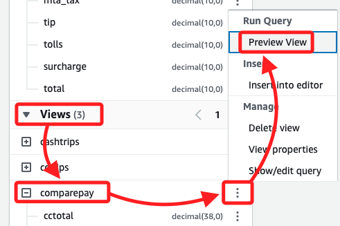
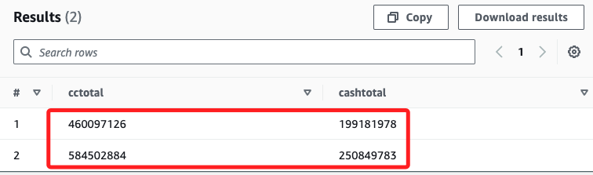

# Task 4：使用 Athena 視圖

<br>

## 步驟

1. 建立信用卡付款的總計視圖。

    ```sql
    CREATE VIEW cctrips AS
        SELECT "sum"("fare") "CreditCardFares"
        FROM yellow
        WHERE ("paytype"='1');
    ```

    

<br>

2. 若要建立現金支付票價總美元價值的視圖，請執行下列查詢。

    ```sql
    CREATE VIEW cashtrips AS
        SELECT "sum"("fare") "CashFares"
        FROM yellow
        WHERE ("paytype"='2');
    ```

<br>

3. 運行以上兩個語法之後，可看到左側的 `Views` 中已經添加兩個對象。

    

<br>

4. 若要從 cctrips 檢視中選擇所有記錄，請執行下列查詢。

    ```sql
    Select * from cctrips;
    ```

    _結果_

    ```bash
    Time in queue:66 ms
    Run time:7.804 sec
    Data scanned:9.32 GB
    ```

<br>

5. 若要從 cashtrips 檢視中選擇所有記錄，請執行下列查詢；以上是建立一個連接兩個不同視圖中的資料的視圖，使用這個新視圖來比較兩個供應商的信用卡付款與現金付款的總收入。

    ```sql
    Select * from cashtrips;
    ```

    _結果_

    ```bash
    Time in queue:79 ms
    Run time:7.733 sec
    Data scanned:9.32 GB
    ```

<br>

## 建立並聯合兩個視圖

1. 聯合信用卡與現金付款視圖，並比較總付款，使用 Athena 視圖來簡化查詢，並通過建立聯合視圖來比較多個視圖的數據。

    ```sql
    CREATE VIEW comparepay AS
    WITH
        cc AS (
            SELECT SUM(fare) AS cctotal, vendor
            FROM yellow
            WHERE paytype = '1'
            GROUP BY paytype, vendor
        ),
        cs AS (
            SELECT SUM(fare) AS cashtotal, vendor, paytype
            FROM yellow
            WHERE paytype = '2'
            GROUP BY paytype, vendor
        )
    SELECT 
        cc.cctotal, 
        cs.cashtotal
    FROM 
        cc
    JOIN 
        cs
    ON 
        cc.vendor = cs.vendor;
    ```

    _效率資訊_

    ```bash
    Time in queue:83 ms
    Run time:538 ms
    Data scanned:-
    ```

<br>

2. 從左側觀察建立的 Views。

    

<br>

## 預覽結果

1. 在左側下方的 `Views` 區塊中，展開 `comparepay` 右側三點後點擊 `Preview View`。

    

<br>

2. 如果有提示，勾選後點擊 `Open query`；如果沒提示會直接運行查詢。

    

<br>

3. 結果如下。

    

<br>

___

_END_