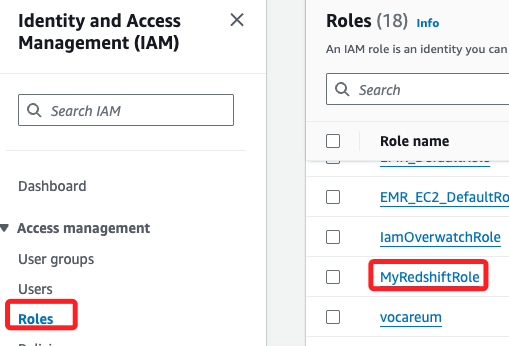
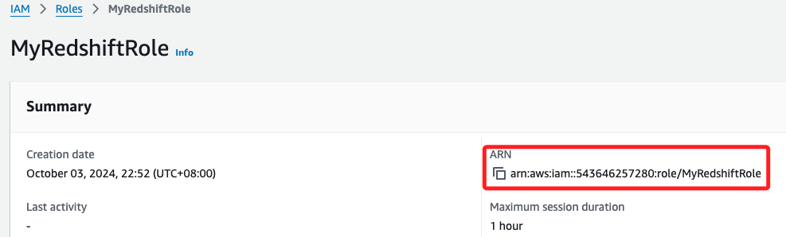
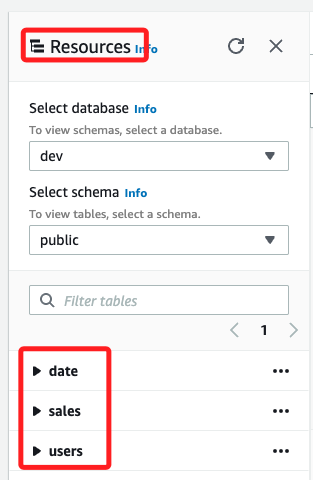
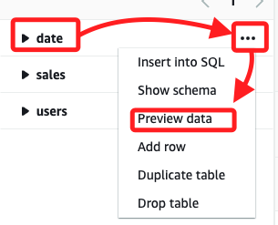
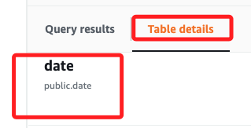
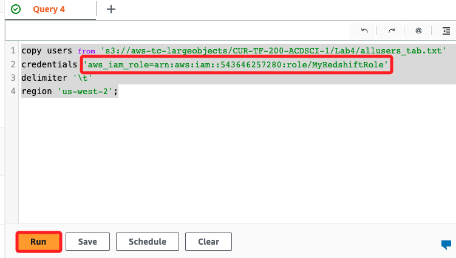
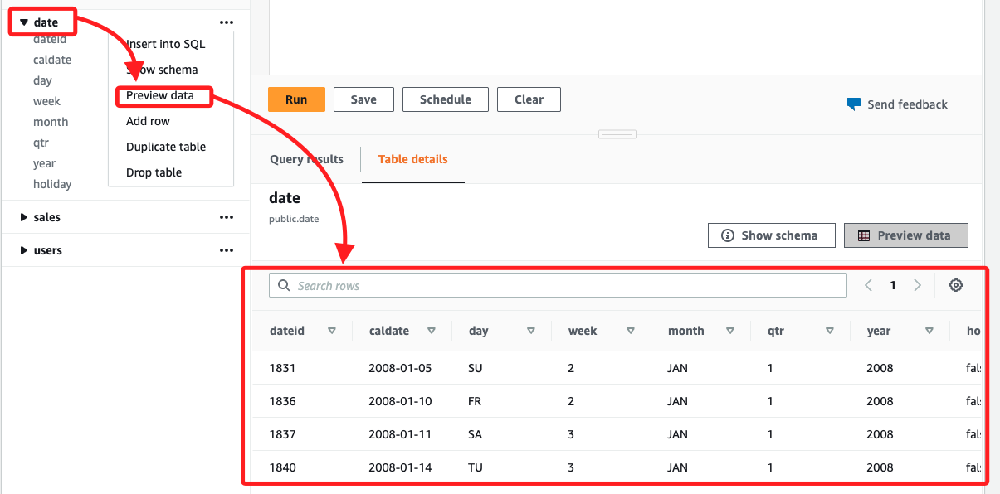

# 任務 4：從 S3 加載數據

_透過 `COPY` 指令從 S3 Bucket 中加載數據到 Redshift 集群，每個表格使用不同的 `分隔符`，例如 `\t` 和 `|`。_

<br>

## 查詢 Role

1. 進入 `IAM`，選取 `Roles` 中指定的 Role。

    

<br>

2. 複製 `ARN` 備用。

    

<br>

## 載入數據

_回到 Redshift_

<br>

1. 當前在 `Resources` 中有三個表格，但其內容是空的。

    

<br>

2. 可點擊資料表右側三點中的 `Preview data` 預覽資料。

    

<br>

3. 特別注意，這裡的預覽功能並不會生成語句，而是直接在 `Table details` 中顯示內容，從這可知目前表內無數據。

    

<br>

4. 複製以下語句，替換其中的 `<替換 ARN>`，替換後無需使用尖勾括號。

    ```sql
    copy users from 's3://aws-tc-largeobjects/CUR-TF-200-ACDSCI-1/Lab4/allusers_tab.txt'
    credentials 'aws_iam_role=<替換 ARN>'
    delimiter '\t'
    region 'us-west-2';
    ```

<br>

5. 運行以上指令後，`S3` 中的數據文件會被加載到 `Redshift` 的 `users` 表，Redshift 會使用指定的 IAM 角色來確保對 S3 的訪問權限。如果數據格式正確且權限設置無誤，users 表將會填充來自該文件的數據。。

    

<br>

6. 比照相同模式，以下是查詢 `date`。

    ```sql
    copy date from 's3://aws-tc-largeobjects/CUR-TF-200-ACDSCI-1/Lab4/date2008_pipe.txt'
    credentials 'aws_iam_role=<替換 ARN>'
    delimiter '|' region 'us-west-2';
    ```

<br>

7. 再次預覽 `data`，此時數據已被填入。

    

<br>

8. 對於 `sales` 也是相同。

    ```sql
    copy sales from 's3://aws-tc-largeobjects/CUR-TF-200-ACDSCI-1/Lab4/sales_tab.txt'
    credentials 'aws_iam_role=<替換 ARN>'
    delimiter '\t' timeformat 'MM/DD/YYYY HH:MI:SS' region 'us-west-2';
    ```

<br>

___

_END_