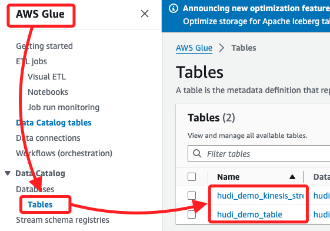
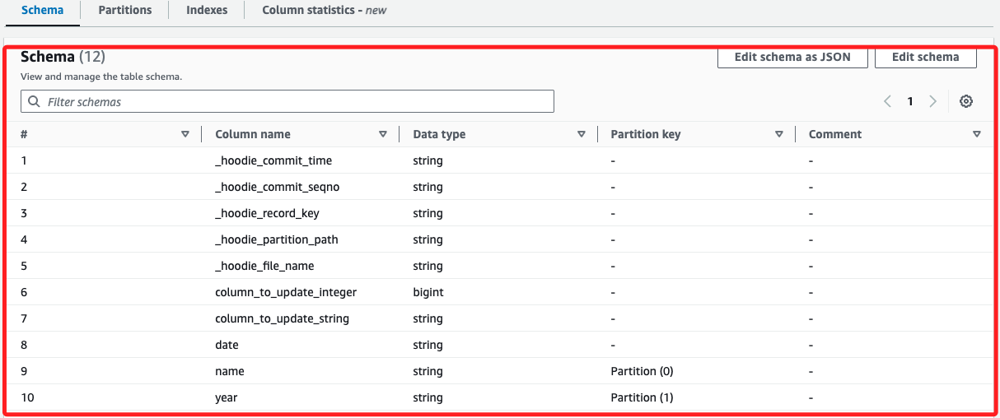
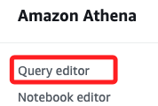
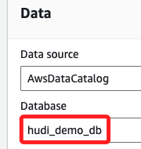
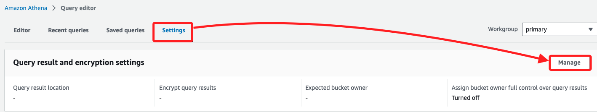
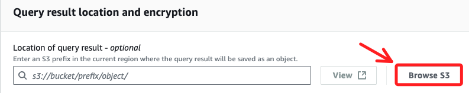
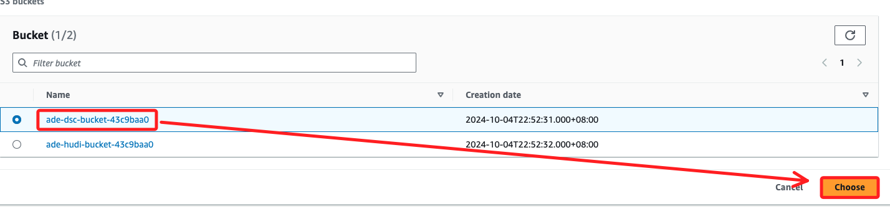
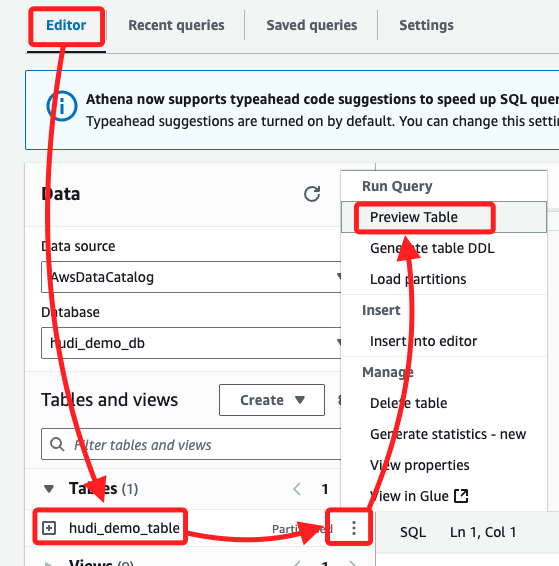
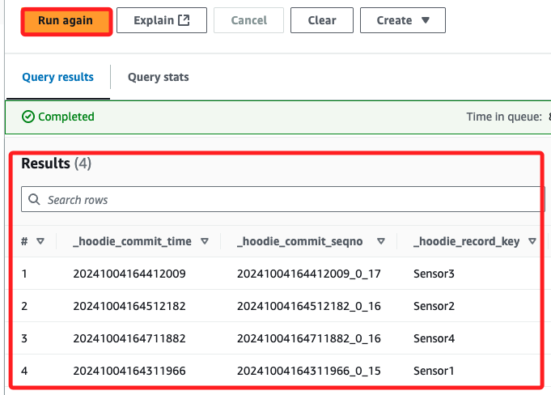
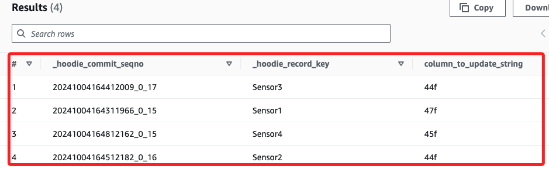

# Task 6：使用 Athena 檢查架構並查詢數據

_使用 Athena 檢查表架構，並運行查詢來分析數據_

<br>

## 檢查表架構

1. 進入 `Glue`，點擊左側的 `Tables`，清單中會看到兩個 table 如下。

    

<br>

2. 點擊 `hudi_demo_table` 進行查看。

    

<br>

## 配置 Athena

1. 進入 `Athena`，點擊左側 `Query editor`。

    

<br>

2. 在 `Database` 下拉選單選取 `hudi_demo_db`。

    

<br>

3. 在上方切換到 `Settings` 頁籤，並點擊右側的 `Manage`。

    

<br>

4. 點擊 `Browse S3`。

    

<br>

5. 選擇前綴為 `ade-dsc-bucket` 的 Bucket，然後點擊右下角的 `Choose`。

    

<br>

6. 接著直接點擊右下角 `Save`。

    

<br>

7. 回到 `Editor` 頁籤中，點擊 `hudi_demo_table` 右側三點，在展開的選單中點擊 `Preview Table`。

    

<br>

8. 在右側 `Query` 中會自動生成查詢語句。

    ```sql
    SELECT * FROM "hudi_demo_db"."hudi_demo_table" limit 10;
    ```

<br>

9. 點擊 `Run` 就會顯示數據。

    

<br>

## 執行 Athena 查詢

1. 輸入以下語句後點擊 `Run`；多次執行查詢會發現每次的輸出不一樣。

    ```sql
    SELECT _hoodie_commit_seqno, _hoodie_record_key, column_to_update_string FROM "hudi_demo_table"
    ```

<br>

2. 每次查詢的結果都不一樣是因為 `Kinesis Data Generator (KDG)` 每秒會生成並發送一組新的隨機數據到 `Kinesis` 資料流中，`AWS Glue` 作業會捕捉這些數據變更，並使用 `Apache Hudi` 連接器將新的數據即時插入或更新到儲存在 `S3` 資料湖中的 `Hudi` 表中；因此，每次在 `Athena` 中查詢 `hudi_demo_table` 時，返回的結果都會反映最新的數據變更，這就是為什麼每次查詢的結果都會不同。

    

<br>

___

_END_