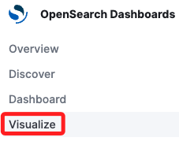
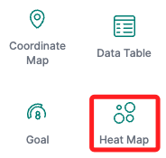
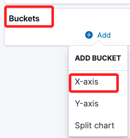
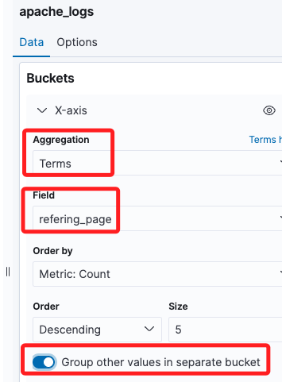
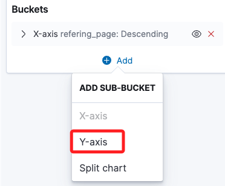
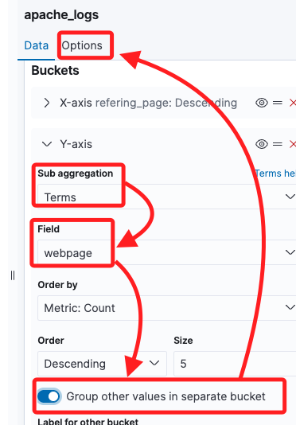
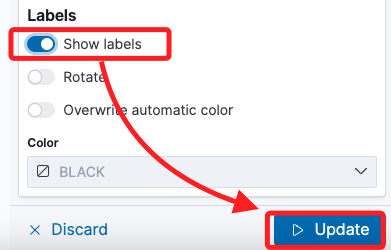
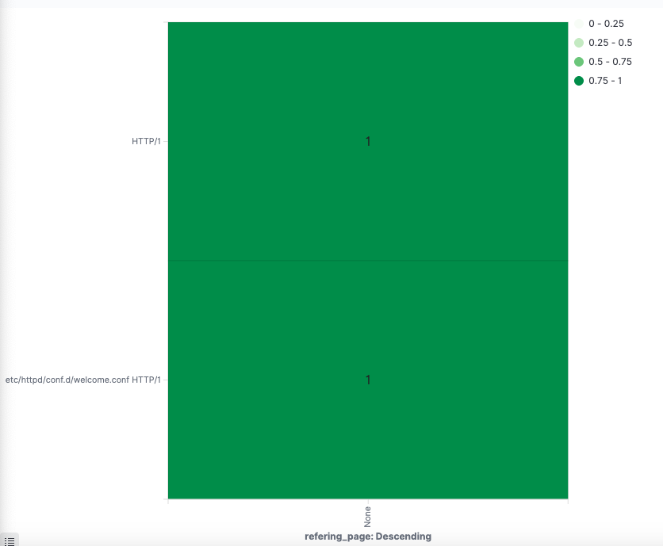

# 建立熱圖

 

## 步驟

1. 點擊 `Visualize`，接著點擊 `Create new visualization`。

    

 

2. 選擇 `Heat Map`。

    

 

3. 同樣使用 `apache_logs`。

    

 

4. 在 `Bucket` 選擇 `X-axis`。

    

 

5. 第一個 Bucket 設定為。

    

 

6. 先將第一個 Bucket 收合，然後點擊 `+ Add` 添加第二個。

    

 

7. 選擇 `Y-axis`。

    

 

8. 依照以下指示設定，然後切換頁籤到 `Options`。

    

 

9. 在 Labels 部分開啟顯示標籤，然後點擊右下角的 `Update`。

    

 

10. 這個數據內容似乎不適合做熱圖。

    

 

___

_END_