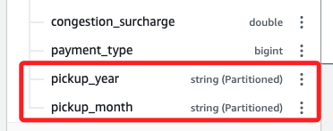

# Task 08：使用分區進行數據優化

_任務目標是建立一個 `yellowtaxi_data_parquet` 表，並採用 `Parquet` 格式和 `Snappy` 壓縮技術，與之前對 `lookup` 表所做的操作類似。此外，將針對出租車數據進行分區，因為該數據具有時間特性，分區可以根據時間更好地組織數據。_

<br>

## 說明

1. 通過在 `S3` 建立一個以前綴 `optimized-data` 的為名的分區，分區的好處是可以限制每次查詢掃描的數據量，從而提升性能並降低成本。

<br>

2. 分區將表格分為不同部分，並根據欄位值將相關數據放在一起。

<br>

3. 藉由分區，當新數據加入時，會根據時間分段儲存，這樣包含取車日期的查詢將更加高效，與 `Parquet` 格式和 `Snappy` 壓縮技術配合使用，數據儲存將得到全面優化。

<br>

## 更新工作流

_建立具分區功能的 Parquet 表_

<br>

1. 在 `Step Functions` 主控台中開啟 `WorkflowPOC` 狀態機，進入 `Workflow Studio`，並在 `Actions` 面板中，搜尋 `athena`。

    

<br>

2. 將 `StartQueryExecution` 任務拖到 `Run Create Parquet lookup Table Query` 與 `End` 任務之間，並將 `State name` 改為 `Run Create Parquet data Table Query`。

    

<br>

3. 將 `API Parameters` 的預設 JSON 代碼替換為以下內容，並替換其中兩處 `<替換-S3-Bucket>` 為實際的 S3 Bucket 名稱。

    ```json
    {
        "QueryString": "CREATE table if not exists nyctaxidb.yellowtaxi_data_parquet WITH (format='PARQUET',parquet_compression='SNAPPY',partitioned_by=array['pickup_year','pickup_month'],external_location = 's3://<替換-S3-Bucket>/nyctaxidata/optimized-data/') AS SELECT vendorid,tpep_pickup_datetime,tpep_dropoff_datetime,passenger_count,trip_distance,ratecodeid,store_and_fwd_flag,pulocationid,dolocationid,fare_amount,extra,mta_tax,tip_amount,tolls_amount,improvement_surcharge,total_amount,congestion_surcharge,payment_type,substr(\"tpep_pickup_datetime\",1,4) pickup_year, substr(\"tpep_pickup_datetime\",6,2) AS pickup_month FROM nyctaxidb.yellowtaxi_data_csv where substr(\"tpep_pickup_datetime\",1,4) = '2020' and substr(\"tpep_pickup_datetime\",6,2) = '01'",
        "WorkGroup": "primary",
        "ResultConfiguration": {
          "OutputLocation": "s3://<替換-S3-Bucket>/athena/"
        }
    }
    ```

<br>

4. 選擇 `Wait for task to complete`，然後點擊 `Save` 保存工作流。

    

<br>

## 測試並驗證結果

1. 在 `AWS Glue` 主控台中，刪除現有的三個表，這樣可以確保下次運行工作流時選擇正確的路徑。

    

<br>

2. 在 `S3` 主控台中，點擊進入前綴為 `gluelab` 的 Bucket。

    

<br>

3. 點擊進入其中的 `nyctaxidata` 資料夾。

    

<br>

4. 選擇 `optimized-data-lookup`，然後點擊 `Delete`。

    

<br>

5. 補充說明，由於賦予 `Athena` 的權限不允許它刪除儲存在 `S3` 的表信息，因此需要手動刪除 `S3 Bucket` 中的 `optimized-data-lookup`，否則工作流在運行 `Create Parquet lookup Table Query` 任務時將會失敗。這個問題只會出現在內部表如 Parquet 表的情境，而不是外部表。

<br>

## 測試

_回到 `Step Functions` 主控台_

<br>

1. 運行狀態機 `WorkflowPOC` 後點擊右上角的 `Execute`，將測試命名為 `TaskEightTest`，完成時會顯示工作流。

    

<br>

## 驗證新表的建立

1. 在 `Athena` 主控台中，選擇 `Query editor`。

    

<br>

2. 選擇 `Settings` 頁籤，點擊 `Manage` 並配置如下：

    

<br>

3. 先點擊 `Browse S3`。

    

<br>

4. _點擊進入_ 前綴為 `gluelab` 的 Bucket；再次強調，這裡是 _點擊進入_，不是 _選取_。

    

<br>

5. 在這是選擇 `athena` 後點擊右下角 `Choose`。

    

<br>

6. 點擊 `Save`。

    

<br>

## 回到 Athena

1. 切換頁籤到 `Editor`，在下方 `Data` 面板中，下拉 `Database` 的選單並選擇 `nyctaxidb`。

    

<br>

2. 展開新方 `yellowtaxi_data_parquet` 表，可觀察其內部結構。

    

<br>

3. 向下滾動查看最後兩列，這是作為分區儲存的字串；確認 `Partitioned` 標籤存在，確保表格已經根據指定的分區進行優化處理。

    

<br>

___

_END：以上完成在 Glue 中重新建立兩個 Parquet 格式表，並使用 Snappy 壓縮技術，此外也對 `yellowtaxi_data_parquet` 表進行了分區設置，並確認該表能夠在 Athena 查詢編輯器中加載。_