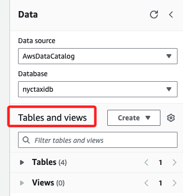
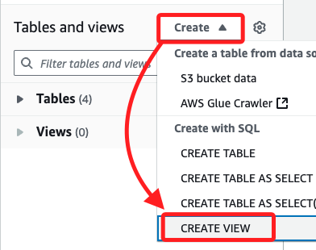
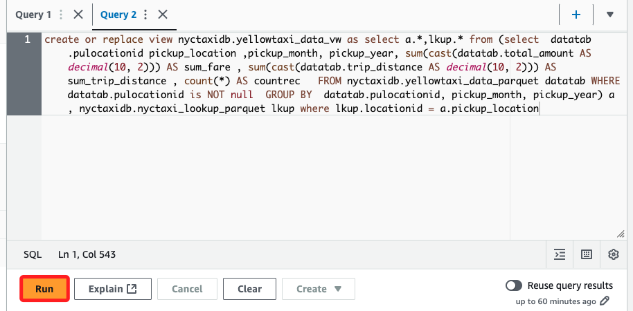
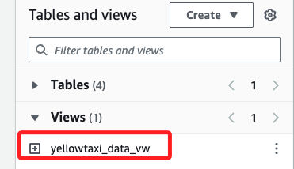
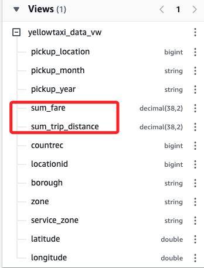
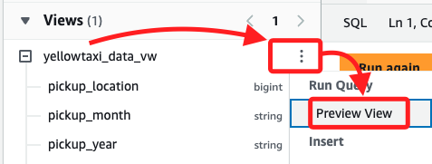
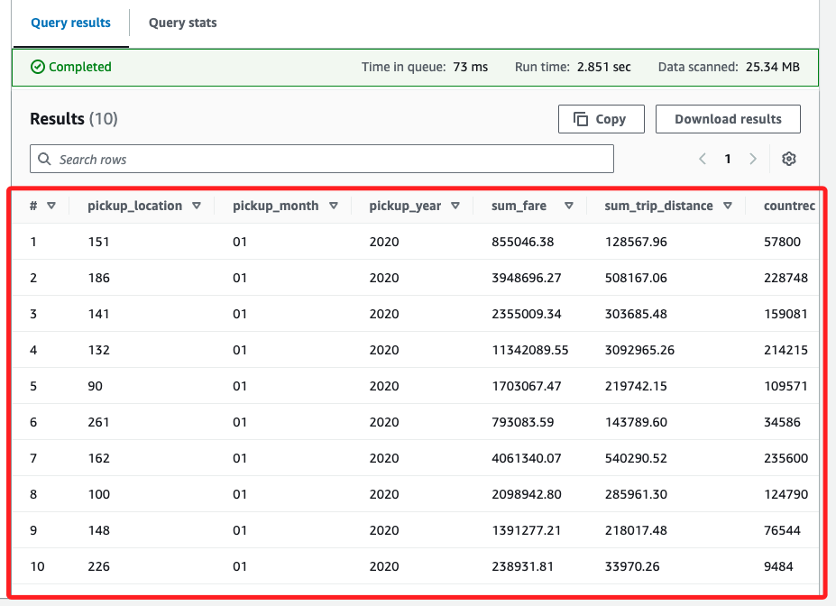

# Task 09：在 Athena 中建立視圖

_任務目標是在 `Athena` 查詢編輯器中建立一個 `數據視圖`，該視圖將結合儲存在 `Parquet` 格式中的兩個表的數據。_

<br>

## 使用 Athena 查詢編輯器建立新視圖

1. 在 Athena 主控台的 `Data` 面板中，找到 `Tables and views` 區塊。

    

<br>

2. 展開 `Create`，然後點選 `CREATE VIEW`。

    

<br>

3. 在右側的 Query 頁籤中，系統會自動填充以下 SQL 指令建立視圖。

    ```sql
    -- View Example
    CREATE OR REPLACE VIEW view_name AS
    SELECT column1, column2
    FROM table_name
    WHERE condition;
    ```

<br>

4. 替換預設的語句如下；特別注意，此 SQL 指令將兩個 `Parquet` 表 `yellowtaxi_data_parquet` 和 `nyctaxi_lookup_parquet` 中的數據結合，並生成一個名為 `yellowtaxi_data_vw` 的視圖。視圖將根據 `pulocationid`（取車地點）進行匯總，並計算該地點每月、每年的乘車總費用 (`sum_fare`)、總里程 (`sum_trip_distance`) 以及乘車次數 (`countrec`)。

    ```sql
    create or replace view nyctaxidb.yellowtaxi_data_vw as 
    select a.*, lkup.* 
    from (
        select 
            datatab.pulocationid pickup_location,
            pickup_month,
            pickup_year,
            sum(cast(datatab.total_amount AS decimal(10, 2))) AS sum_fare,
            sum(cast(datatab.trip_distance AS decimal(10, 2))) AS sum_trip_distance,
            count(*) AS countrec
        FROM nyctaxidb.yellowtaxi_data_parquet datatab
        WHERE datatab.pulocationid IS NOT NULL
        GROUP BY datatab.pulocationid, pickup_month, pickup_year
    ) a, 
    nyctaxidb.nyctaxi_lookup_parquet lkup
    WHERE lkup.locationid = a.pickup_location;
    ```

<br>

5. 點擊 `Run` 運行查詢。

    

<br>

6. 查詢執行成功後，`Data` 面板中的 `Views` 區塊會列出新建立的 `yellowtaxi_data_vw` 視圖。

    

<br>

7. 展開新視圖的詳細信息，可看到 `sum_fare` 和 `sum_trip_distance` 等匯總欄位。

    

<br>

8. 點擊視圖名稱右側的三個點圖標，選擇 `Preview View`，預覽視圖的結果。

    

<br>

9. 右側同樣會自動生成語句。

    ```bash
    SELECT * FROM "nyctaxidb"."yellowtaxi_data_vw" limit 10;
    ```

<br>

10. 在下方預覽結果如下圖；結果展示視圖中生成的匯總信息，例如乘車總費用、總里程以及乘車次數。

    

<br>

___

_END_