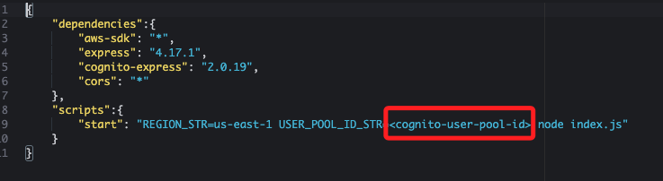

# Task 5：更新應用程式以使用 Cognito 進行身份驗證

_在此任務中，將會更新 Birds 應用程式的設定，使其與 Amazon Cognito user pool進行互動，提供身份驗證功能。這需要將user pool ID、應用程式客戶端 ID 以及 Amazon Cognito 的域名前綴等資訊添加到應用程式中。_

<br>

## 更新 Web 應用程式配置

1. 返回 Cloud9 IDE，在終端機中，按下組合鍵 `control+C` 停止運行中的 Node 伺服器。

    

<br>

## 編輯設定文件

1. 在左側欄中，在 `website/scripts` 路徑中點擊打開 `config.js` 文件。

    

<br>

2. 取消以下代碼的註解，並將每個佔位符替換為記錄在 `MyDoc.txt` 中的相應值；其中 `CONFIG.CLOUDFRONT_DISTRO_STR` 僅需填入 `.cloudfront.net` 前的字串；另外，`CONFIG.COGNITO_IDENTITY_POOL_ID_STR` 目前尚未紀錄。

    

<br>

3. 編輯完成後，切記保存修改。

    

<br>

## 推送將更新到 S3 Bucket

1. 在終端機中紀錄變數，將 `<s3-bucket>` 替換為 `MyDoc.txt` 中記錄的 S3 Bucket 名稱。

    ```bash
    S3_BUCKET=<s3-bucket>
    ```

<br>

2. 運行指令。

    ```bash
    cd /home/ec2-user/environment
    aws s3 cp website s3://$S3_BUCKET/ --recursive --cache-control "max-age=0"
    ```

<br>

## 更新 Node 伺服器配置

1. 運行指令更新 Node 伺服器文件。

    ```bash
    cd /home/ec2-user/environment/node_server
    cp package2.json package.json
    cp libs/mw2.js libs/mw.js
    ```

<br>

2. 在左側欄展開 `node_server` 資料夾，點擊打開 `package.json` 文件。

    

<br>

3. 將 `<cognito_user_pool_id>` 替換為 `MyDoc.txt` 中記錄的 `Amazon Cognito user pool ID`。

    

<br>

3. 完成修改後顯示如下，切記保存修改後的 `package.json` 文件。

    

<br>

4. 至此，已成功將應用程式與 `Amazon Cognito user pool` 進行集成，並完成了必要的配置；接下來，可以重新啟動 Node 伺服器並測試應用程式的身份驗證功能。

<br>

___

_END_