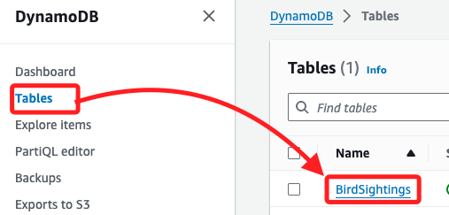
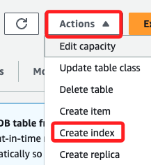
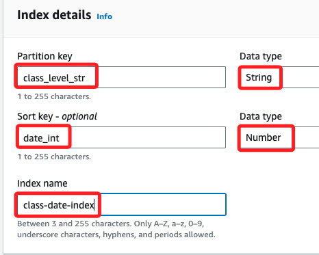
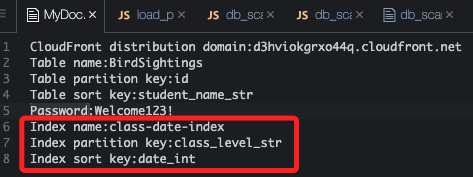

# Task 6：為資料表新增 GSI

_GSI，全域次要索引；這個任務的情境是 Ms. García 希望每週收到一份報告，該報告只顯示 三年級學生過去 7 天內的活動數據，隨著更多年級開始使用此應用程式，四年級學生也在積極新增數據，這使得必須確保報告中只包含三年級學生的資料。為了達到此目標，需要使用 `GSI` 來進行基於年級和日期的查詢。_

<br>

## 載入額外數據至資料表

_在新增 GSI 之前，先執行以下指令，將額外的數據載入至 `BirdSightings` 資料表，此數據包含一些四年級學生的觀察記錄。_

<br>

1. 運行以下指令載入新的數據集。

    ```bash
    cd /home/ec2-user/environment/node_server
    node load_past_sightings_2.js
    ```

<br>

2. 結果顯示載入了 `9` 筆數據到 `DynamoDB`。

    

<br>

## 在資料表中建立 GSI

_為了能夠依據 `年級` 和 `日期` 篩選記錄，需在 `BirdSightings` 資料表上新增一個 `GSI`。_

<br>

1. 進入 DynamoDB 主控台，在左側欄中選擇 `Tables`，並點擊 `BirdSightings` 資料表。

    

<br>

2. 展開 `Actions` 並點擊 `Create index`。

    

<br>

3. 在 `Index details` 中進行以下設定，首先在 `Partition key` 輸入 `class_level_str` 並確保選擇 `String`；`Sort key` 輸入 `date_int` 並確保選擇 `Number`；`Index name` 輸入 `class-date-index`。

    

<br>

4. 滾動到下方點擊 `Create index`。

    

<br>

5. 可將索引名稱、索引分區鍵及排序鍵等資訊紀錄在 `MyDoc.txt`，稍後會用來進行查詢

    

<br>

## 確認索引建立狀態

1. 索引的建立過程可能需要幾分鐘時間；在繼續下一個任務之前，確保索引的狀態顯示為 `Active`。

<br>

2. 以上操作成功為 `BirdSightings` 資料表新增了 `全域次要索引 (GSI)`，這個 GSI 是使用 `class_level_str` 作為分區鍵，並使用 `date_int` 作為排序鍵，允許依據年級與日期來進行高效的查詢。
4
<br>

___

_END_