# Task 4：將 Lambda 加入狀態機

_在此任務中，將建立一個 `report.html` 文件並將其上傳到 Amazon S3，然後使用 AWS CLI 建立並測試一個預簽名 URL（presigned URL），確認能夠通過該 URL 訪問報告。接著，將測試一個用來生成預簽名 URL 的 Lambda 函數，並將該函數添加到之前建立的狀態機中。_

<br>

## 建立一個範例報告

_返回 Cloud9，將報告上傳至 S3 並測試訪問_

<br>

1. 首先要建立文本 `report.html`，點擊上方 `File` 中的 `New File` 新建文件。

<br>

2. 在新的文件中貼上以下文本，並將文件儲存為 `report.html`。

    ```html
    <output>Hello! This is some sample HTML.</output>
    ```

<br>

3. 運行以下指令將文件上傳至 `S3`，並設置 `cache-control` 為 `max-age=0`；透過這樣的設置具體表示該檔案不應被快取，或至少在每次請求時應該重新驗證是否有更新版本，也就是說這樣設置會強制瀏覽器每次都向伺服器請求最新的檔案，而不使用之前快取的版本。

    ```bash
    cd /home/ec2-user/environment
    bucket=`aws s3api list-buckets --query "Buckets[].Name" | grep s3bucket | tr -d ',' | sed -e 's/"//g' | xargs`
    aws s3 cp report.html s3://$bucket/ --cache-control "max-age=0"
    ```

<br>

## 驗證 Bucket 設定

1. 進入 `S3`，點擊進入預設的 Bucket。

    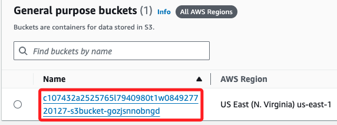

<br>

2. 切換到 `Permissions` 頁籤，查看下方的 `Bucket Policy` 區塊。

    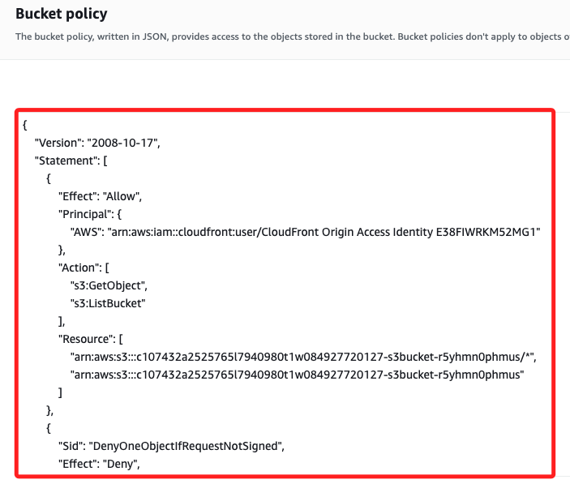

<br>

## 測試訪問 `report.html`

1. 回到前面步驟所進入的 Bucket 中，找到並點擊進入前面步驟上傳的 `report.html` 文件。

    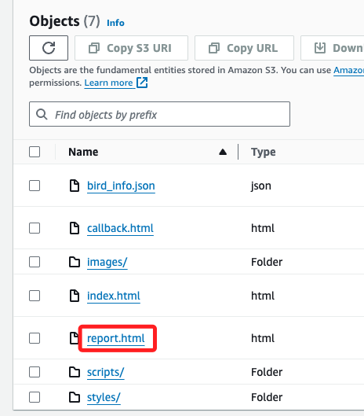

<br>

2. 複製其中的 `Object URL`。

    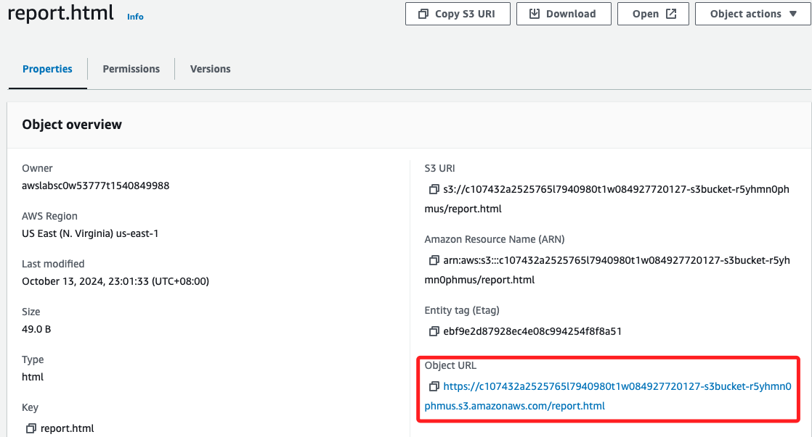

<br>

3. 開啟新的瀏覽器頁面貼上網址進行訪問，應會看到 `AccessDenied` 錯誤，這是由於 `Bucket Policy` 的限制所致。

    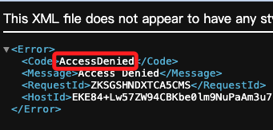

<br>

## 建立並測試 `預簽名 URL`

_預簽名 `Presigned URL` 是指在 AWS S3 中生成的一種具有臨時訪問權限的 URL，允許用戶在限定的時間內無需擁有 AWS 資格憑證就可以直接訪問指定的 S3 資源。_

<br>

1. 在 Cloud9 終端中運行以下指令，生成有效期為 `30 秒` 的 `預簽名 URL`。

    ```bash
    aws s3 presign s3://$bucket/report.html --expires-in 30
    ```

<br>

2. 在瀏覽器中打開該 URL，確認能夠在 30 秒內訪問報告。

    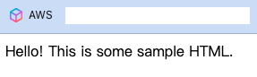

<br>

3. 超過 30 秒後 URL 將過期，刷新頁面就會返回 `AccessDenied` 錯誤。

    

<br>

## 查看 Lambda 函數的 IAM 角色

1. 打開 IAM 控制台，搜尋並點擊進入 `RoleForAllLambdas` 角色。

    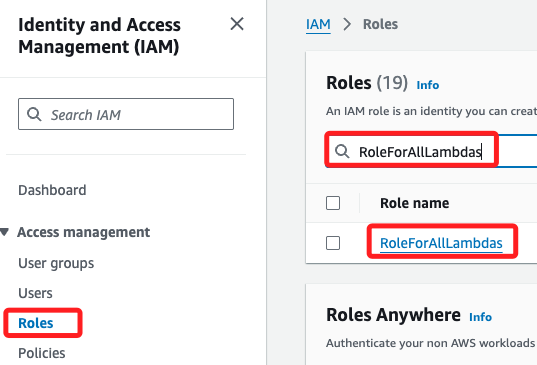

<br>

2. 在 `Permissions` 標籤中展開 `lambdaPolicyForAllLambdaSteps` 政策，確認允許對 Amazon S3、Amazon SNS 和 DynamoDB 執行操作。

<br>

3. 切換到 `Trust relationships` 標籤中，確認 `Lambda` 服務可以假設此角色。

<br>

## 測試 Lambda 函數

1. 搜尋並進入 `Lambda` 服務，點擊進入 `GeneratePresignedURL` 函數。

    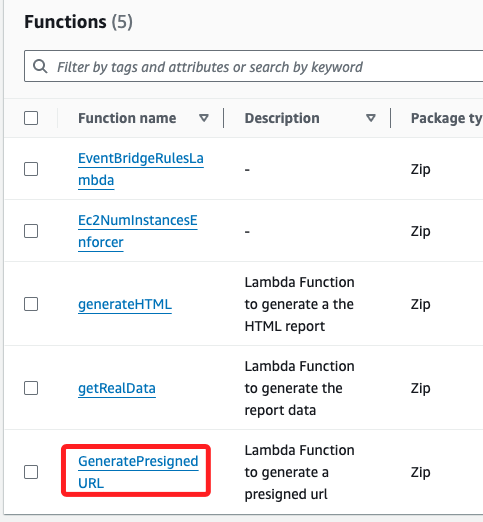

<br>

2. 切換到 `Test` 頁籤，設置 `Event name` 為 `test1`，並點擊右上角的 `Test`。

    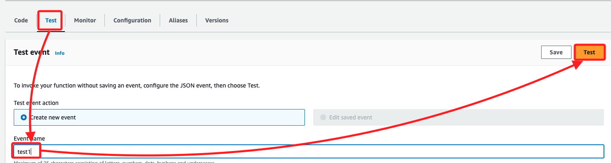

<br>

3. 展開 `Details` 可看到返回值中包含 `預簽名 URL`。

    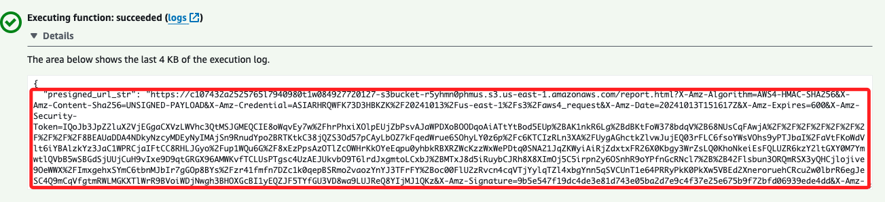

<br>

4. 複製這個網址，然後在瀏覽器中進行訪問，確認這能夠正確加載 `report.html`。

    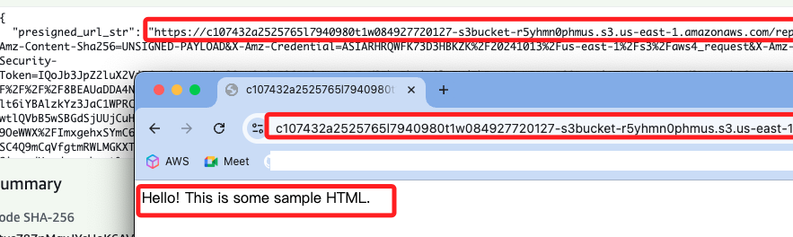

<br>

## 將 Lambda 函數添加至狀態機

_返回 Step Functions 編輯狀態機_

<br>

1. 選擇 `MyStateMachine` 並點擊 `Edit`。

<br>

2. 在左側搜尋框輸入 `Lambda`，並將 `Invoke` 拖到 `SNS Publish` 之前。

    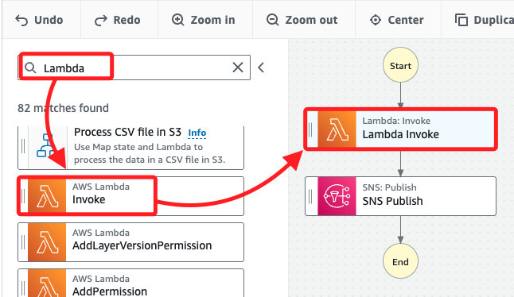

<br>

## 配置 Lambda 調用設置

1. 在 `State name` 輸入 `GeneratePresignedURL`。

    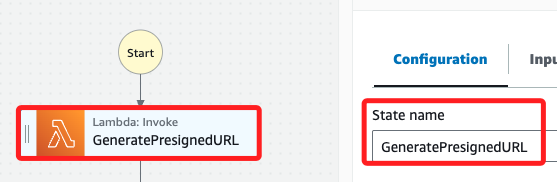

<br>

2. 展開 `Function name` 選擇 `GeneratePresignedURL:$LATEST`。

    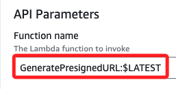

<br>

3. `Payload` 選擇 `No payload`。

<br>

4. `Next state` 使用預設的 `SNS Publish`。

<br>

5. 點擊右上角的 `Save`。

<br>

## 測試更新後的狀態機

1. 點擊 `Execute`，將 `Input` 框中的內容刪除，只保留空大括號 `{}` 作為輸入。

    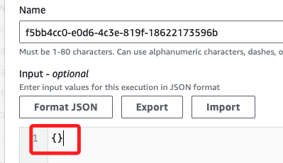

<br>

2. 點擊右下角 `Start execution` 開始執行狀態機。

<br>

3. 查看收到的郵件中是否包含 `預簽名 URL`。

    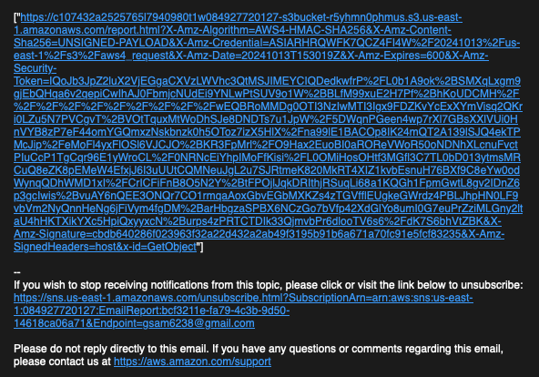

<br>

4. 點擊信件中的連結確認是否能正確打開網址；在此任務中，成功建立一個範例報告並將其上傳至 S3，測試了預簽名 URL 功能，並將用於生成預簽名 URL 的 Lambda 函數集成到 Step Functions 狀態機中，這確保了報告只能通過安全的預簽名 URL 訪問。

    

<br>

___

_END_
