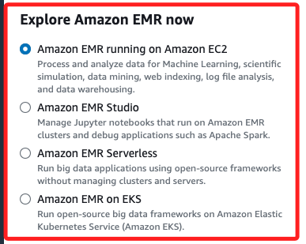

# Hadoop

_是個由 Apache Software Foundation 開發的分散式框架，專門用來儲存和處理大規模數據，主要解決傳統資料庫難以處理的超大數據集問題_

<br>

## 說明

1. AWS 提供了 `EMR (Elastic MapReduce)`，這是一個基於 `Hadoop` 的雲端服務，可快速部署和運行 Hadoop 集群。

<br>

2. `Amazon EMR` 結合 Hadoop 提供大規模數據處理的高效解決方案，並具有按需擴展、成本效益和高可用性等優勢。

<br>

3. `Amazon EMR` 是一個完全托管的服務，讓用戶可在 AWS 上快速部署 Hadoop 集群，並使用 Hadoop 生態系統中的工具如 Spark、HBase、Hive、Pig 等來處理大數據工作負載。

<br>

## Amazon EMR 的主要功能

1. 分佈式數據處理：自動配置和管理 Hadoop 群集，進行大規模的分佈式處理。

<br>

2. 整合其他工具：支援 Apache Spark、HBase、Hive 等。

<br>

3. 彈性擴展：根據負載自動擴展叢集。

<br>

4. S3 整合：可以將 S3 用作 Hadoop 分散式文件系統（HDFS）的替代品，用來儲存和讀取數據。

<br>

## 運行模式

_Amazon EMR 提供了多種不同的模式_



<br>

1. Amazon EMR running on Amazon EC2：這個模式運行在 EC2 上，可根據需求配置並運行大數據框架如 `Apache Spark、Apache Hive、Presto` 等進行資料處理和分析，這個選項允許完整控制運算資源和集群管理，適合需要自訂環境的使用者。

<br>

2. Amazon EMR Studio：這是專門為數據科學家和工程師設計的模式，允許通過 Jupyter Notebooks 來進行可視化資料處理和應用程式開發，使用者可在這裡運行和調試基於 `Apache Spark` 的應用，適合需要互動式工作流程和開發環境的人。

<br>

3. Amazon EMR Serverless：這是個無伺服器的選項，讓使用者可以運行大數據應用程式而不需要管理底層的基礎架構，系統會自動根據應用程式的需求來縮放運算資源，只需為實際使用的資源付費，適合那些希望簡化運維和彈性擴展需求的應用。

<br>

4. Amazon EMR on EKS：這個選項允許在 `Amazon Elastic Kubernetes Service (EKS)` 上運行開源大數據框架，它將工作負載和基礎設施分離，適合有容器化需求或已經使用 EKS 的用戶，可以方便地利用 `Kubernetes 集群` 來執行大數據處理工作。

<br>

## 操作

_使用 AWS SDK 在 Python 中操作 Amazon EMR 來建立一個簡單的 Hadoop 集群並執行 MapReduce 任務。_

<br>

1. 安裝庫。

    ```bash
    pip install boto3
    ```

<br>

2. 建立 EMR 叢集運行 Hadoop。

    ```python
    import boto3

    # 建立 EMR 客戶端
    emr_client = boto3.client(
        'emr', region_name='us-east-1'
    )

    # 建立一個帶有 Hadoop 的 EMR 叢集
    response = emr_client.run_job_flow(
        # 叢集名稱
        Name="MyHadoopCluster",
        # EMR 版本（包含 Hadoop 版本）
        ReleaseLabel='emr-6.3.0',
        Instances={
            'InstanceGroups': [
                {
                    # 主節點
                    'Name': "Master node",  
                    'Market': 'ON_DEMAND',
                    'InstanceRole': 'MASTER',
                    # EC2 instance 類型
                    'InstanceType': 'm5.xlarge',
                    'InstanceCount': 1
                },
                {
                    # 工作節點
                    'Name': "Core - 2 nodes",
                    'Market': 'ON_DEMAND',
                    'InstanceRole': 'CORE',
                    'InstanceType': 'm5.xlarge',
                    'InstanceCount': 2
                }
            ],
            # EC2 SSH Key，用於連接主節點
            'Ec2KeyName': 'my-key-pair',
        },
        Applications=[
            # 安裝 Hadoop
            {'Name': 'Hadoop'},
            # 可選，安裝 Hive
            {'Name': 'Hive'},
            # 可選，安裝 Pig
            {'Name': 'Pig'}
        ],
        Configurations=[
            {
                # Hadoop 環境配置
                'Classification': 'hadoop-env',
                'Configurations': [
                    {
                        'Classification': 'export',
                        'Properties': {
                            'JAVA_HOME': '/usr/lib/jvm/java-1.8.0'
                        }
                    }
                ]
            }
        ],
        # 叢集中的 EC2 角色
        JobFlowRole='EMR_EC2_DefaultRole',
        # EMR 服務角色
        ServiceRole='EMR_DefaultRole',
        VisibleToAllUsers=True,
        # 日誌存放於 S3
        LogUri='s3://my-emr-logs/',
        AutoScalingRole='EMR_AutoScaling_DefaultRole',
    )

    # 輸出 EMR 叢集 ID
    print(f"Created cluster with ID: {response['JobFlowId']}")
    ```

<br>

3. 建立 Hadoop 叢集後，可提交任務來運行 MapReduce 作業；這裡假設要運行一個 `MapReduce` 任務來處理 `S3` 上的數據。

    ```python
    # 提交一個 Hadoop 任務到 EMR 叢集
    response = emr_client.add_job_flow_steps(
        # 使用自己建立的叢集 ID
        JobFlowId='j-xxxxxxxxxxxxx',
        Steps=[
            {
                # 任務名稱
                'Name': 'Word count',
                'ActionOnFailure': 'CONTINUE',
                'HadoopJarStep': {
                    'Jar': 'command-runner.jar',
                    'Args': [
                        'hadoop-streaming',
                        # 輸入文件
                        '-input', 's3://my-input-bucket/input/',
                        # 輸出結果
                        '-output', 's3://my-output-bucket/output/',
                        # Mapper 腳本
                        '-mapper', 's3://my-script-bucket/mapper.py',
                        # Reducer 腳本
                        '-reducer', 's3://my-script-bucket/reducer.py'
                    ]
                }
            }
        ]
    )

    # 輸出 Step ID
    print(f"Submitted step with ID: {response['StepIds'][0]}")
    ```

<br>

4. 當任務完成後，可以手動終止叢集以避免額外費用。

    ```python
    # 停止 EMR 叢集
    emr_client.terminate_job_flows(
        # 替換自己的叢集 ID
        JobFlowIds=['j-xxxxxxxxxxxxx']
    )
    ```

<br>

## MapReduce

_Hadoop 生態系統中主要的分散式計算框架，專門用來處理大規模數據集，以下說明其兩個主要階段。_

<br>

1. Map（映射）階段：資料會被分成小塊，並分配給多個計算節點，這些節點各自處理部分資料，將資料轉換成 `鍵值對`；這階段主要負責過濾和分類數據。

<br>

2. Reduce（歸約）階段：接收 Map 階段的輸出，將相同 key 的數據進行合併和處理，生成最終的結果；這階段的目的是彙總和計算數據。

<br>

___

_END_