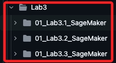
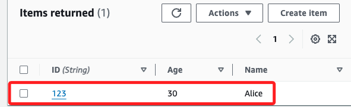
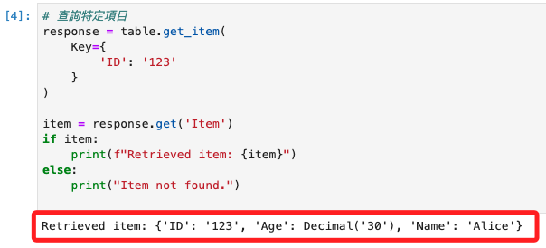
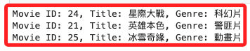
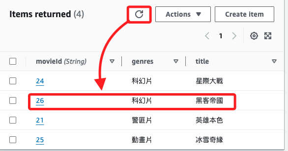
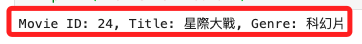

# SageMaker

_操作 AWS CLI_

<br>

## 第一階段

1. 參考 `Lab3`。

    

<br>

## 第二階段

_建立腳本_

<br>

1. 建立連接與建立表格。

    ```python
    import boto3

    # 建立 DynamoDB 資源
    dynamodb = boto3.resource('dynamodb', region_name='us-east-1')

    # 建立 DynamoDB 表格
    table_name = 'SampleTable'
    table = dynamodb.create_table(
        TableName=table_name,
        KeySchema=[
            {
                'AttributeName': 'ID',
                # Partition key
                'KeyType': 'HASH'
            }
        ],
        AttributeDefinitions=[
            {
                'AttributeName': 'ID',
                # S 表示 String
                'AttributeType': 'S'
            }
        ],
        ProvisionedThroughput={
            'ReadCapacityUnits': 5,
            'WriteCapacityUnits': 5
        }
    )

    # 等待表格建立完成
    table.meta.client.get_waiter('table_exists').wait(TableName=table_name)
    print(f"Table {table_name} is created successfully.")
    ```

<br>

2. 插入資料。

    ```python
    # 插入資料到 DynamoDB 表格
    table.put_item(
    Item={
            'ID': '123',
            'Name': 'Alice',
            'Age': 30
        }
    )
    print("Item inserted successfully.")
    ```

    

<br>

3. 查詢資料。

    ```python
    # 查詢特定項目
    response = table.get_item(
        Key={
            'ID': '123'
        }
    )

    item = response.get('Item')
    if item:
        print(f"Retrieved item: {item}")
    else:
        print("Item not found.")
    ```

    

<br>

4. 刪除表格。

    ```python
    # 刪除 DynamoDB 表格
    table.delete()
    print(f"Table {table_name} deleted successfully.")
    ```

<br>

## 操作電影資料表

1. 查詢表中的所有項目。

    ```python
    import boto3

    # 建立 DynamoDB 資源
    dynamodb = boto3.resource('dynamodb', region_name='us-east-1')
    table = dynamodb.Table('Table_20240718_01')

    # 查詢表中的所有項目
    response = table.scan()
    items = response.get('Items', [])

    # 列印查詢結果
    for item in items:
        print(
            f"Movie ID: {item['movieId']}, "
            f"Title: {item['title']}, "
            f"Genre: {item['genres']}"
        )
    ```

    

<br>

2. 插入一個新的電影資料項目。

    ```python
    # 插入新項目
    table.put_item(
    Item={
            'movieId': '26',
            'title': '黑客帝國',
            'genres': '科幻片'
        }
    )
    print("New movie item inserted successfully.")
    ```

    

<br>

3. 查詢特定的 `movieId`。

    ```python
    # 查詢特定項目
    response = table.get_item(
        Key={
            # 要查詢的 movieId
            'movieId': '24'
        }
    )

    item = response.get('Item')
    if item:
        print(
            f"Movie ID: {item['movieId']}, "
            f"Title: {item['title']}, "
            f"Genre: {item['genres']}"
        )
    else:
        print("Movie not found.")
    ```

    

<br>

___

_END_