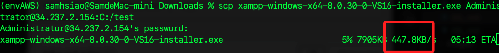
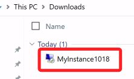

# 關於 XAMPP 的安裝

_在前面的步驟中，已示範進入伺服器終端機進行安裝，這裡則是基於開啟了 SSH 之後，示範使用 SSH 端口進行傳送並安裝的步驟，若已安裝完成，可僅測試文件傳輸、不要重複安裝。_

<br>

## 在本機下載並透過 SSH 傳送

1. 在本機進入 [官網](https://www.apachefriends.org/zh_tw/download.html) 並下載 `XAMPP`；這裡主要是示範傳輸，所以改選 `8.0.30` 下載。

    

<br>

2. 使用 `SCP` 指令，將下載的執行檔案傳送到 Windwos 伺服器的 `C:` 詞曲的下載文件夾中，運行後會詢問密碼。

    ```bash
    scp ~/Downloads/xampp-windows-x64-8.0.30-0-VS16-installer.exe $Username@$Public_IPv4_address:C:/Users/Administrator/Downloads/
    ```

<br>

3. 速度實在有點慢。

    

<br>

## 安裝 sshpass 輔助 SSH

1. 使用 Homebrew 安裝 sshpass，這是非官方的 Homebrew tap。

    ```bash
    brew install esolitos/ipa/sshpass
    ```

<br>

2. 檢查是否安裝成功。

    ```bash
    sshpass -V
    ```

<br>

3. 使用 sshpass 傳遞密碼來執行 scp 指令，這樣比 scp 更加簡潔。

    ```bash
    sshpass -p $Password scp ~/Downloads/MyInstance1018.rdp $Username@$Public_IPv4_address:"C:/Users/Administrator/Downloads/"
    ```

<br>

4. 進入 Windows 伺服器查看。

    

<br>

___

_END_