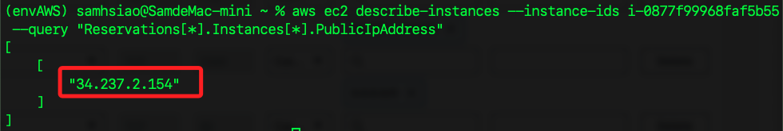

# AWS CLI 指令彙整

<br>

## EC2 相關

1. 取得 EC2 公共 IP。

    ```bash
    aws ec2 describe-instances --instance-ids <EC2-實例-ID> --query "Reservations[*].Instances[*].PublicIpAddress"
    ```

    

<br>

2. 檢查 EC2 實例的狀態。

    ```bash
    aws ec2 describe-instance-status --instance-ids <EC2-ID>
    ```

<br>

3. 啟動 EC2 實例。

    ```bash
    aws ec2 start-instances --instance-ids <EC2-ID>
    ```

<br>

4. 停止 EC2 實例：

    ```bash
    aws ec2 stop-instances --instance-ids <EC2-ID>
    ```

<br>

5. 重新啟動 EC2 實例：

    ```bash
    aws ec2 reboot-instances --instance-ids <EC2-ID>
    ```

<br>

___

_持續補充_