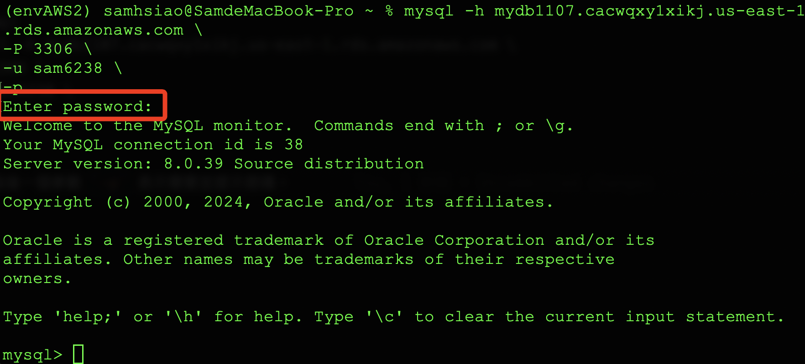

# 基本查詢

<br>

## 連線

1. 連線資料庫。

    ```sql
    mysql -h mydb1107.cacwqxy1xikj.us-east-1.rds.amazonaws.com \
    -P 3306 \
    -u sam6238 \
    -p
    ```

<br>

2. 最後一個參數 `-p` 表示需要並提示密碼，輸入密碼完成連線。 

    

<br>

3. 使用 Workbench 也是相同。

    

<br>

## 資料庫查詢

1. 查詢當前資料庫。

    ```sql
    SELECT DATABASE();
    ```

<br>

2. 查看所有資料庫。

    ```sql
    SHOW DATABASES;
    ```

<br>

3. 選擇資料庫。

    ```sql
    USE <database-名稱>;
    ```

<br>

4. 查看所有表格。

    ```sql
    SHOW TABLES;
    ```

<br>

5. 查看表格結構。

    ```sql
    DESCRIBE <table-名稱>;
    ```

    _或者使用_

    ```sql
    SHOW COLUMNS FROM <table-名稱>;
    ```

<br>

6. 查看表格詳細結構，包含欄位類型、預設值等詳細資訊。

    ```sql
    SHOW CREATE TABLE <table-名稱>;
    ```

<br>

## 資料表查詢

1. 查詢所有欄位資料。

    ```sql
    SELECT * FROM table_name;
    ```

<br>

2. 查詢特定欄位。

    ```sql
    SELECT column1, column2 FROM table_name;
    ```

<br>

3. 使用條件篩選資料。

    ```sql
    SELECT * FROM table_name WHERE <條件判斷式>;
    ```

    _查詢年齡大於 25 的用戶_

    ```sql
    SELECT * FROM users WHERE age > 25;
    ```

<br>

4. 排序查詢結果。

    ```sql
    SELECT * FROM table_name ORDER BY column_name ASC|DESC;
    ```

    _根據年齡從大到小排序_

    ```sql
    SELECT * FROM users ORDER BY age DESC;
    ```

<br>

5. 限制查詢筆數。

    ```sql
    SELECT * FROM table_name LIMIT number;
    ```

    _查詢前 10 筆記錄_

    ```sql
    SELECT * FROM users LIMIT 10;
    ```

<br>

## 資料表維護與管理

1.  新增資料表。

    ```sql
    CREATE TABLE table_name (
        column1 datatype PRIMARY KEY,
        column2 datatype,
        column3 datatype
    );
    ```

    _建立一個使用者表格_

    ```sql
    CREATE TABLE users (
        id INT PRIMARY KEY AUTO_INCREMENT,
        name VARCHAR(50),
        age INT,
        email VARCHAR(100)
    );
    ```

<br>

2. 插入資料。

    ```sql
    INSERT INTO table_name (column1, column2) VALUES (value1, value2);
    ```

    _插入一筆使用者資料_

    ```sql
    INSERT INTO users (name, age, email) VALUES ('Alice', 30, 'alice@example.com');
    ```

<br>

3. 更新資料。

    ```sql
    UPDATE table_name SET column1 = value1 WHERE condition;
    ```

    _更新使用者的年齡_

    ```sql
    UPDATE users SET age = 31 WHERE name = 'Alice';
    ```

<br>

4. 刪除資料。

    ```sql
    DELETE FROM table_name WHERE condition;
    ```

    _刪除年齡大於 30 的使用者_

    ```sql
    DELETE FROM users WHERE age > 30;
    ```

<br>

## 進階查詢

_聚合查詢：計算資料總數、平均值、最大/最小值等_

<br>

1. 總數。

    ```sql
    SELECT COUNT(*) FROM table_name;
    ```

<br>

2. 平均值。

    ```sql
    SELECT AVG(column_name) FROM table_name;
    ```

<br>

3. 最大值。

    ```sql
    SELECT MAX(column_name) FROM table_name;
    ```

<br>

4. 最小值。

    ```sql
    SELECT MIN(column_name) FROM table_name;
    ```

<br>

5. 分組查詢。

    ```sql
    SELECT column_name, COUNT(*) FROM table_name GROUP BY column_name;
    ```

    _統計每個年齡的使用者數量_

    ```sql
    SELECT age, COUNT(*) FROM users GROUP BY age;
    ```

<br>

6. 多表連結查詢（內部連結）。

    ```sql
    SELECT a.column1, b.column2 FROM table1 AS a
    INNER JOIN table2 AS b ON a.common_column = b.common_column;
    ```

    _查詢訂單中的用戶資料_

    ```sql
    SELECT users.name, orders.order_date FROM users
    INNER JOIN orders ON users.id = orders.user_id;
    ```

<br>

___

_END_