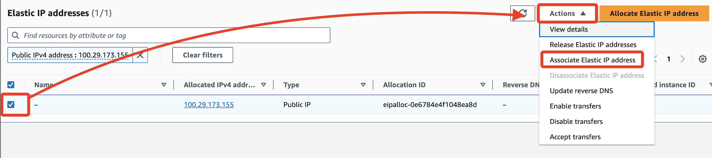
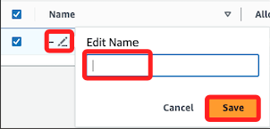
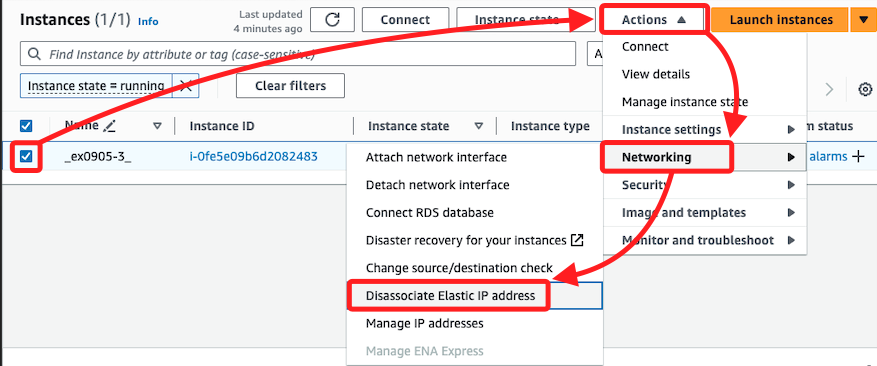
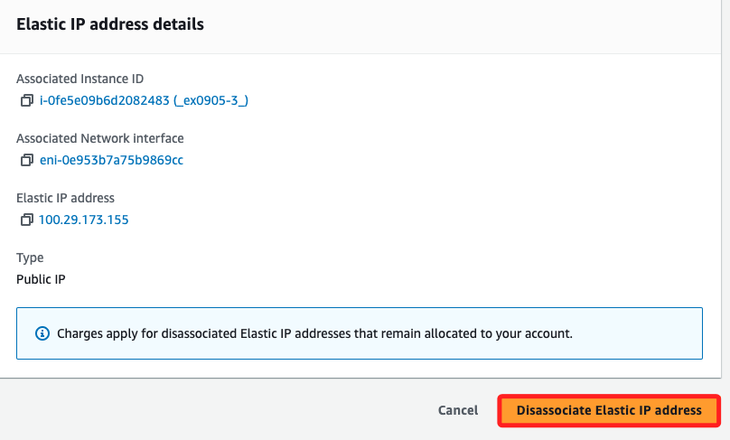
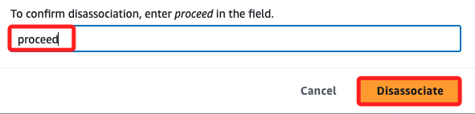
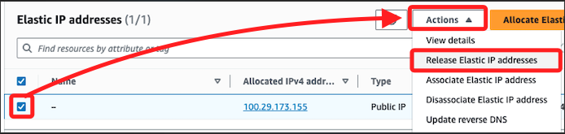

# Elastic IPs

 

## 步驟

1. 搜尋服務 `Elastic IPs`；或是在 `EC2` 左側列表中的 `Network & Security` 子項目內也可看到。

    

 

2. 點擊 `Allocate Elastic IP address`。

    

 

3. 所有設定皆使用預設值即可，滑動到下方點擊右下角的分配 `Allocate`。

    

 

4. 回到清單中會看到添加了一個 `Elastic IP address`，勾選後點擊展開 `Actions`，在下拉選單中選取 `Associate Elastic IP address`。

    

 

5. 建立跟 EC2 實例的關聯，先選取一個實例，然橫勾選左下方的 `Allow thgis Elastic IP address to be reassociated`，然後點擊右下方的 `Associate`。

    

 

6. 可點擊清單中的 `Name` 進行任意易於識別的命名，然後點擊 `Save`。

    

 

## 刪除

_實際稱為釋放 `Release`_

 

1. 先進入 EC2 進行解綁定 `Disassociate Elastic IP addresses`。

    

 

2. 點擊右下角 `Disassociate Elastic IP address`。

    

 

3. 確認。

    

 

4. 在進入 `Elastic IPs` 頁籤中進行釋放 `Release Elastic IP addresses`。

    

 

5. 點擊釋放 `Release`。

    

 

6. 對於綁定在已不存在實例的 `Elastic IP` 可直接進行釋放，若進行解綁，會顯示實例不存在，但 `Allocate ID` 仍會顯示綁在不存在的實例上，以致於無法解綁。

 

___

_END_