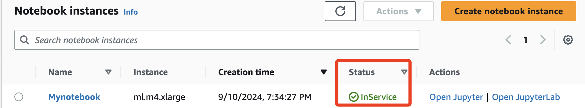

# Creating and importing data

_`90629` Lab 3.1；以下教程分為五個任務，依序為創建 Amazon SageMaker 筆記本實例、運行 Jupyter Notebook 以及下載、保存資料_

<br>

## 使用 Amazon SageMaker 創建 Jupyter Notebook

1. 登錄控制台選擇 `Amazon SageMaker`。

<br>

2. 展開左側選單中的 `Notebook` 區塊，選擇 `Notebook instances`，點擊 `Create notebook instance`。

<br>

3. 在 `Notebook instance name` 輸入 `Mynotebook`。

<br>

4. 從 `Notebook instance type` 下拉選單中選擇 `ml.m4.xlarge`。

<br>

5. 將平台類型設置為 `notebook-al2-v1`。

<br>

6. 展開 `Additional configuration`，選擇包含 `ml-pipeline` 的生命週期配置。

<br>

7. 保持其他設置為預設值，點擊 `Create notebook instance`。

<br>

8. Notebook 實例狀態將顯示為 `Pending`，當狀態變為 `InService` 時可以繼續進行下一步。

    

<br>

## 探索 JupyterLab 界面

1. 當 Notebook 實例變為 `InService` 後可點擊 `Open JupyterLab`。

<br>

2. 打開預先上傳的 `PythonCheatSheet.ipynb` 筆記本文件，藉此熟悉觀察頁面。

<br>

## 操作官方範例

1. 在左側欄中切換到 `Amazon SageMaker Samples`。

<br>

2. 找到並選擇 `linear_learner_mnist.ipynb` 範例筆記本。

<br>

3. 點擊 `Create a Copy`，將示例複製到 JupyterLab 環境中。

<br>

4. 雖然可查看筆記本的內容，但由於本實驗中未設置 S3 存儲桶，無法運行該筆記本的代碼。

<br>

## 導入資料

1. 在 JupyterLab 中選擇 `File > New > Notebook` 創建一個新筆記本。

<br>

2. 選擇 `conda_python3` 作為 Kernel 來運行 Python 代碼。

<br>

3. 在第一個單元格中輸入以下 Markdown 內容作為標題：

    ```markdown
    # Importing the data
    ```

<br>

4. 在單元格中輸入以下代碼。

    ```python
    import warnings, requests, zipfile, io
    warnings.simplefilter('ignore')
    import pandas as pd
    from scipy.io import arff
    ```

<br>

5. 在下一個單元格中輸入下載和解壓資料的代碼。

    ```python
    f_zip = 'http://archive.ics.uci.edu/ml/machine-learning-databases/00212/vertebral_column_data.zip'
    r = requests.get(f_zip, stream=True)
    Vertebral_zip = zipfile.ZipFile(io.BytesIO(r.content))
    Vertebral_zip.extractall()
    ```

<br>

6. 運行全部代碼後，點擊左側欄位上方的刷新功能圖標，則會在左側文件瀏覽器中看到以下文件：`column_2C_weka.arff`、`column_2C.dat`、`column_3C_weka.arff`、`column_3C.dat`。

<br>

7. 以下代碼可加載和查看資料。

    ```python
    data = arff.loadarff('column_2C_weka.arff')
    df = pd.DataFrame(data[0])
    df.head()
    ```

<br>

## 下載並保存筆記本

1. 在 JupyterLab 左側的文件瀏覽器中，右鍵點擊要保存的文件，選擇 `Download`。

<br>

2. 選擇保存到本地電腦的位置。

<br>

## 實驗結束

_`End Lab`，這個 Lab 沒評分_

<br>

___

_END_