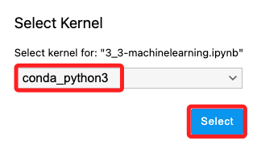

# Encoding Categorical Variables

_`90629` Lab 3.3；編碼類別變量_

 

## 說明

1. 這個 Lab 將對 `類別變量` 進行編碼，使用 UCI 機器學習數據庫的 `汽車數據集（Automobile dataset）`。

 

2. 在登控制台搜索並進入 `Amazon SageMaker`，接著在左側欄中點擊進入 `Notebooks`，然後等待下方的 `MyNotebook` 實例顯示狀態為 `InService`，點擊右側的 `Open JupyterLab` 打開筆記本。

 

3. 與之前步驟相同，選取偏好的語系並點擊進入，這裡選取 `zh_cn`，接著點擊腳本 `3_3-machinelearning.jpynb`；若有選擇核心的彈窗，則選取 `conda_python3`。

    

 

## 完成

_就教程來說，完成以上步驟就可以 End Lab 了，以下針對教程中的技術性問題進行補充_

 

___

_END_