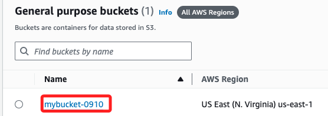
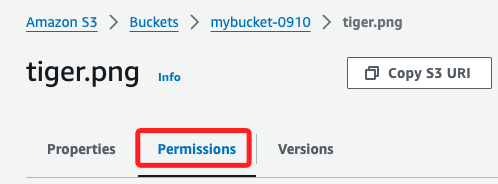
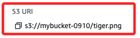

# S3

_`90630`_

<br>

## 操作步驟

1. 先 `Launch Learner Lab`，然後 `Start Lab`，`AWS` 亮綠燈代表完成啟動，點擊進入；與之前操作相同，細節不再贅述。

    

<br>

2. 主控台中搜尋並進入 S3。

    

<br>

3. 點擊 `Create Bucket`。

    

<br>

4. 任意命名如 `mybucket-0910`，這個名稱必須是全球唯一識別，若有重複會提示重新命名，另外也不可以有大寫字母。

    

<br>

5. 在 `Object Ownership` 切換選項為 `ACLs enable`；`ACLs` 就是 `Access Control Lists`，代表開啟存取控制清單。

    

<br>

6. 取消勾選 `Block all public access`，然後勾選下方的 `I acknowledge ...`。

    

<br>

7. 點擊右下角 `Create bucket`。

    

<br>

## 上傳圖片

1. 點擊進入。

    

<br>

2. 點擊畫面中的 `Ipload`，或右上角按鈕也可以。

    

<br>

3. 選擇 `Add files`。

    

<br>

4. 從本地選擇任意圖片。

    

<br>

5. 展開 `Permissions`，勾選其中的 `Everyone` 中的兩個 `Read` 框。

    

<br>

6. 補充說明，其中 `Objects` 授權是針對 `S3 bucket` 中具體物件的存取權限，如文件、圖片、影片等；另外，`Object ACL` 是針對對象的存取控制清單本身的授權，這個選項授予用戶查看或修改該文件 ACL 的權限，也就是對於文件的存取權限進行查詢；所以也可以僅提供 `Objects` 權限。

    

<br>

7. 更改權限後都必須勾選 `I acknowledge ...`。

    

<br>

8. 其餘使用預設，點擊右下角的 `Upload`。

    

<br>

## 查看圖片

1. 滑動到下方 `Files and folders` 區塊，點擊上傳的圖片。

    

<br>

2. 複製右下角的 `Object URL` 後在瀏覽器開啟。

    

<br>

3. 便可在網際網路中以網頁形式瀏覽這張圖片，換句話說，這就是一個單一圖片的靜態網頁。

    

<br>

## 關於權限

1. 文件上傳後若要修改權限，可以在文件中切換頁籤到在 `permissions`。

    

<br>

2. 點擊右上角的 `Edit` 便可進行修改，方式與設定時相同，不再贅述。

    

<br>

3. 上傳 `.html` 文件，複製 Object URL，這就是個只有單張圖片的靜態網頁。

    

<br>

## 製作一個靜態網頁

_使用前面上傳的圖片，對這個靜態網頁進行優化_

<br>

1. 特別說明，在圖片文件中有一個 `S3 URL`，這是用於 AWS 內部服務和工具中，像是 AWS CLI 或 SDK 的操作，而不是在網頁上直接引用，因為瀏覽器無法直接解析 S3 URI；因此，以下的文本依舊使用 `Object URL` 作為圖片連結。

    

<br>

2. 在本機編輯一個 `index.html` 腳本。

    ```html
    <!DOCTYPE html>
    <html lang="en">
    <head>
        <meta charset="UTF-8">
        <meta name="viewport" content="width=device-width, initial-scale=1.0">
        <title>Bootstrap Static Page</title>
        <!-- Bootstrap CSS CDN -->
        <link href="https://stackpath.bootstrapcdn.com/bootstrap/4.3.1/css/bootstrap.min.css" rel="stylesheet">
    </head>
    <body>

        <!-- Navigation Bar -->
        <nav class="navbar navbar-expand-lg navbar-light bg-light">
            <a class="navbar-brand" href="#">實踐大學推廣教育部課程</a>
            <button class="navbar-toggler" type="button" data-toggle="collapse" data-target="#navbarNav" aria-controls="navbarNav" aria-expanded="false" aria-label="Toggle navigation">
                <span class="navbar-toggler-icon"></span>
            </button>
            <div class="collapse navbar-collapse" id="navbarNav">
                <ul class="navbar-nav ml-auto">
                    <li class="nav-item active">
                        <a class="nav-link" href="#">Home <span class="sr-only">(current)</span></a>
                    </li>
                    <li class="nav-item">
                        <a class="nav-link" href="#">About</a>
                    </li>
                    <li class="nav-item">
                        <a class="nav-link" href="#">Contact</a>
                    </li>
                </ul>
            </div>
        </nav>

        <!-- Header Section -->
        <header class="jumbotron text-center">
            <h1 class="display-4">歡迎來到 AWS S3 示範網頁</h1>
            <p class="lead">這個個簡單的 Bootstrap 網頁，圖片來自於 S3。</p>
        </header>

        <!-- Image Section -->
        <div class="container text-center">
            <h2>這是 S3 的圖片文件</h2>
            
        </div>

        <!-- Footer Section -->
        <footer class="footer bg-light text-center">
            <p class="mt-4">© 2024 My Bootstrap Site. All Rights Reserved.</p>
        </footer>

        <!-- Bootstrap JS and dependencies -->
        <script src="https://code.jquery.com/jquery-3.3.1.slim.min.js"></script>
        <script src="https://cdnjs.cloudflare.com/ajax/libs/popper.js/1.14.7/umd/popper.min.js"></script>
        <script src="https://stackpath.bootstrapcdn.com/bootstrap/4.3.1/js/bootstrap.min.js"></script>
    </body>
    </html>
    ```

<br>

3. 如前所述，其中圖片部分的連結如下。

    ```html
    <!-- Image Section -->
    <div class="container text-center">
        <h2>這是 S3 的圖片文件</h2>
        
    </div>
    ```

<br>

4. 同樣在 `S3` 頁面中點擊 `Upload`，接著點擊 `Add files`。

    

<br>

5. 上傳 `index.html` 文件。

    

<br>

6. 一樣要設置 ACL。

    

<br>

7. ，然後點擊右下角的 `Upload` 完成上傳文件。

    

<br>

## 瀏覽

1. 複製 `Object URL`。

    

<br>

2. 訪問靜態網頁。

    

<br>

## 上傳資料夾

_若網頁是一個資料夾結構_

<br>

1. 以下使用網路免費的 Bootstrap [範例資源](https://startbootstrap.com/theme/freelancer#google_vignette)。

    

<br>

2. 點擊 `Download` 到本機後解壓縮，可將資料夾命名短一點如 `demo`；這不影響後續操作，純粹看了順眼。

    

<br>

3. 重複前面步驟，同樣是點擊 `Upload`，然後選擇的是 `Add folder`。

    

<br>

4. 選取資料夾後會出現彈窗，點擊 `上傳` 即可。

    

<br>

5. 設定 ACL，然後點擊右下角的 `Upload`。

    

<br>

6. 上傳完成。

    

<br>

7. 進入 `demo` 資料夾內的 `index.html` 文件，同樣複製 `Object URL` 進行訪問；特別補充一點，網頁雖然包含了 Bootstrap 和一些 JavaScript，但這是在前端執行的，並不涉及伺服器端的動態處理，如果網頁依賴後端伺服器來根據使用者輸入或資料庫的變動生成內容，並且每次的結果可能不同，那就是屬於動態網頁範疇。

    

<br>

___

_END_