# Lab6 Scale and Load Balance Your Architecture

_簡介與步驟說明_

 

## 簡介

1. 說明如何使用 `Elastic Load Balancing (ELB)` 和 `Auto Scaling` 服務來達成 `負載平衡` 和 `自動擴展基礎設施` 的目的。

 

2. 使用 `Elastic Load Balancing` 可自動分配應用程式的流量到多個 `EC2 實例`，達到應用容錯的目的。

 

3. 使用 `Auto Scaling` 根據定義的條件自動調整 `EC2 實例` 的數量，以維持應用程式的可用性。

 

4. `ELB`可根據應用流量需求動態地提供負載平衡容量，確保流量能夠無縫地分配到不同的 EC2 實例，從而實現故障容錯。

 

5. `Auto Scaling` 可以根據預設條件如 CPU 使用率或流量波動來自動增加或減少 EC2 實例數量，確保在流量高峰時維持性能，同時在流量減少時降低成本，特別適合那些需求模式穩定或者使用頻率具有變動性的應用程式。

 

## 場景

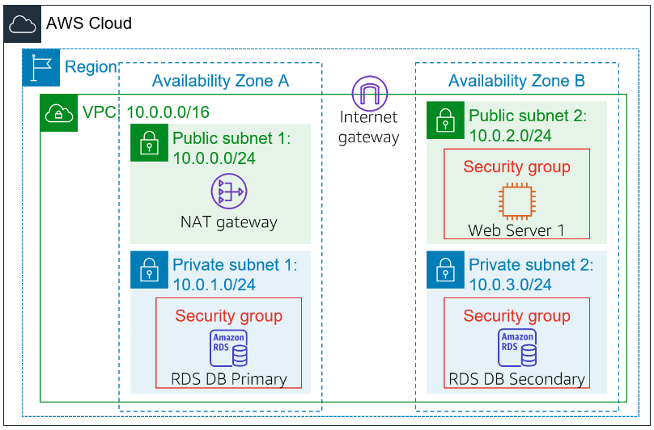

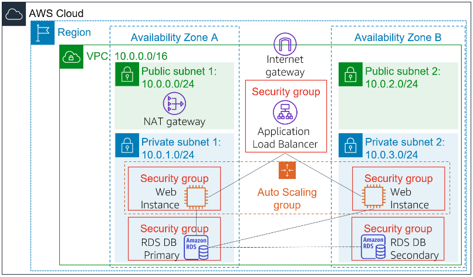

 

## 建立 AMI 用於 Auto Scaling 

1. 在控制台搜尋並進入 `EC2` 後，在左側欄或畫面中央的資源列表處點擊 `Instances`。

    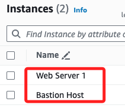

 

2. 確認 `Web Server 1` 的狀態已經檢查通過；勾選後展開 `Actions` 選單，在 `Image and templates` 內點擊 `Create image`。

    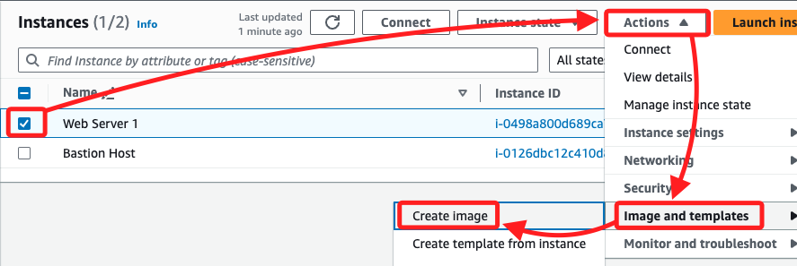

 

3. 設置名稱為 `WebServerAMI`，描述為 `Lab AMI for Web Server`。

    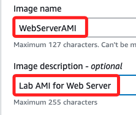

 

4. 其餘使用預設內容，然後點擊右下角的 `Create image`。

    

 

5. 切換到 AMIs， 確認 AMI 已建立，並記下 `AMI ID`。

    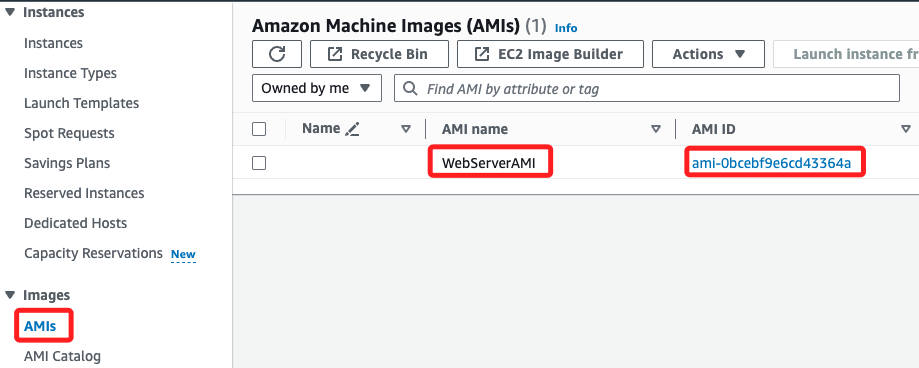

 

## 建立負載平衡器

1. 在左側欄的 `Load Balancing` 分類下進入 `Target Groups`，點擊 `Create target group`。

    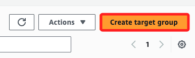

 

2. 選擇目標類型為 `Instances`。

    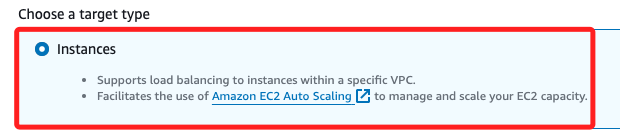

 

3. 名稱設為 `LabGroup`。

    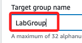

 

4. VPC 選擇 `Lab VPC`。

    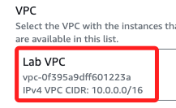

 

5. 其餘使用預設，點擊 `Next`。

    

 

6. 完成相關設置，務必滑動到右下角點擊 `Create target group` 完成設置。

    

 

7. 回到清單後，再次進入左側欄 `Load Balancing` 中的 `Load Balancers`，點擊 `Create load balancer`。

    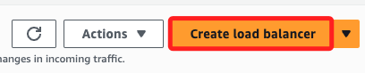

 

8. 選擇 `Application Load Balancer`，並點擊下方的 `Create`。

    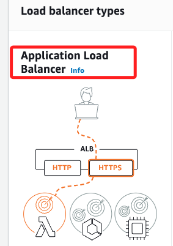

 

9. 輸入名稱 `LabELB`。

    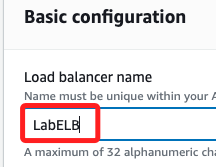

 

10. 在 `Network mapping` 區塊中，選擇 Lab VPC，並勾選兩個 AZ。

    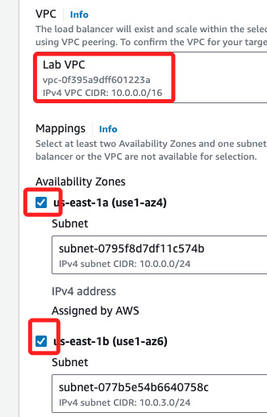

 

11. 確認兩個子網都設置為公開子網。

    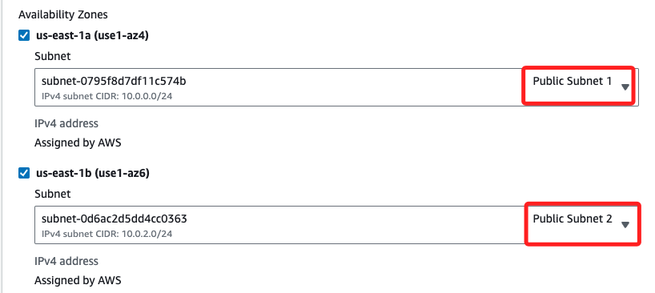

 

12. 在 `Security groups` 中，選擇 `Web Security Group` 並移除被勾選的預設安全群組。

    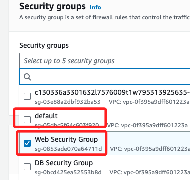

 

13. 將預設的 `HTTP:80` 轉發到 `LabGroup`。

    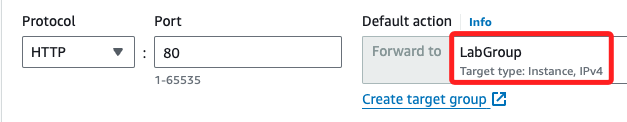

 

14. 然後滑動到下方點擊 `Create load balancer`。

    

 

## 建立啟動範本與 Auto Scaling 組

1. 在左側欄中選擇 `Launch Templates`。

    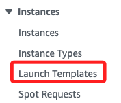

 

2. 在畫面中點擊 `Create launch template`。

    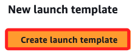

 

3. 設定範本名稱為 `LabConfig`，並勾選 `Provide guidance to help me set up a template...`。

    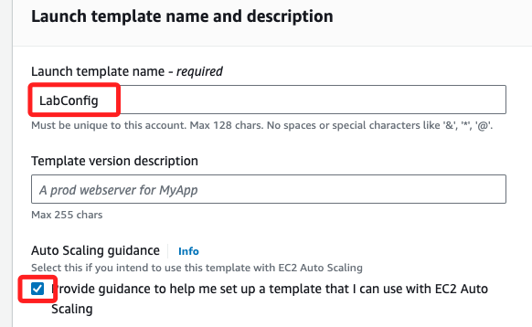

 

4. 選擇 AMI 為 `WebServerAMI`。

    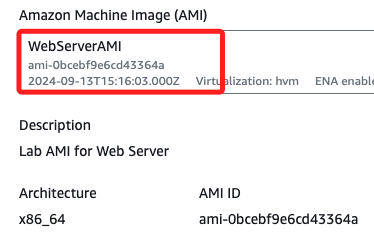

 

5. 實例類型選擇 `t2.micro`。

    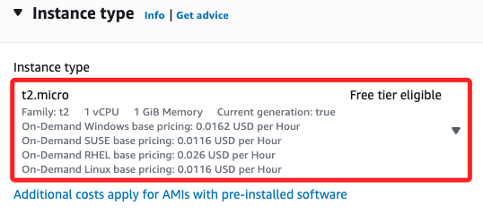

 

6. 金鑰對選擇 `vockey`。

    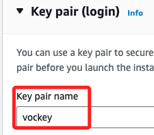

 

7. 在 `Network settings` 中選擇使用現有的 `Web Security Group`。

    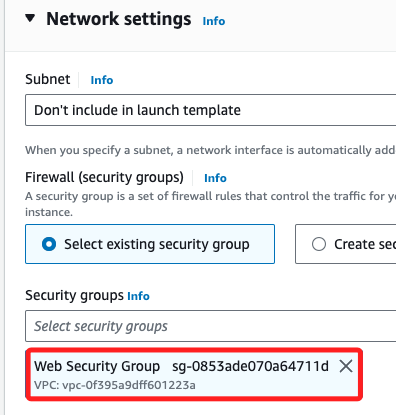

 

8. 在 `Advanced details` 區塊中，將 `Detailed CloudWatch monitoring` 切換為 `Enable`。

    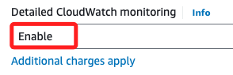

 

9. 然後點擊右側按鈕建立並啟動範本。

    

 

10. 在成功對話框中，點擊 `Create Auto Scaling group`。

    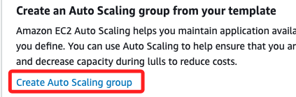

 

11. 設置 Auto Scaling 組名稱為 `Lab Auto Scaling Group`，選擇範本 `LabConfig`；點擊 `Next`。

    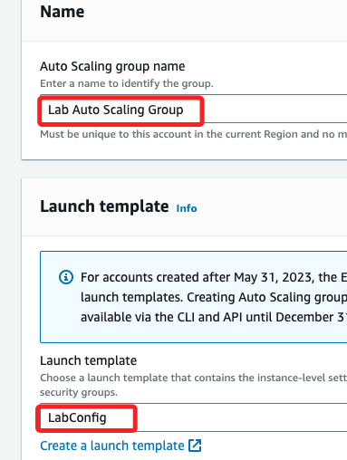

 

12. 在 `Network` 區塊中，選擇 `VPC` 為 `Lab VPC`，並設定子網為 `Private Subnet 1` 和 `Private Subnet 2`；點擊 `Next`。

    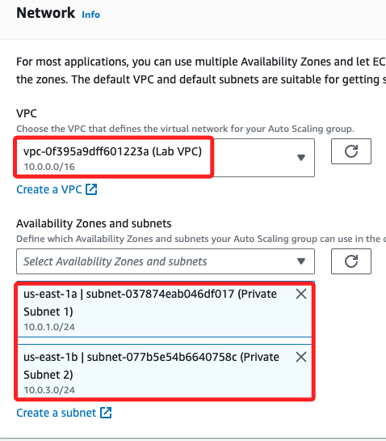

 

13. 在 Load balancing 中，選擇 `Attach to an existing load balancer`。

    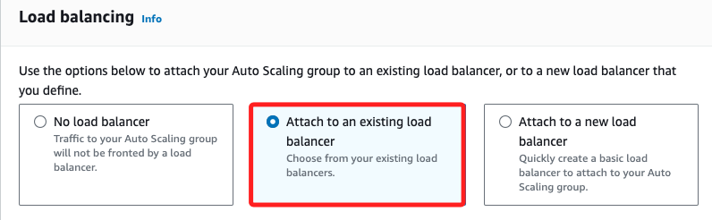

 

14. 同樣選擇 `LabGroup`。

    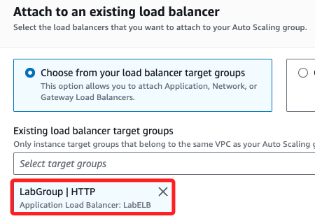

 

15. 在 `Additional settings` 區塊中，勾選 `Enable group metrics collection within CloudWatch`；然後點擊 `Next`。

    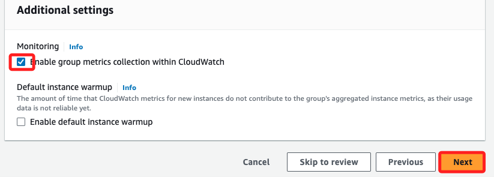

 

16. 設置群組大小為最小 2、最大 6。

    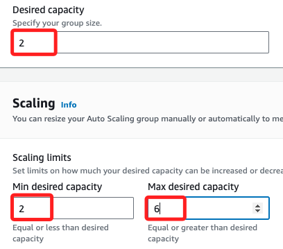

 

17. 選取 `Target tracking scaling policy` 會展開下方設置。

    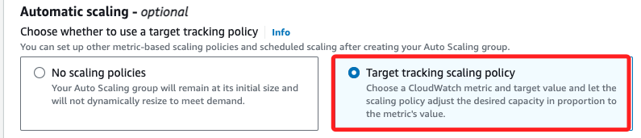

 

18. 命名為 `LabScalingPolicy`，並配目標值 `60`；然後點擊 `Next`。

    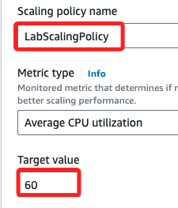

 

19. 可跳過預覽，點擊 `Next`。

    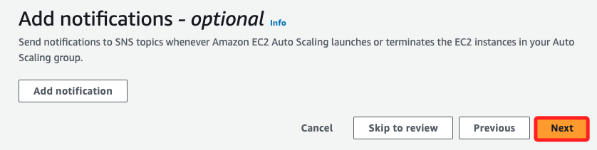

 

## 標籤

1. 在 `Add tags` 中，添加一個標籤，Key 命名為 `Name`，Value 設置為 `Lab Instance`；然後點擊 `Next`。

    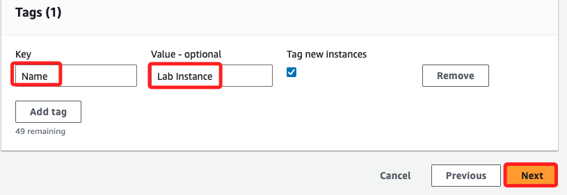

 

2. 滑動到最下方，點擊 `Create Auto Scalling group`。

    

 

## 驗證負載平衡功能

1. 在 Instances 頁面確認有兩個新實例 `Lab Instance`，並確認這些實例已通過健康檢查。

    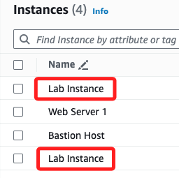

 

2. 點擊左側 `Target Groups` 進入清單，勾選 `LabGroup`，應可看到兩個實例。

    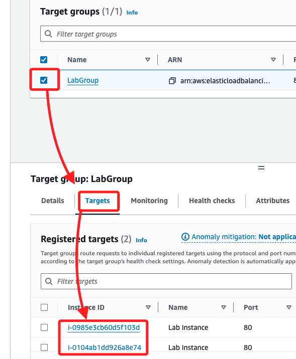

 

3. 切換到左側欄中的 `Load Balancers`，勾選 `LabELB`，然後滑動到下方，確認 `DNS name`，自動複製時不會複製其中的 `A Record`，手動複製則需注意省略。

    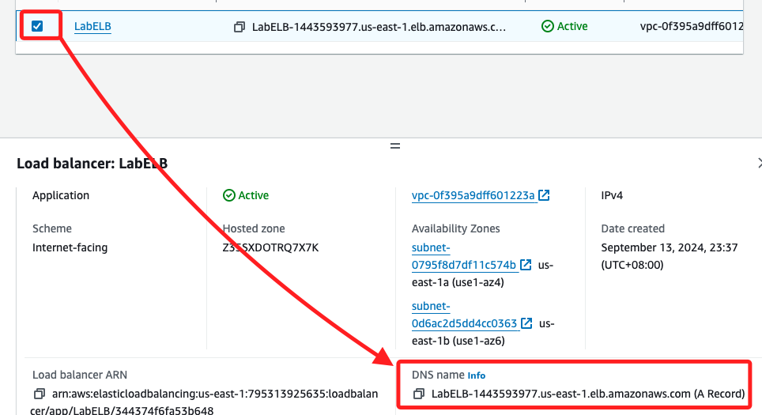

 

4. 複製 `DNS name` 並在瀏覽器中訪問。

    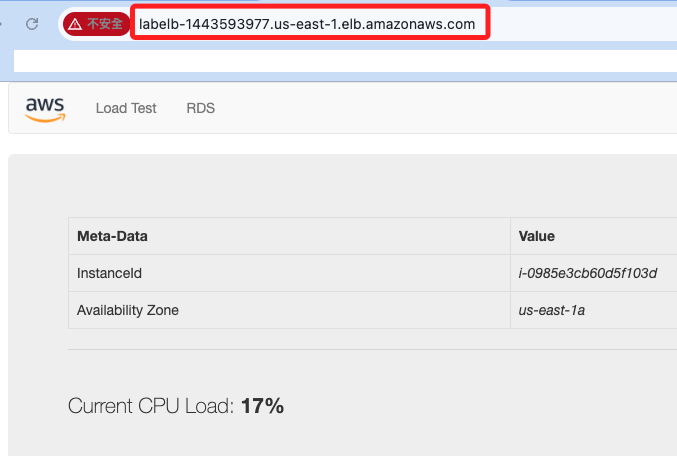

 

## 測試 Auto Scaling 

1. 返回 AWS 管理控制台並搜尋 `CloudWatch`。

    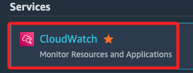

 

2. 點擊左側欄中 `All alarms`，確認有兩個自動創建的警報，並執行負載測試。

    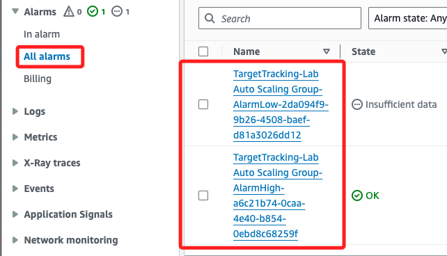

 

3. 過了一段時間後，會出現警報。

    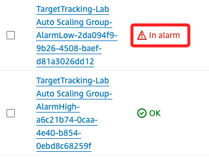

 

4. 回到瀏覽器中，點擊 `Load Test`，這將導致應用程式產生高負載，瀏覽器頁面會自動刷新，使`Auto Scaling` 群組中的所有執行個體產生負載。

    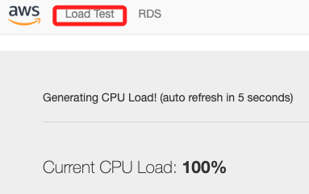

 

5. 等待一段時間；`AlarmLow` 先變成 `OK`。

    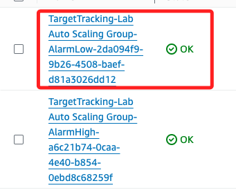

 

6. 可點擊進入 `AlarmHigh` 查看，此時使用率已經提高。

    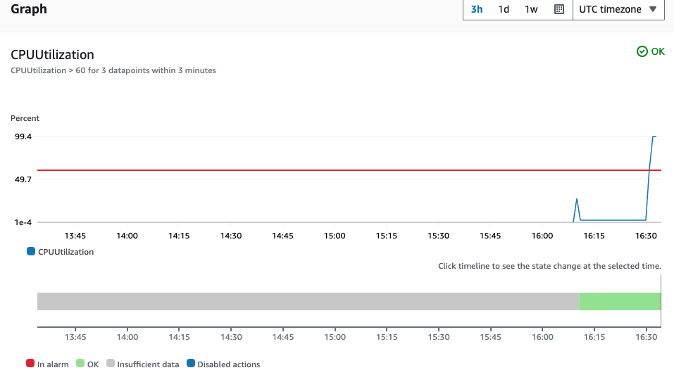

 

7. 過一陣子會自動出現 `In alarm`。

    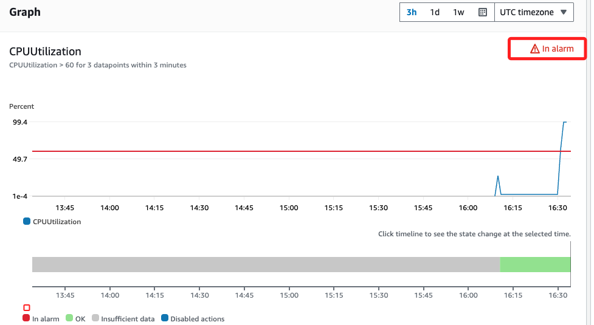

 

8. 再回到清單中刷新頁面。

    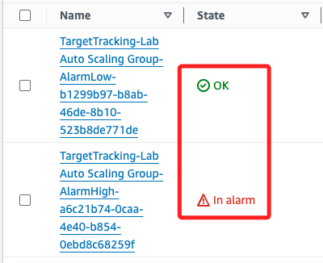

 

## 回 EC2 查看

1. 當 CPU 利用率超過 60% 並持續超過 3 分鐘，Auto Scaling 組會新增實例來平衡負載。

    

 

2. 選擇 `Web Server 1` 並將其 `Terminate`。

    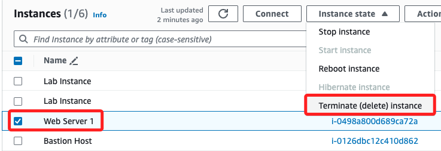

 

3. 點擊確認；特別注意， `Terminate` 需要時間生效，所以 Submit Lab 的時候可能要確認是否已完成。

    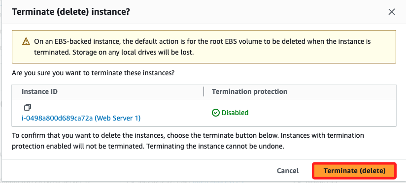

 

## 完成

_Submit && End Lab_

 

___

_END_