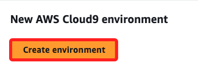
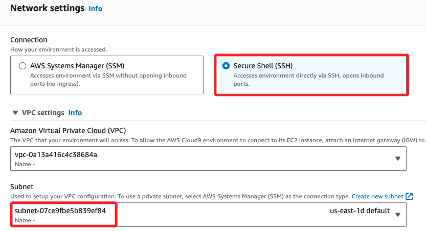
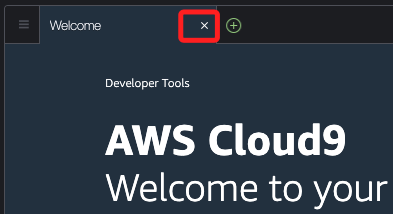
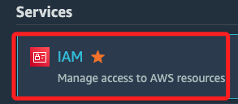
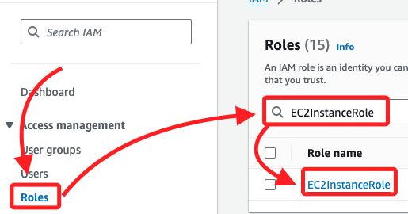
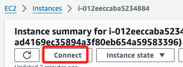
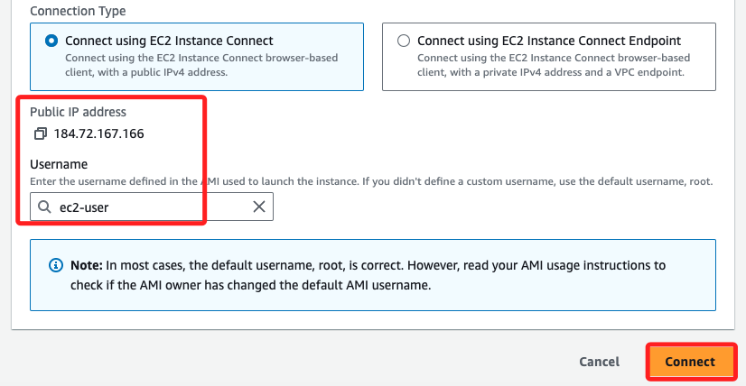
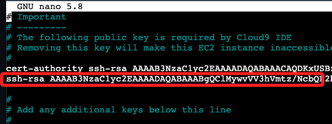
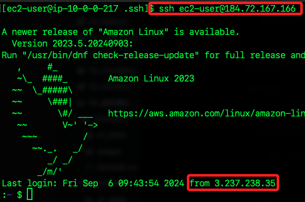

# Sandbox

_`90628`；這個 Lab 實作上遇到一些挑戰，因為依據教程似乎暗示著我們從外部連線跳板進入 Cloud9，但 Lab IAM 的 SSM 權限並未開啟，而跳板進入目標時限制必須使用 SSM，不知道算不算是打關卡的概念，最終雖是成功了，但總覺得像是腦筋急轉彎，不像是教程。_

<br>

## 特別提醒事項

1. [官方宣佈](https://aws.amazon.com/tw/blogs/devops/how-to-migrate-from-aws-cloud9-to-aws-ide-toolkits-or-aws-cloudshell/) 自 `2024年07月25日` 起將關閉新用戶訪問 Cloud9，其實包含既有用戶當前（09/07）也無法訪問，所謂的現有用戶可能是指服務使用中的用戶才可繼續使用。

<br>

2. DevOps 團隊推薦兩個替代方案 `AWS IDE Toolkits` 和 `AWS CloudShell` 進行遷移。

<br>

3. `AWS IDE Toolkits` 是一套插件，允許開發者在 VSCode 等 IDE 中直接管理 AWS 資源，也就是 `Boto3`。

<br>

4. `AWS CloudShell` 是 AWS 管理控制台中的瀏覽器終端，預配置了 AWS CLI，方便隨時操作 AWS 資源。

<br>

## 說明

1. 從 `Modules` 點擊進入 `Sandbox Environment`。

    

<br>

1. 參考左側欄中的說明步驟進行操作；完成 `Start Lab` 之後，點擊 `AWS` 進入主控台。

    

<br>

3. 搜尋並進入 `Cloud9`。

    

<br>

4. 建立環境。

    

<br>

5. 任意命名如 `_MyEnv-0906_`。

    

<br>

6. 切換 `Network settings` 為 `SSH`；並設定任一子網。

    

    _當前帳號不夠權限選擇預設的 `SSM`_

    

<br>

7. 其餘先使用預設，點擊右下角建立 `Create`。

    

<br>

8. 會自動跳回清單頁面，等待建立完成。

    

<br>

9. 點擊 `Open` 進入。

    

<br>

10. 關閉歡迎頁面。

    

<br>

## 在 Cloud9 中使用 AWS CLI

_已經內建 CLI，無需額外安裝_

<br>

1. 打開下方終端，執行 AWS CLI 命令；查詢當前用戶身份，可比對這個 `Account` 會是自己的 `Academy` 帳號。

    ```bash
    aws sts get-caller-identity
    ```

    

<br>

2. 列出當前運行的 EC2 實例。

    ```bash
    aws ec2 describe-instances
    ```

<br>

3. 可優化指令，僅顯示 EC2 實例的 ID 及名稱。

    ```bash
    aws ec2 describe-instances --query "Reservations[*].Instances[*].[InstanceId, Tags[?Key=='Name'].Value | [0]]" --output text
    ```

    

<br>

## 使用 AWS SDK for Python

_Boto3_

<br>

1. 若要開啟新的終端，點擊 `+` 符號，然後點擊 `New Terminal`。

    

<br>

2. 雖然官方說明文件在語義上似乎說已經內建了 `boto3`，但實際上還是需要安裝才能使用；以下是安裝套件指令。

    ```bash
    pip install boto3
    ```

<br>

3. 訊息指出因為權限問題無法寫入系統的全局 site-packages 目錄，pip 將自動選擇將 Boto3 安裝到使用者目錄，也就是 `user-level installation`，而不是安裝到全局系統目錄；不影響安裝，可順利完成。

    

<br>

4. 安裝後可先進入 Python 環境中測試看看。

    ```bash
    python3
    ```

<br>

2. 使用 Boto3 操作 EC2。

    ```python
    import boto3
    ec2 = boto3.client('ec2', region_name='us-east-1')
    ec2.describe_regions()
    ```

<br>

3. 列出了 AWS 支持的區域以及 API 請求的相關元數據。

    

<br>

4. 退出 Python。

    ```bash
    exit()
    ```

<br>

## 連接 EC2 實例

_使用密鑰_

<br>

1. 回到 `Academy` 的入口處，展開上方 `Details` 下拉選單，點擊其中的 `Show`。

    

<br>


2. 在彈出的視窗中會顯示連線所需資訊，可依據使用的系統以及連線方式進行下載或複製必要文件或資訊。

    

<br>

3. 以下示範透過 `PEM 密鑰文件` 進行連線；首先下載 `PEM 密鑰文件`。

    

<br>

4. 特別注意，下方顯示了 `SecretKey` 與 `AccessKey`，這裡的鍵名與 CLI 設定文件略有不同；其中 `SecretKey` 就是 `Secret Access Key`，`AccessKey` 就是 `AWS Access Key ID`；這兩個密鑰資料可在本機的 `~/.aws/credentials` 中查看，或透過終端機指令 `aws configure` 進行設定。

    

<br>

5. 這個下載的 `labsuser.*` 文件的權限設定初始值是 `644`。

    

<br>

6. 比照 EC2 教程中的說明，先修改密鑰文件的權限為 `400`；注意指令的執行路徑。

    ```bash
    chmod 400 labsuser.pem
    ```

    

<br>

## EC2

1. 先進入 EC2 查看，建立 Cloud9 的過程中添加了兩個實例。

    

<br>

2. 其中 `Bastion Host` 就是 `堡壘主機`，以下我稱為 `跳板主機`；可通過 `Bastion Host` 來訪問其他位於私有子網中的 EC2 實例。

    

<br>

3. 接著點擊下方的 `Security`，然後點擊 `Security groups`。

    

<br>

4. 在 `Inbound rules` 頁籤中點擊右下方的 `Edit Inbound rules`。

    

<br>

5. 預設已經開啟 `SSH` 的 22 Port，並允許來自所有 IP 的連線 `0.0.0.0`。

    

<br>

6. 在密鑰所在路徑中開啟終端，並直接運行以下指令進行連線；若不在路徑中，則要添加密鑰文件的路徑。

    ```bash
    ssh -i labsuser.pem ec2-user@<Bastion Host 公共 IP>
    ```

<br>

7. 第一次連線會詢問是否確認建立連線，輸入 `yes`。

    

<br>

8. 成功連入會顯示如下畫面。

    

<br>

## 結束 Learner Lab

1. 完成所有操作後可關閉 Lab，這會自動刪除所有建立的資源並清理環境。

    

<br>

2. 這是按官方說明順序所寫的步驟，但以下將繼續操作，所以僅作紀錄、不實際關閉。

<br>

## Lab 操作的各種限制

_在 Lab 中的操作是有侷限性的，官方對此也加以提示_

<br>

1. 所有操作僅限於 `us-east-1` 區域。

<br>

2. EC2 同時運行的實例數量最多為 9 個，超過限制的實例將自動終止。

<br>

3. 在建立 AWS 資源時，使用預設的 `LabRole` 角色

    

<br>

4. 這個角色有預設的 `LabInstanceProfile` 進行訪問和權限控制；`Instance Profile` 是一個容器，用於將 `IAM Role` 連接到 EC2 實例，這樣該實例可以通過角色獲得 AWS 服務的訪問權限。

    

<br>

5. 可查看其中的 `Trust relationships`，這也是 `IAM Role` 的一部分，用於定義哪些實體可以假設這個 Role。

    

<br>

## 與 EC2 相關的終端指令

_接著將示範在 Cloud9 終端中進行相關查詢指令，若嘗試在遠端連線的終端中運行將會出錯，因為 `EC2InstanceRole` 預設不具備相關權限，這裡先嘗試在 Cloud9 中執行，並體驗遠端並無權限後，將在後面步驟進行各種限制的排除與說明。_

<br>

1. 查詢 Instance Profile 的詳細信息。

    ```bash
    aws iam get-instance-profile --instance-profile-name LabInstanceProfile
    ```

<br>

2. 查詢 IAM 角色 的 Trust Relationships。

    ```bash
    aws iam get-role --role-name LabRole
    ```

<br>

3. 列出當前區域內的所有 EC2 實例。

    ```bash
    aws ec2 describe-instances
    ```

<br>

4. 查看特定 EC2 實例的狀態，這裡以這個 `Bastion Host` 為例。 

    ```bash
    aws ec2 describe-instance-status --instance-ids i-0c3135f2500a4443e
    ```

<br>

5. 查看 EC2 配額。

    ```bash
    aws ec2 describe-account-attributes
    ```

<br>

## 添加權限

_為了排除相關限制，以下略超出教程範圍，對預設的 IAM 進行設定_

<br>

1. 進入 IAM 服務。

    

<br>

2. 進入 Roles，搜尋並點擊進入與 EC2 實例關聯的 IAM 角色 `EC2InstanceRole`。

    

<br>

3. 為角色添加政策。

    

<br>

4. 搜尋並勾選 `AmazonEC2ReadOnlyAccess`，點擊 `Add permissions`。

    

<br>

5. 完成以上步驟後，可嘗試在本機進行終端機查詢指令，會得到跳板與目標 EC2 實例的資訊；確保可以運行，然後繼續以下步驟。

    

<br>

## 本地連線目標 EC2

_從本地經由跳板進入目標 EC2_

<br>

1. 先進入目標 EC2 中的安全群組設定白名單；這步驟與前面相同不再贅述，惟先前做查詢時，跳板中已預設開啟 `0.0.0.0`。

    

<br>

2. 點擊連線 `Connect`，用以確認可連入目標 EC2。

    

<br>

3. 修改名稱 `ec2-user` 連線；不要使用預設的 `root`。

    

<br>

4. 先在跳板 EC2 實例的終端機中運型以下指令，用以建立密鑰對；後續將複製到目標實例中以通過驗證。

    ```bash
    ssh-keygen
    ```

<br>

5. 使用以下指令進入密鑰路徑並輸出指定的公鑰。

    ```bash
    cd ~/.ssh && cat id_rsa.pub
    ```

<br>

6. 複製這組公鑰；特別注意，假如有多組公鑰，可任意複製一組到遠端作為驗證，但務必確保本地存在私鑰。

    

<br>

7. 進入目標實例中，也就是 Cloud9 的 EC2 中，編輯授權文件。

    ```bash
    sudo nano ~/.ssh/authorized_keys
    ```

<br>

8. 貼上前面複製的公鑰；一列就是一組公鑰，每一列末端無需斷行符號；完成後 `儲存（control+O）`、`退出（control+X）`。

    

<br>

9. 畫面終端機的下方顯示有公共與私有 IP，複製 `PublicIPs`。

    

<br>

10. 回到堡壘的終端機中，進行連線；因為已經複製了公鑰，無需使用參數指定密鑰文件。

    ```bash
    ssh ec2-user@184.72.167.166
    ```

<br>

11. 連線成功。

    

<br>

12. 進入 `~/environment` 並輸出 `README.md`。

    ```bash
    cd ~/environment && cat README.md
    ```

    

<br>

13. 可與 Cloud IDE 中的畫面進行核對。

    

<br>

___

_END_