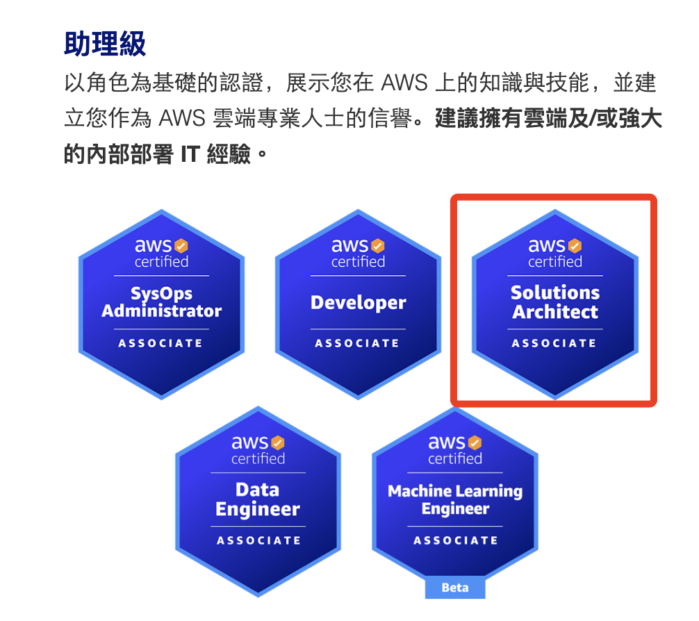

# 簡介資料科學的範疇

再次重申 [證照](https://aws.amazon.com/tw/certification/?gclid=CjwKCAjwooq3BhB3EiwAYqYoEkgvyEfrn3sxL2tuDhfIIHjnqodh51HGiBCgiOs5g_xSk3vAKoePQhoCt4QQAvD_BwE&trk=27399cc9-66c8-4728-9b99-87521594026f&sc_channel=ps&ef_id=CjwKCAjwooq3BhB3EiwAYqYoEkgvyEfrn3sxL2tuDhfIIHjnqodh51HGiBCgiOs5g_xSk3vAKoePQhoCt4QQAvD_BwE:G:s&s_kwcid=AL!4422!3!616901124151!e!!g!!aws%20certification!12663683966!121596159578) 的流程

`Availability zone（AZ）`

AWS 在 CDN 服務中定義的 `edge` 與一般所稱的 `邊緣設備` 並不相同，所指是邊緣的儲存設備。

CDN（Content delivery network）

## EC2

EC2（Amazon Elastic Compute Cloud）

1. Elastic：表示「彈性」，象徵 EC2 提供隨需擴展或縮減計算資源的能力，用戶可以根據實際需求動態調整運算資源。
   
2. Compute Cloud：指的是「運算雲端」，強調這項服務提供基於雲端的運算資源，讓使用者能夠租用虛擬機器來執行應用程式，而不需要擁有實體硬體。

因此，Amazon EC2 是一種彈性且可擴展的雲端運算服務，允許使用者根據需求靈活調配計算資源。

## DDOS 攻擊
