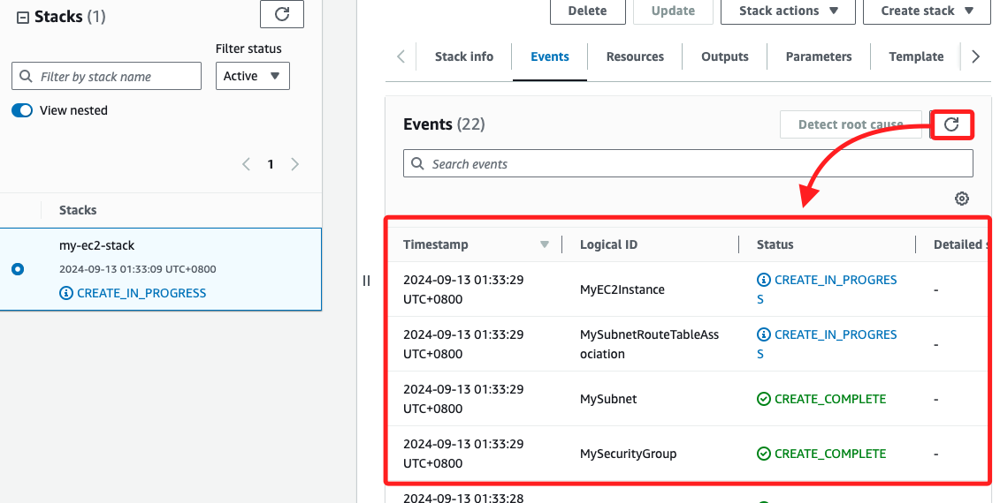

# CloudFormation

_以下嘗試完成老師上課時提到的使用 `.yaml` 腳本自動化建立雲計算 `EC2` 環境任務；特別說明，尚未找到合適可操作的 Lab，這裡使用 Root 帳號進行操作_

<br>

## 步驟紀錄

_使用 `CloudFormation` 完成自動化建立雲計算環境任務，可透過 `.yaml` 或 `.json` 格式的模板進行部署和管理 CloudFormation Stack，以下分別使用主控台 與 CLI 來進行，既然使用了模板，這裡就暫不使用 SDK 部署。_ 

<br>

1. 搜尋並進入 `CloudFormation`。

    

<br>

2. 點擊 `Create stack`。

    

<br>

3. 在本地建立模板文件 `*.yaml`，命名為 `cloudformation-template.yaml`，內容如下；這個模板會自動建立一個 VPC、子網路、網際網路閘道、路由表、安全群組，並在此網路架構中啟動一個 EC2 實例；特別注意。

    ```yaml
    AWSTemplateFormatVersion: '2010-09-09'
    Description: '使用 CloudFormation 一鍵式部署 EC2 實例的雲端環境'

    Resources:
    MyVPC:
        Type: 'AWS::EC2::VPC'
        Properties: 
        CidrBlock: '10.0.0.0/16'
        EnableDnsSupport: true
        EnableDnsHostnames: true
        Tags: 
            - Key: Name
            Value: MyVPC

    MySubnet:
        Type: 'AWS::EC2::Subnet'
        Properties:
        VpcId: !Ref MyVPC
        CidrBlock: '10.0.1.0/24'
        MapPublicIpOnLaunch: true
        AvailabilityZone: 'us-east-1a'
        Tags:
            - Key: Name
            Value: MySubnet

    MyInternetGateway:
        Type: 'AWS::EC2::InternetGateway'
        Properties: 
        Tags:
            - Key: Name
            Value: MyInternetGateway

    AttachGateway:
        Type: 'AWS::EC2::VPCGatewayAttachment'
        Properties: 
        VpcId: !Ref MyVPC
        InternetGatewayId: !Ref MyInternetGateway

    MyRouteTable:
        Type: 'AWS::EC2::RouteTable'
        Properties: 
        VpcId: !Ref MyVPC
        Tags:
            - Key: Name
            Value: MyRouteTable

    MyRoute:
        Type: 'AWS::EC2::Route'
        DependsOn: AttachGateway
        Properties: 
        RouteTableId: !Ref MyRouteTable
        DestinationCidrBlock: '0.0.0.0/0'
        GatewayId: !Ref MyInternetGateway

    MySubnetRouteTableAssociation:
        Type: 'AWS::EC2::SubnetRouteTableAssociation'
        Properties: 
        SubnetId: !Ref MySubnet
        RouteTableId: !Ref MyRouteTable

    MySecurityGroup:
        Type: 'AWS::EC2::SecurityGroup'
        Properties: 
        # 使用英文描述
        GroupDescription: 'Allow HTTP and SSH traffic'
        VpcId: !Ref MyVPC
        SecurityGroupIngress: 
            - IpProtocol: tcp
            FromPort: '22'
            ToPort: '22'
            CidrIp: '0.0.0.0/0'
            - IpProtocol: tcp
            FromPort: '80'
            ToPort: '80'
            CidrIp: '0.0.0.0/0'
        Tags:
            - Key: Name
            Value: MySecurityGroup

    MyEC2Instance:
        Type: 'AWS::EC2::Instance'
        Properties: 
        InstanceType: 't2.micro'
        # 替換 Key Pair 名稱
        KeyName: 'my-key-pair'
        # 使用最新的 Amazon Linux AMI ID
        ImageId: 'ami-098143f68772b34f5'
        NetworkInterfaces: 
            - AssociatePublicIpAddress: true
            DeviceIndex: '0'
            SubnetId: !Ref MySubnet
            GroupSet: 
                - !Ref MySecurityGroup
        Tags:
            - Key: Name
            Value: MyEC2Instance
            
    Outputs:
    InstanceId:
        Description: "EC2 Instance ID"
        Value: !Ref MyEC2Instance

    PublicIP:
        Description: "Public IP Address of EC2 Instance"
        Value: !GetAtt MyEC2Instance.PublicIp
    ```

<br>

4. 補充說明，EC2 安全群組的描述只接受 ASCII 字符，若使用中文描述導致創建失敗；以下是這類錯誤的訊息。

    

<br>

5. 點擊 `Choose an existing template`。

    

<br>

6. 選取 `Upload a template file`，然後點擊 `Choose file`。

    

<br>

7. 選擇前面編輯的腳本。

    

<br>

8. 可點擊 `View In Application Composer` 進行查看。

    

<br>

9. 顯示如下圖；`MyEC2Instance` 與 `MySecurityGroup` 相關聯，表示 EC2 實例放置在定義的安全群組中；`MySecurityGroup` 與 `MyVPC` 相關聯，代表安全群組被應用在建立的 VPC 中，而 `MyVPC` 中包含了 `子網路`、`路由表`、`網際網路閘道` 等定義。

    

<br>

10. 點擊 `Next`。

    

<br>

11. 命名為 `my-ec2-stack`，然後點擊 `Next`。

    

<br>

## Configure stack options

_配置堆疊選項_

<br>

1. _可_ 點擊添加標籤 `Add new tag`；將 Key 設置為 `Project`、Value 設置為 `EC2-Setup`；編輯標籤有利於更好地組織與識別資源，特別在有多個堆疊的狀況。

    

<br>

2. 其他使用預設，然後點擊最下方 `Next`。

    

<br>

3. 檢查後點擊 `Submit` 建立。

    

<br>

4. 接下來在運行過程中會先顯示 `CREATE_IN_PROGRESS`。

    

<br>

5. 右側會顯示過程中事件 `Events` 日誌。

    

<br>

6. 完成時顯示 `CREATE_COMPLETE`。

    

<br>

## 查詢

1. 進入 EC2 可查看建立的實例。

    

<br>

2. 查看安全群組。

    

<br>

3. 在 `CloudFormation` 的 `Resources` 頁籤中可查看更詳盡的資訊。

    

<br>

## 使用 CLI 部署 CloudFormation Stack

_確保已安裝並配置好 AWS CLI_

<br>

1. 使用 `pwd` 指令確認腳本所在路徑。

    

<br>

2. 開啟終端機運行以下指令，這會建立一個 CloudFormation Stack 並命名為 `my-ec3-stack`，並根據模板建立 EC2 實例及其相關的網路資源；使用 `file://` 路徑來指向模板。

    ```bash
    aws cloudformation create-stack \
    --stack-name my-ec3-stack \
    --template-body file:///Volumes/SSD_01/00_課程講義專用/AWS_2024/01_課程筆記/20240905/02_0912/00_template/cloudformation-template.yaml \
    --capabilities CAPABILITY_NAMED_IAM
    ```

<br>

3. 部署完成後，使用 AWS CLI 查詢 EC2 實例信息，驗證資源是否正確建立；這將返回 Stack 的詳細信息。

    ```bash
    aws cloudformation describe-stacks --stack-name my-ec3-stack
    ```

<br>

4. 僅查詢公共 IP。

    ```bash
    aws cloudformation describe-stacks \
      --stack-name my-ec3-stack \
      --query "Stacks[0].Outputs[?OutputKey=='PublicIP'].OutputValue" \
      --output text
    ```

    

<br>

5. 進入 `.pem` 所在路徑，先依據官網只是，降低授權到 `400`。

    ```bash
    chmod 400 my-key-pair.pem 
    ```

    _查詢、授權、確認_

    

<br>

6. 使用 SSH 讀取 `Key Pair` 文件連接到 EC2 實例的公共 IP，在這裡是 `52.91.88.126`。 

    ```bash
    ssh -i my-key-pair.pem ec2-user@<公共 IP>
    ```

    

<br>

## 徹底刪除

_包括 堆疊、VPC、安全群組_

<br>

1. 刪除 CloudFormation 堆疊；另外，CloudFormation 會自動處理資源的刪除，所以當刪除 堆疊時，會自動刪除該堆疊中創建的所有資源，包括 EC2 實例、VPC、子網、路由表、安全群組等。

    ```bash
    aws cloudformation delete-stack --stack-name my-ec2-stack
    ```

<br>

2. 確認堆疊的刪除進度。

    ```bash
    aws cloudformation describe-stacks --stack-name my-ec2-stack
    ```

<br>

## 手動刪除 VPC

_如果 VPC 沒有被自動刪除，可手動刪除 VPC_

<br>

1. 列出所有 VPC。

    ```bash
    aws ec2 describe-vpcs --query "Vpcs[*].[VpcId,Tags]" --output table
    ```

    

<br>

2. 確認是否為預設的 VPC；如果返回 `true` 則代表這是預設的 VPC，不建議刪除。

    ```bash
    aws ec2 describe-vpcs --vpc-ids vpc-0bc382c104053eb24 --query "Vpcs[0].IsDefault"
    ```

<br>

3. 若確認是其他方式建立且無用的 VPC，可根據目標 ID 進行刪除。

    ```bash
    aws ec2 delete-vpc --vpc-id <輸入目標識別 ID>
    ```

<br>

## 手動刪除安全群組

_與前面相同，如果安全群組沒有被自動刪除，可手動進行刪除_

<br>

1. 列出所有安全群組。

    ```bash
    aws ec2 describe-security-groups --query "SecurityGroups[*].[GroupId,GroupName,Tags]" --output table
    ```

    

<br>

2. 可透過指令進行手動刪除安全群組。

    ```bash
    aws ec2 delete-security-group --group-id <安全群組 ID>
    ```

<br>

## 刪除子網

_手動刪除子網_

<br>

1. 列出所有子網。

    ```bash
    aws ec2 describe-subnets --query "Subnets[*].[SubnetId,Tags]" --output table
    ```

<br>

2. 刪除指定子網。

    ```bash
    aws ec2 delete-subnet --subnet-id <指定子網 ID>
    ```

<br>

## 刪除網際網路閘道

1. 舉例來說，若要刪除以下的閘道 `igw-0b609a15f8ee56719`。

    

<br>

2. 先分離閘道與 VPC `vpc-0bc382c104053eb24` 的關聯。

    ```bash
    aws ec2 detach-internet-gateway --internet-gateway-id `<如上閘道 ID>` --vpc-id `<如上 VPC ID>`
    ```

<br>

3. 刪除指定閘道。

    ```bash
    aws ec2 delete-internet-gateway --internet-gateway-id `<指定閘道 ID>`
    ```

<br>

## 檢查所有資源是否被刪除

1. VPC。

    ```bash
    aws ec2 describe-vpcs --query "Vpcs[*].[VpcId,Tags]" --output table
    ```

<br>

2. 安全群組。

    ```bash
    aws ec2 describe-security-groups --query "SecurityGroups[*].[GroupId,GroupName,Tags]" --output table
    ```

<br>

3. 子網。

    ```bash
    aws ec2 describe-subnets --query "Subnets[*].[SubnetId,Tags]" --output table
    ```

<br>

4. 閘道。

    ```bash
    aws ec2 describe-internet-gateways --output table
    ```

<br>

## 確認 CloudFormation 堆疊已完全刪除

    ```bash
    aws cloudformation describe-stacks --stack-name my-ec2-stack
    ```

    

<br>

## 補充

_關於 VSCode 中編輯 YAML 格式化的設定_

<br>

1. 安裝插件 `Prettier`。

    

<br>

2. 在 `setting.json` 中進行設置即可；特別注意，不要使用 `redhat` 進行排版。

    ```json
    "[yaml]": {
        // 不要使用
        //"editor.defaultFormatter": "redhat.vscode-yaml"
        "editor.defaultFormatter": "esbenp.prettier-vscode"
    }
    ```

<br>

___

_END_