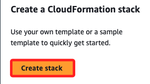
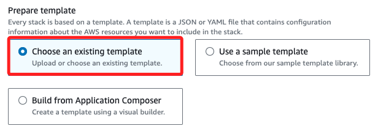
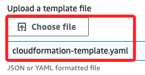
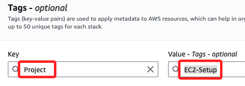

# YAML

_任務：使用 `.yaml` 一鍵式建立雲計算環境；這裡以 `EC2` 為例_

<br>

## 實作

_可用 `AWS CloudFormation` 完成一鍵式建立雲計算環境，透過 `.yaml` 或 `.json` 格式的模板來自動化基礎架構的部署和管理，部署 CloudFormation Stack 可通過控制台或 AWS CLI 進行。_ 

<br>

1. 搜尋並進入 `CloudFormation`。

    

<br>

2. 點擊 `Create stack`。

    

<br>

3. 在本地建立模板文件 `*.yaml`，命名為 `cloudformation-template.yaml`，內容如下；這個模板會自動建立一個 VPC、子網路、網際網路閘道、路由表、安全群組，並在此網路架構中啟動一個 EC2 實例。

```yaml
AWSTemplateFormatVersion: '2010-09-09'
Description: '使用 CloudFormation 一鍵式部署 EC2 實例的雲端環境'

Resources:
  MyVPC:
    Type: 'AWS::EC2::VPC'
    Properties: 
      CidrBlock: '10.0.0.0/16'
      EnableDnsSupport: true
      EnableDnsHostnames: true
      Tags: 
        - Key: Name
          Value: MyVPC

  MySubnet:
    Type: 'AWS::EC2::Subnet'
    Properties:
      VpcId: !Ref MyVPC
      CidrBlock: '10.0.1.0/24'
      MapPublicIpOnLaunch: true
      AvailabilityZone: 'us-east-1a'
      Tags:
        - Key: Name
          Value: MySubnet

  MyInternetGateway:
    Type: 'AWS::EC2::InternetGateway'
    Properties: 
      Tags:
        - Key: Name
          Value: MyInternetGateway

  AttachGateway:
    Type: 'AWS::EC2::VPCGatewayAttachment'
    Properties: 
      VpcId: !Ref MyVPC
      InternetGatewayId: !Ref MyInternetGateway

  MyRouteTable:
    Type: 'AWS::EC2::RouteTable'
    Properties: 
      VpcId: !Ref MyVPC
      Tags:
        - Key: Name
          Value: MyRouteTable

  MyRoute:
    Type: 'AWS::EC2::Route'
    DependsOn: AttachGateway
    Properties: 
      RouteTableId: !Ref MyRouteTable
      DestinationCidrBlock: '0.0.0.0/0'
      GatewayId: !Ref MyInternetGateway

  MySubnetRouteTableAssociation:
    Type: 'AWS::EC2::SubnetRouteTableAssociation'
    Properties: 
      SubnetId: !Ref MySubnet
      RouteTableId: !Ref MyRouteTable

  MySecurityGroup:
    Type: 'AWS::EC2::SecurityGroup'
    Properties: 
      # 使用英文描述
      GroupDescription: 'Allow HTTP and SSH traffic'
      VpcId: !Ref MyVPC
      SecurityGroupIngress: 
        - IpProtocol: tcp
          FromPort: '22'
          ToPort: '22'
          CidrIp: '0.0.0.0/0'
        - IpProtocol: tcp
          FromPort: '80'
          ToPort: '80'
          CidrIp: '0.0.0.0/0'
      Tags:
        - Key: Name
          Value: MySecurityGroup

  MyEC2Instance:
    Type: 'AWS::EC2::Instance'
    Properties: 
      InstanceType: 't2.micro'
      # 替換 Key Pair 名稱
      KeyName: 'my-key-pair'
      # 使用最新的 Amazon Linux AMI ID
      ImageId: 'ami-098143f68772b34f5'
      NetworkInterfaces: 
        - AssociatePublicIpAddress: true
          DeviceIndex: '0'
          SubnetId: !Ref MySubnet
          GroupSet: 
            - !Ref MySecurityGroup
      Tags:
        - Key: Name
          Value: MyEC2Instance
          
Outputs:
  InstanceId:
    Description: "EC2 Instance ID"
    Value: !Ref MyEC2Instance

  PublicIP:
    Description: "Public IP Address of EC2 Instance"
    Value: !GetAtt MyEC2Instance.PublicIp
```

<br>

4. 補充說明，EC2 安全群組的描述只接受 ASCII 字符，若使用中文描述導致創建失敗；以下是這類錯誤的訊息。

    

<br>

5. 點擊 `Choose an existing template`。

    

<br>

6. 選取 `Upload a template file`，然後點擊 `Choose file`。

    

<br>

7. 選擇前面編輯的腳本。

    

<br>

8. 可點擊 `View In Application Composer` 進行查看。

    

<br>

9. 顯示如下圖；`MyEC2Instance` 與 `MySecurityGroup` 相關聯，表示 EC2 實例放置在定義的安全群組中；`MySecurityGroup` 與 `MyVPC` 相關聯，代表安全群組被應用在建立的 VPC 中，而 `MyVPC` 中包含了 `子網路`、`路由表`、`網際網路閘道` 等定義。

    

<br>

10. 點擊 `Next`。

    

<br>

11. 命名為 `my-ec2-stack`，然後點擊 `Next`。

    

<br>

## Configure stack options

_配置堆疊選項_

<br>

1. _可_ 點擊添加標籤 `Add new tag`；將 Key 設置為 `Project`、Value 設置為 `EC2-Setup`；編輯標籤有利於更好地組織與識別資源，特別在有多個堆疊的狀況。

    

<br>

2. 其他使用預設，然後點擊最下方 `Next`。

    

<br>

3. 檢查後點擊 `Submit` 建立。

    

<br>

4. 接下來在運行過程中會先顯示 `CREATE_IN_PROGRESS`。

    

<br>

5. 右側會顯示過程中事件 `Events` 日誌。

    

<br>

## 

7. 使用 AWS CLI 部署 CloudFormation Stack；確保已安裝並配置好 AWS CLI；以下建立一個 CloudFormation Stack 並命名為 `my-ec2-stack`，並根據模板建立 EC2 實例及其相關的網路資源。

```bash
aws cloudformation create-stack \
  --stack-name my-ec2-stack \
  --template-body file://cloudformation-template.yaml \
  --capabilities CAPABILITY_NAMED_IAM
```


5. 部署完成後，使用 AWS CLI 獲取 EC2 實例信息驗證資源是否正確建立；這將返回 Stack 的詳細信息，並可使用返回的公有 IP 來連接到 EC2 實例。


```bash
aws cloudformation describe-stacks --stack-name my-ec2-stack
```


4. 使用 SSH 讀取 `Key Pair` 文件連接到 EC2 實例

```bash
ssh -i my-key-pair.pem ec2-user@<公共 IP>
```

5. 刪除 CloudFormation Stack。

```bash
aws cloudformation delete-stack --stack-name my-ec2-stack
```

6. 以上使用 AWS CloudFormation 和 YAML 模板一鍵式地建立雲計算環境，包含 VPC、子網路、網際網路閘道、安全群組，並啟動一個 EC2 實例；除此，可修改這個模板添加其他 AWS 資源如 S3、RDS 等。