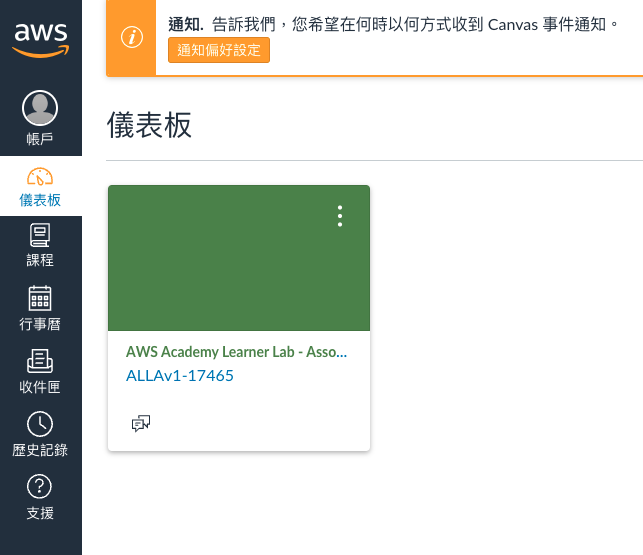
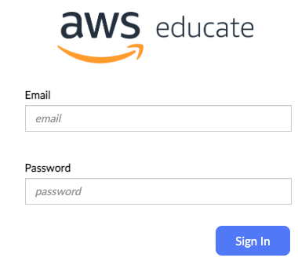
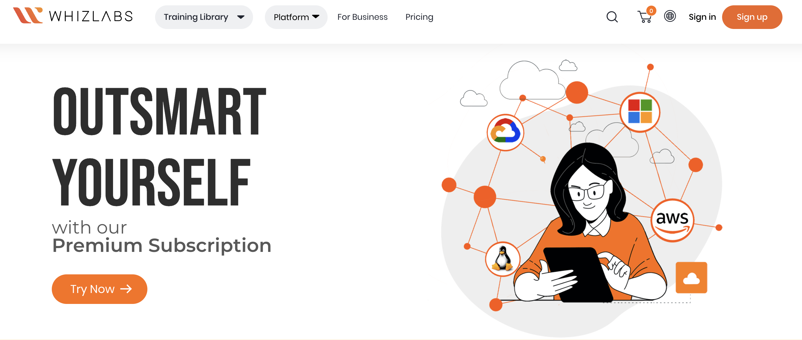
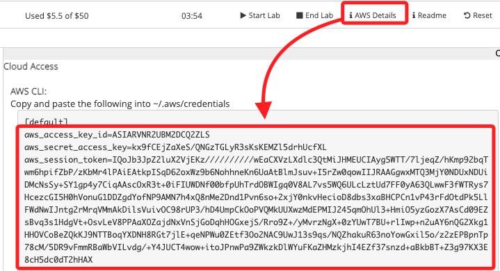

# AWS_2024

<br>

# aws academy

Aws academy [登入頁面](https://www.awsacademy.com/vforcesite/LMS_Login)


<br>

AWS academy [儀表板](https://awsacademy.instructure.com/)



<br>

# aws educate

登入 [aws educate](https://www.awseducate.com/signin/SiteLogin?language=en_US)



<br>

## 工具

_可用作互聯的工具很多，可多比較_

<br>

1. [winscp 載點](https://winscp.net/eng/download.php)

<br>

##  刷題

1. [whizlabs](https://www.whizlabs.com/)

    

<br>

## Lab 建立 AWS CLI 開發環境

_兩步驟完成 AWS CLI 設定_

<br>

1. 複製 AWS Details 中的密鑰到終端機運行。

    

<br>

2. 在終端機運行以下指令完成環境變數設定。

    ```bash
    export AWS_ACCESS_KEY_ID=$aws_access_key_id
    export AWS_SECRET_ACCESS_KEY=$aws_secret_access_key
    export AWS_SESSION_TOKEN=$aws_session_token
    ```

<br>
___

_未完_