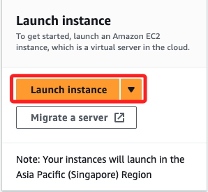
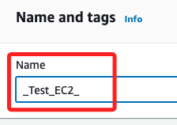
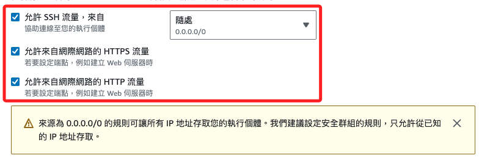
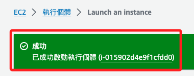
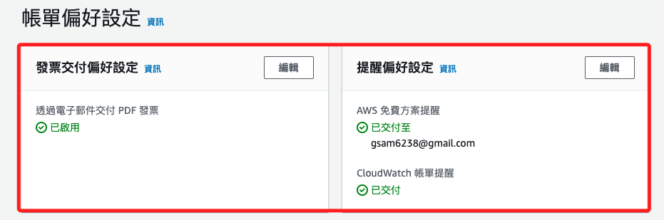
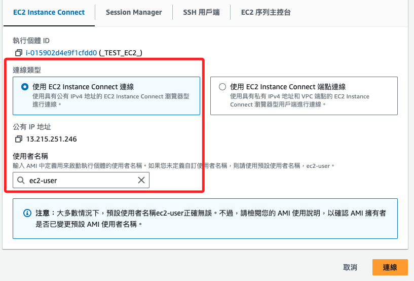
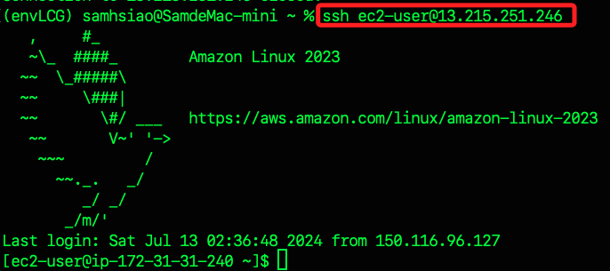

# EC2

<br>

## 說明

1. 進入面板後，點擊中央的 `Launch`。

    

<br>

2. 命名 `_TEST_EC2_`。

    

<br>

3. 先測試勉金鑰。

    

<br>

4. 僅測試，所以先將所有的連線都開啟。

    

<br>

5. 右下角點擊 `啟動`。

    

<br>

6. 很快完成啟動。

    

<br>

## 關於帳單

1. 點擊提醒。

    

<br>

2. 設定如下。

    

<br>

## 連線到執行個體

1. 點擊 `連線到執行個體`。

    

<br>

2. 記錄下連線資訊，點擊右下角的 `連線`。

    ```bash
    # 執行個體 ID
    i-015902d4e9f1cfdd0
    # 公有 IP
    13.215.251.246
    # 使用者名稱
    ec2-user
    ```

    

<br>

## 編輯 .ssh

_與 Linux 系統一致_

<br>

1. 進入 `.ssh`，使用 `nano` 編輯，無需 `sudo`。

    ```bash
    cd .ssh && nano authorized_keys
    ```

<br>

2. 複製本機的 `*.pub`，具體是哪個公鑰取決於建立的方式。

<br>

3. 貼到遠端的 `authorized_keys` 文件。

<br>

4. 連線。

    ```bash
    ssh ec2-user@13.215.251.246
    ```

    

<br>

___

_END_