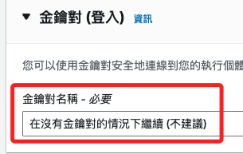
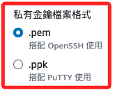
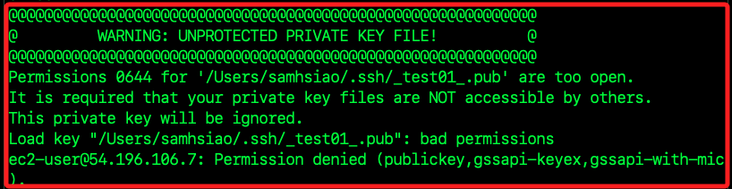
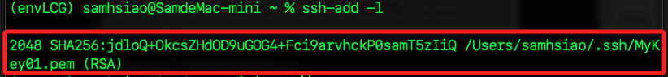

# EC2

<br>

## 說明

1. 進入面板後，點擊中央的 `Launch`。

    

<br>

2. 命名 `_TEST_EC2_`。

    

<br>

3. 先測試勉金鑰。

    

<br>

4. 僅測試，所以先將所有的連線都開啟。

    

<br>

5. 右下角點擊 `啟動`。

    

<br>

6. 很快完成啟動。

    

<br>

## 關於帳單

1. 點擊提醒。

    

<br>

2. 設定如下。

    

<br>

## 連線到執行個體

1. 點擊 `連線到執行個體`。

    

<br>

2. 記錄下連線資訊，點擊右下角的 `連線`。

    ```bash
    # 執行個體 ID
    i-015902d4e9f1cfdd0
    # 公有 IP
    13.215.251.246
    # 使用者名稱
    ec2-user
    ```

    

<br>

## 編輯 .ssh

_與 Linux 系統一致_

<br>

1. 進入 `.ssh`，使用 `nano` 編輯，無需 `sudo`。

    ```bash
    cd .ssh && nano authorized_keys
    ```

<br>

2. 複製本機的 `*.pub`，具體是哪個公鑰取決於建立的方式。

<br>

3. 貼到遠端的 `authorized_keys` 文件。

<br>

4. 連線。

    ```bash
    ssh ec2-user@13.215.251.246
    ```

    

<br>

## 建立新的金鑰

1. 也可以建立新的金鑰。

    

<br>

2. 命名金鑰。

    

<br>

3. 依據連線方式選擇建立哪一種金鑰。

    

<br>

4. 先測試使用 `.pem`，並使用 `RSA` 即可，然後點擊 `建立金鑰對`。

    

<br>

5. 點擊之後會自動下載到本地，名稱就是自訂的 `MyKey01.pem`。

    

<br>

6. 將下載的文件放入指定位置，可以統一放在 `.ssh` 資料夾中管理。

<br>

7. 使用以下指令進行連線。

    ```bash
    ssh -i ~/.ssh/MyKey01.pem ec2-user@52.221.239.188
    ```

<br>

8. 得到以下訊息表示權限太寬鬆，所以拒絕連線，必須設置為只有擁有者可以讀取的權限。

    

<br>

9. 修正權限為 `400`。

    ```bash
    chmod 400 ~/.ssh/MyKey01.pem
    ```

<br>

## 將金鑰添加到 SSH 代理

1. 添加 .pem 文件到 SSH agent。

    ```bash
    ssh-add ~/.ssh/MyKey01.pem
    ```

    

<br>

2. 查詢當前已添加的私密金鑰。

    ```bash
    ssh-add -l
    ```

    

<br>

## 配置 SSH 文件

1. 編輯 `~/.ssh/config` 文件。

    ```bash
    code ~/.ssh/config
    ```

<br>

2. 加入以下設定；補充說明，因為已經寫入 SSH agent，所以不用加入 `IdentityFile` 也可以。

    ```bash
    Host myec2
        HostName 52.221.239.188
        User ec2-user
        IdentityFile ~/.ssh/MyKey01.pem
    ```

<br>

3. 同樣使用 SSH 連線。

    ```bash
    ssh myec2
    ```

<br>

___

_END_