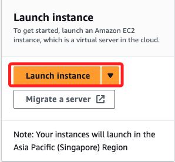
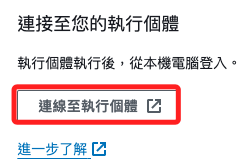
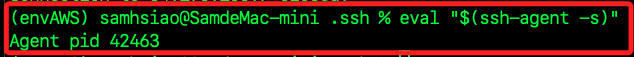

# EC2

<br>

## 說明

1. 進入面板後，點擊中央的 `Launch 啟動新的執行個體`。

    

<br>

2. 命名 `_TEST_EC2_`。

    

<br>

3. 測試階段可免用金鑰。

    

<br>

## 建立新的金鑰

_金鑰對並不是由 EC2 所建立，而是在使用 EC2 時自行創建的，用於 SSH 登入 EC2 執行個體，提供身份驗證的方式；私鑰保存在本地，公鑰則儲存在 EC2 執行個體上。_

<br>

1. 可依據建議點擊 `建立新的金鑰對`。

    

<br>

2. 任意命名如 `_test01_`，然後使用一般的 `RSA` 進行加密，格式使用預設的 `.pem` 即可。 

    

<br>

3. 點擊右下角 `建立金鑰對`，會自動下載到本地電腦中。

    

<br>

## 網路設定

_繼續設定_

<br>

1. 在 VPC 部分，預設會建立一個 VPC，這部分不用做設定。

    

<br>

2. 假如因故不存在，可點擊 `建立新的預設 VPC`，否則無法完成個體的建立。

    

<br>

3. 進入後點擊 `建立預設 VPC`。

    

<br>

4. 建立完成，回到執行個體頁面，刷新 VPC 後選取預設的 VPC 及子網路。

    

<br>

5. 這裡進行簡易的測試練習，所以先將所有的連線都開啟。

    

<br>

6. 右下角點擊 `啟動執行個體`。

    

<br>

7. 很快完成啟動；可點擊右下角的 `檢視所有執行個體` 進行查看。

    

<br>

8. 在這個步驟要 _手動刷新網頁_，然後稍作等待讓 EC2 完成啟動。

    

<br>

9. 可多次手動刷新網頁確認當前狀態，這個訊息不會自動刷新。

    

<br>

10. 點擊執行個體進入後，也可在下方的 `狀態和警示` 頁籤中也可看到資訊。

    

<br>

## 關於帳單

_開始使用之前，可先了解一下方案與費用_

<br>

1. 點擊提醒。

    

<br>

2. 設定如下。

    

<br>

## 連線到執行個體

1. 點擊 `連線到執行個體`。

    

<br>

2. 或是點擊 `執行個體 ID` 後，從右上方選單中點擊 `連線`。

    

<br>

3. 可連線資訊做個紀錄，在其他步驟也會用到，其中預設的使用者名稱為 `ec2-user`；點擊右下角的 `連線`。

    ```bash
    # 執行個體 ID
    i-015902d4e9f1cfdd0
    # 公有 IP
    13.215.251.246
    # 使用者名稱
    ec2-user
    ```

    

<br>

4. 啟動網頁版的 Shell，可使用 Linux 指令進行操作。

    

<br>

## 設定 SSH 文件

_以下在 AWS Shell 中編輯 EC2 的 `.ssh` 文件，操作與其他 Linux 系統是一樣的_

<br>

1. 進入 `.ssh`，使用 `nano` 編輯，無需 `sudo`。

    ```bash
    cd .ssh && nano authorized_keys
    ```

<br>

2. 複製本機 `~/.ssh` 資料夾內的 `*.pub` 文件，具體選擇哪個公鑰取決於對加密方式的要求，以及相關設定的規劃；若無密鑰對存在，可在本機執行 `ssh-keygen` 指令生成，其他的生成方式另作說明。

    

<br>

3. 貼到遠端的 `authorized_keys` 文件。

    

<br>

4. 再次運行連線指令，SSH 將自動驗證密鑰進行連線，免輸入密碼。

    ```bash
    ssh ec2-user@13.215.251.246
    ```

    

<br>

## 使用指定的 `.pem` 文件進行連線

_在前面步驟若有建立新的金鑰可跳過 `1~5`，第 `6` 點開始說明如何指定 `.pem`_

<br>

1. 也可以建立新的金鑰。

    

<br>

2. 命名金鑰。

    

<br>

3. 依據連線方式選擇建立哪一種金鑰。

    

<br>

4. 先測試使用 `.pem`，並使用 `RSA` 即可，然後點擊 `建立金鑰對`。

    

<br>

5. 點擊之後會自動下載到本地，名稱就是自訂的 `_test01_.pem`。

    

<br>

6. 將下載的文件如 `_test01_.pem` 移動到指定位置，建議統一放在 `.ssh` 資料夾中管理。

    ```bash
    mv ~/Downloads/_test01_.pem ~/.ssh
    ```

<br>

7. 使用指令轉換 `.pem` 文件為 `.pub`。

    ```bash
    ssh-keygen -y -f ~/.ssh/_test01_.pem > ~/.ssh/_test01_.pub
    ```

<br>

8. 確保 .pub 文件具有正確的權限，需設定權限為 `400`。

    ```bash
    chmod 400 ~/.ssh/_test01_.pub
    ```

<br>

9. 若未設定正確權限，可能得到以下訊息表示權限太寬鬆而拒絕連線，應設置為只有擁有者可以讀取的權限 `400`。

    

<br>

10. 參考之前步驟，先複製這個 `.pub` 文件。

    ```bash
    cat ~/.ssh/_test01_.pub
    ```

<br>

11. 再次使用 AWS SHELL 編輯文件。

    ```bash
    nano authorized_keys
    ```

<br>

12. 貼上 `.pub` 文件內容，這時會有兩行，無需斷行標點符號。

    

<br>

13. 使用以下指令進行連線，連線前先查看執行個體的公共 IP 地址。

    ```bash
    ssh <EC2 使用者名稱>@<EC2 的公共 IP>
    
    # 如
    ssh ec2-user@54.196.106.7
    ```

<br>

## 將 `.pem` 添加到 SSH 代理

_效果類似於轉換為 `.pub` 文件並寫入遠端 `authorized_keys` 文件_

<br>

1. 確保 SSH agent 正在運行。

    ```bash
    eval "$(ssh-agent -s)"
    ```

    

<br>

2. 將 `.pem` 文件添加到 `SSH agent`。

    ```bash
    ssh-add ~/.ssh/_test01_.pem
    ```

    

<br>

3. 查詢當前已添加的私鑰。

    ```bash
    ssh-add -l
    ```

    

<br>

4. 連線。

    ```bash
    ssh ec2-user@54.196.106.7
    ```

<br>

## 配置 SSH 文件透過 `.pem` 連線

1. 編輯 `~/.ssh/config` 文件。

    ```bash
    code ~/.ssh/config
    ```

<br>

2. 加入以下設定；補充說明，因為已經寫入 SSH agent，所以不用加入 `IdentityFile` 也可以。

    ```bash
    Host myec2
        HostName 52.221.239.188
        User ec2-user
        IdentityFile ~/.ssh/MyKey01.pem
    ```

<br>

3. 同樣使用 SSH 連線。

    ```bash
    ssh myec2
    ```

<br>

___

_END_