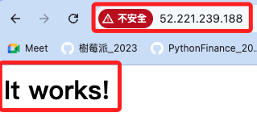

# LAMP

_將實體 instance 規劃為 LAMP server_

<br>

## 說明

1. LAMP 就是 Linux, Apache, MySQL/MariaDB, PHP/Perl/Python，而 LAMP 伺服器可用在許多方面，如網站托管、Web 應用程式開發、內容管理系統（CMS）、資料庫管理等。

<br>

2. 以下將說明在 Amazon Linux 2023 上，透過指令在 EC2 終端機中運行安裝 LAMP 堆疊。

<br>

## 檢查系統版本

1. 查看系統使用的 Linux 發行版。

    ```bash
    cat /etc/os-release
    ```

    _輸出_

    ```bash
    NAME="Amazon Linux"
    VERSION="2023"
    ID="amzn"
    ID_LIKE="fedora"
    VERSION_ID="2023"
    PLATFORM_ID="platform:al2023"
    PRETTY_NAME="Amazon Linux 2023.5.20240708"
    ANSI_COLOR="0;33"
    CPE_NAME="cpe:2.3:o:amazon:amazon_linux:2023"
    HOME_URL="https://aws.amazon.com/linux/amazon-linux-2023/"
    DOCUMENTATION_URL="https://docs.aws.amazon.com/linux/"
    SUPPORT_URL="https://aws.amazon.com/premiumsupport/"
    BUG_REPORT_URL="https://github.com/amazonlinux/amazon-linux-2023"
    VENDOR_NAME="AWS"
    VENDOR_URL="https://aws.amazon.com/"
    SUPPORT_END="2028-03-15"
    ```

<br>

2. 特別注意，依據結果得知系統使用的是 `Amazon Linux 2023`，這個版本的 Amazon Linux 使用 `dnf` 來管理軟體庫，不使用 `amazon-linux-extras`，所以舊版指令如 `sudo amazon-linux-extras install` 並不適用。

<br>

### 安裝 Apache

1. 更新套件管理器並安裝 Apache。

    ```bash
    sudo dnf update -y && sudo dnf install -y httpd
    ```

<br>

2. 啟動並設置 Apache 在開機時啟動。

    ```bash
    sudo systemctl start httpd && sudo systemctl enable httpd
    ```

<br>

3. 查看 httpd 狀態。

    ```bash
    service httpd status
    ```

<br>

4. 若未啟動，則啟動服務並設定為開機啟動。

    ```bash
    sudo systemctl start httpd && sudo systemctl enable httpd
    ```

<br>

## 安裝 MariaDB

1. 安裝 MariaDB。

    ```bash
    sudo dnf install -y mariadb105-server
    ```

<br>

2. 啟動並設置 MariaDB 在開機時啟動。

    ```bash
    sudo systemctl start mariadb && sudo systemctl enable mariadb
    ```

<br>

3. 檢查 MariaDB 伺服器的運行狀態。

    ```bash
    sudo systemctl status mariadb
    ```

<br>

## 配置 MariaDB

1. 執行 MariaDB 安全設置腳本來配置 root 密碼和其他安全選項。

        ```bash
        sudo mysql_secure_installation
        ```

<br>

2. 設定與一般設定時相同，這裡暫時略過。

## 安裝 PHP

1. 安裝 PHP 及相關模組。

    ```bash
    sudo dnf install -y php php-mysqlnd
    ```

<br>

2. 重新啟動 Apache 以載入 PHP 模組。

    ```bash
    sudo systemctl restart httpd
    ```

<br>

## 測試 LAMP 堆疊

1. 創建一個 PHP 測試文件。

    ```bash
    echo "<?php phpinfo(); ?>" | sudo tee /var/www/html/info.php
    ```

<br>

2. 可直接訪問 `EC2 的公有 IP`，會顯示 Apache 的預設首頁 `It works!`。

    

<br>

3. 可編輯指定的內容再次刷新。

    ```bash
    echo "<html><body><h1>這是我自訂的網頁內容</h1></body></html>" | sudo tee /var/www/html/index.html
    ```

    

<br>

4. 或訪問 `http://<EC2 的公有 IP>/info.php` 可看到 PHP 信息頁面。

    ```bash
    52.221.239.188/info.php
    ```

<br>

## 透過 VSCode

1. 由於前面已經設定好 `/.ssh/config` 文件，可直接使用 VSCode 進行訪問，這兩個設定皆已無需輸入密碼，一個使用 `.pem`，一個使用。

    ```bash
    Host myec2
    HostName 52.221.239.188
    User ec2-user
    IdentityFile ~/.ssh/MyKey01.pem

    Host myec22
    HostName 52.221.239.188
    User ec2-user
    ```

<br>

2. 但透過 VSCode 是無法運行 `sudo` 的權限的，所以先進入終端查看文件權限設定。

    ```bash
    ls -l /var/www/html/index.html
    ```

    _結果：644_

    ```bash
    -rw-r--r--. 1 root root 66 Jul 13 07:17 /var/www/html/index.html
    ```

<br>

3. 更改文件權限。

    ```bash
    sudo chmod 664 /var/www/html/index.html
    ```

<br>

4. 也可以更改擁有者，不過我比較建議慣用一種方式授權，編輯完成後就改回來，這樣比較好管理。

    ```bash
    sudo chown ec2-user:ec2-user /var/www/html/index.html
    ```

<br>

## 確認套件名稱

1. 若出現類似於以下訊息。

    ```bash
    [ec2-user@ip-172-31-26-228 ~]$ sudo dnf install -y mariadb-server
    Last metadata expiration check: 3:17:35 ago on Sat Jul 13 03:27:59 2024.
    No match for argument: mariadb-server
    Error: Unable to find a match: mariadb-server
    ```

<br>

2. 查找 MariaDB 的可用包，依據結果，將安裝 `mariadb105-server`。

    ```bash
    sudo dnf search mariadb
    ```

    _結果_

    ```bash
    Last metadata expiration check: 3:18:20 ago on Sat Jul 13 03:27:59 2024.
    ======================= Name & Summary Matched: mariadb ========================
    mariadb-connector-c.x86_64 : The MariaDB Native Client library (C driver)
    mariadb-connector-c-devel.x86_64 : Development files for mariadb-connector-c
    mariadb-connector-c-test.x86_64 : Testsuite files for mariadb-connector-c
    mariadb105-connect-engine.x86_64 : The CONNECT storage engine for MariaDB
    mariadb105-devel.x86_64 : Files for development of MariaDB/MySQL applications
    mariadb105-oqgraph-engine.x86_64 : The Open Query GRAPH engine for MariaDB
    mariadb105-pam.x86_64 : PAM authentication plugin for the MariaDB server
    mariadb105-rocksdb-engine.x86_64 : The RocksDB storage engine for MariaDB
    mariadb105-server.x86_64 : The MariaDB server and related files
    mariadb105-server-utils.x86_64 : Non-essential server utilities for
                                : MariaDB/MySQL applications
    mariadb105-sphinx-engine.x86_64 : The Sphinx storage engine for MariaDB
    mariadb105-test.x86_64 : The test suite distributed with MariaDB
    perl-DBD-MariaDB.x86_64 : MariaDB and MySQL driver for the Perl5 Database
                            : Interface (DBI)
    perl-DBD-MariaDB-tests.x86_64 : Tests for perl-DBD-MariaDB
    ============================ Name Matched: mariadb =============================
    mariadb-connector-c-config.noarch : Configuration files for packages that use
                                    : /etc/my.cnf as a configuration file
    mariadb105.x86_64 : A very fast and robust SQL database server
    mariadb105-backup.x86_64 : The mariabackup tool for physical online backups
    mariadb105-common.x86_64 : The shared files required by server and client
    mariadb105-cracklib-password-check.x86_64 : The password strength checking
                                            : plugin
    mariadb105-errmsg.x86_64 : The error messages files required by server and
                            : embedded
    mariadb105-gssapi-server.x86_64 : GSSAPI authentication plugin for server
    =========================== Summary Matched: mariadb ===========================
    mysql-selinux.noarch : SELinux policy modules for MySQL and MariaDB packages
    ```

<br>

___

_END_