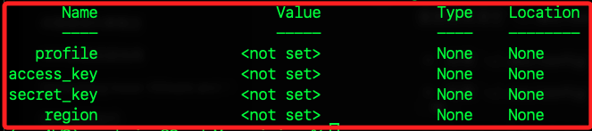

# 清除 AWS CLI 在本地的 IAM 設定

_刪除或重置相關的設定檔案_

<br>

## 準備工作

_安裝 AWS CLI，另外也可使用腳本安裝，這裡僅示範使用 brew 安裝_

<br>

1. 使用 Homebrew 安裝。

    ```bash
    brew install awscli
    ```

<br>

2. 驗證安裝。

    ```bash
    aws --version
    ```

<br>

## 刪除 AWS CLI 配置檔案

1. AWS CLI 玉社的配置與認證檔案分別儲存在 `~/.aws/config` 和 `~/.aws/credentials` 中，可手動刪除達到重置目的。

    ```bash
    rm ~/.aws/config
    rm ~/.aws/credentials
    ```

<br>

2. 也可以清空檔案的內容達到相同目的；這個指令本身不會對文件進行任何寫入操作，只是確保文件存在並且內容為空，常用於重置配置文件的情境。

    ```bash
    > ~/.aws/config
    > ~/.aws/credentials
    ```

<br>

3. 使用 AWS CLI 指令 `aws configure` 來刪除配置文件中的指定配置。

    ```bash
    aws configure set aws_access_key_id "" --profile default
    aws configure set aws_secret_access_key "" --profile default
    aws configure set region "" --profile default
    ```

<br>

4. 確認配置是否已經被清空。

    ```bash
    aws configure list
    ```

    

<br>

___

_END_