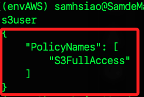
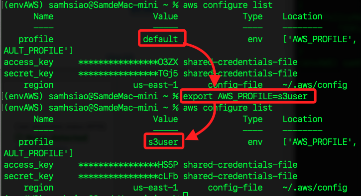
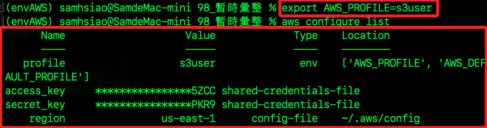

# 添加政策

<br>

## 步驟

1. 建立一個 JSON 文件如 `s3_policy.json` 用來定義用戶的訪問權限。

    ```bash
    touch s3_policy.json
    ```

<br>

2. 編輯政策文件，允許用戶對 S3 進行完全控制。

    ```json
    {
        "Version": "2012-10-17",
        "Statement": [
            {
                "Effect": "Allow",
                "Action": [
                    "s3:ListAllMyBuckets",
                    "s3:ListBucket",
                    "s3:GetBucketLocation",
                    "s3:CreateBucket",
                    "s3:DeleteBucket",
                    "s3:PutObject",
                    "s3:GetObject",
                    "s3:DeleteObject"
                ],
                "Resource": "*"
            }
        ]
    }
    ```

<br>

3. 將政策文件指定給用戶 `s3user`；特別注意，這涉及到政策文件路徑，所以要確保路徑正確。

    ```bash
    aws iam put-user-policy --user-name s3user --policy-name S3FullAccess --policy-document file://s3_policy.json
    ```

<br>

4. 確認指定用戶如 `s3user` 當前附加的政策列表。

    ```bash
    aws iam list-user-policies --user-name s3user
    ```

    

<br>

5. 使用指定用戶 `s3user` 的憑證配置 AWS CLI。

    ```bash
    aws configure --profile s3user
    ```

<br>

6. 配置好 profile，必須指定 profile 來切換用戶，如 `s3user`。

    ```bash
    export AWS_PROFILE=s3user
    ```

    

<br>

7. 查詢指定用戶的區域。

    ```bash
    aws configure get region --profile s3user
    ```

<br>

8. 查詢指定用戶的所有設定。

    ```bash
    aws configure list --profile s3user
    ```

<br>

9. 查詢全部 IAM 使用者資訊。

    ```bash
    aws iam list-users
    ```

<br>

## 錯誤排除

1. 使用指令 `aws iam list-users` 查詢時出錯，這是由於當前使用的 IAM 使用者 `s3user` 沒有執行 `iam:ListUsers` 操作的權限。

    ```bash
    An error occurred (AccessDenied) when calling the ListUsers operation: User: arn:aws:iam::891377311393:user/s3user is not authorized to perform: iam:ListUsers on resource: arn:aws:iam::891377311393:user/ because no identity-based policy allows the iam:ListUsers action
    ```

<br>

2. 建立一個政策文件 `policy.json`，內容如下。

    ```json
    {
        "Version": "2012-10-17",
        "Statement": [
            {
                "Effect": "Allow",
                "Action": "iam:ListUsers",
                "Resource": "*"
            }
        ]
    }
    ```

<br>

3. 切換使用者為 `root`。

    ```bash
    aws configure --profile root
    ```

<br>

4. 使用 `root` 為 `s3user` 附加這個政策。

    ```bash
    aws iam put-user-policy --user-name s3user --policy-name ListUsersPolicy --policy-document file://policy.json --profile root
    ```

<br>

5. 切換到指定使用者 `s3user` 的配置檔案。

    ```bash
    export AWS_PROFILE=s3user
    ```

<br>

6. 確認當前使用者。

    ```bash
    aws configure list
    ```

    

<br>

___

_END_