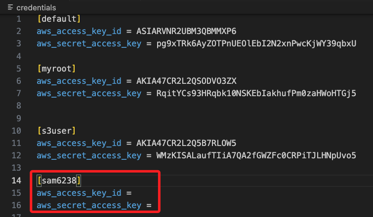

# 一次性查詢所有帳號當期帳單

_通過遍歷配置文件中的多個 AWS Profile 來實現_

<br>

## 環境設置

1. 進入本地設定文件中，接著要編輯兩個文件 `config`、`credentials`。

    ```bash
    cd ~/.aws
    ```

<br>

2. 在 `credentials` 中必須紀錄每個帳號的 id 及 key，使用的 Section 格式為 [<識別符>]。

    

<br>

3. 在 `config` 中設定區域及輸出格式，Section 格式在 <識別符> 之前，除了 `default` 之外，加上 `peofile`；特別注意，這是 AWS CLI 標準的配置方式，用於定義多個帳號或角色的配置，有利於區分 default 配置和其他用戶定義的配置；如果在配置文件中直接使用 [<識別符>]，而不加 `profile` 前綴，這仍是有效的配置，AWS CLI 和 boto3 會將其視為一個自定義的配置；兩者在 AWS CLI 行為上沒有區別，但使用 `[profile <name>]` 是一種更規範的寫法。

<br>

## 範例

1. 在 `profiles` 列表中添加配置文件中所有 Profile，並逐個查詢每個帳號的成本。

<br>

2. 使用 `boto3.Session(profile_name=profile)` 創建 `Session`，這樣可以在每個 Profile 下進行獨立的查詢。

<br>

3. 根據 `start_of_this_month` 和當前日期 `today` 查詢當月的成本數據。

<br>

4. 通過遍歷 `response['ResultsByTime']` 來計算每個帳號的總成本。

<br>

5. 完整代碼。

    ```python
    import boto3
    from datetime import datetime

    def get_cost_and_usage(client, start_date, end_date):
        # 使用成本探查者（Cost Explorer）API
        response = client.get_cost_and_usage(
            TimePeriod={
                'Start': start_date,
                'End': end_date
            },
            Granularity='MONTHLY',
            Metrics=['UnblendedCost']
        )
        return response

    def print_cost_report(response, account_name, period_description):
        total_amount = 0.0
        for result in response['ResultsByTime']:
            print(f"\nCost report for account {account_name} ({period_description}):")
            for group in result.get('Groups', []):
                amount = float(group['Metrics']['UnblendedCost']['Amount'])
                total_amount += amount

        print(f"Total cost for account {account_name}: {total_amount:.2f} USD")

    def main():
        # 定義查詢的時間範圍（當月到今天）
        today = datetime.utcnow().date()
        start_of_this_month = today.replace(day=1).isoformat()
        
        # 列出需要查詢的 AWS profiles
        profiles = ['default', 'myroot', 's3user', 'sam6238', 'samhsiao6238', 'sam6237', 'sam6239', 'ugmail', 'unccu']

        for profile in profiles:
            # 使用指定的 profile 來創建會話
            session = boto3.Session(profile_name=profile)
            client = session.client('ce')
            
            # 查詢當月的成本和使用情況
            response_this_month = get_cost_and_usage(client, start_of_this_month, today.isoformat())
            
            # 打印當月的總成本
            print_cost_report(response_this_month, profile, "This month to date")

    if __name__ == "__main__":
        main()
    ```

<br>

6. 運行後可看到每個 Profile 都會有一個當月成本報告。

    ```bash
    Cost report for account myroot (This month to date):
    Total cost for account myroot: 10.25 USD

    Cost report for account s3user (This month to date):
    Total cost for account s3user: 5.50 USD

    ...
    ```

<br>

___

_END_

