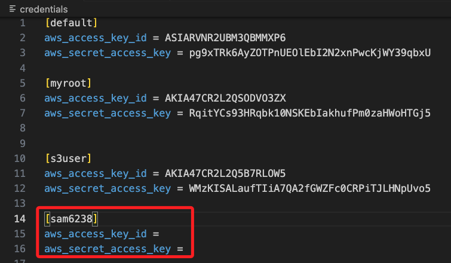

# 批次查詢當期帳單

_通過遍歷配置文件中的多個 AWS Profile 來實現_

<br>

## 環境設置

1. 進入本地設定文件中，接著要編輯兩個文件 `config`、`credentials`。

    ```bash
    cd ~/.aws
    ```

<br>

2. 在 `credentials` 中必須紀錄每個帳號的 id 及 key，使用的 Section 格式為 `[<識別符>]`。

    

<br>

3. 在 `config` 中設定區域及輸出格式，Section 格式在 <識別符> 之前，除了 `default` 之外，加上 `peofile`；特別注意，這是 AWS CLI 標準的配置方式，用於定義多個帳號或角色的配置，有利於區分 default 配置和其他用戶定義的配置；如果在配置文件中直接使用 [<識別符>]，而不加 `profile` 前綴，這仍是有效的配置，AWS CLI 和 boto3 會將其視為一個自定義的配置；兩者在 AWS CLI 行為上沒有區別，但使用 `[profile <name>]` 是一種更規範的寫法。

<br>

## 範例

1. 在 `profiles` 列表中添加 AWS 配置文件中的有效 Profile，例如 `'default', 'samhsiao6238', 'sam6237'`，並對每個 Profile 進行獨立的成本查詢。

<br>

2. 使用 `boto3.Session(profile_name=profile)` 建立會話，這樣可以根據指定的 AWS Profile 在不同的帳號環境中進行查詢。

<br>

3. 定義查詢時間範圍：通過 `start_of_this_month` 設定從當月開始到當前日期 `today` 的查詢範圍，專注於當月的成本。

<br>

4. 使用 `get_cost_and_usage` 函數進行 API 請求，每次查詢時會發送到 AWS Cost Explorer API，並根據設置的查詢參數返回成本數據。

<br>

5. 通過 `GroupBy` 按服務分組：使用 `GroupBy` 按照服務類型對成本數據進行分組，從而能夠查看不同 AWS 服務的詳細成本。

<br>

6. 遍歷 `response['ResultsByTime']` 來計算每個帳號的總成本，並逐個輸出每個服務的成本數據，以及最終合計的總成本。

<br>

7. 調用 `print_cost_report` 函數進行報告輸出：每個帳號的成本結果將會以友好的格式輸出，列出每個服務的成本及總和。

<br>

8. 完整代碼。

    ```python
    import boto3
    from datetime import datetime

    # 使用成本探查者（Cost Explorer）API
    def get_cost_and_usage(client, start_date, end_date):
        response = client.get_cost_and_usage(
            TimePeriod={
                'Start': start_date,
                'End': end_date
            },
            Granularity='MONTHLY',
            Metrics=['UnblendedCost'],
            GroupBy=[
                {
                    'Type': 'DIMENSION',
                    'Key': 'SERVICE'
                }
            ]
        )
        return response

    # 輸出成本報告
    def print_cost_report(response, account_name, period_description):
        print(f"\nCost report for account {account_name} ({period_description}):")
        total_amount = 0.0
        for result in response['ResultsByTime']:
            print(f"Time Period: {result['TimePeriod']['Start']} - {result['TimePeriod']['End']}")
            if 'Groups' in result:
                for group in result['Groups']:
                    service = group['Keys'][0]
                    amount = group['Metrics']['UnblendedCost']['Amount']
                    unit = group['Metrics']['UnblendedCost']['Unit']
                    print(f"Service: {service}, Amount: {amount} {unit}")
                    total_amount += float(amount)
            else:
                print("No cost data found for this time period.")
        
        print(f"Total cost for account {account_name}: {total_amount:.2f} USD")

    # 主程序
    def main():
        # 定義查詢的時間範圍（當月到今天）
        today = datetime.utcnow().date()
        start_of_this_month = today.replace(day=1).isoformat()
        
        # 列出需要查詢的 AWS profiles
        profiles = ['default', 'samhsiao6238', 'sam6237']

        for profile in profiles:
            # 使用指定的 profile 來建立會話
            session = boto3.Session(profile_name=profile)
            client = session.client('ce')
            
            # 查詢當月的成本和使用情況
            response_this_month = get_cost_and_usage(client, start_of_this_month, today.isoformat())
            
            # 輸出當月的總成本
            print_cost_report(response_this_month, profile, "This month to date")

    if __name__ == "__main__":
        main()
    ```

<br>

9. 運行後可看到每個 Profile 都會有一個當月成本報告。

    ```bash
    Cost report for account default (This month to date):
    Time Period: 2024-09-01 - 2024-09-28
    Service: Amazon DynamoDB, Amount: 0 USD
    Service: Amazon Elastic File System, Amount: 0.0000242952 USD
    Service: Amazon Rekognition, Amount: 0.0001386658 USD
    Service: AmazonCloudWatch, Amount: 0 USD
    Service: Tax, Amount: 0 USD
    Total cost for account default: 0.00 USD

    Cost report for account samhsiao6238 (This month to date):
    Time Period: 2024-09-01 - 2024-09-28
    Service: Amazon Simple Storage Service, Amount: 0.0000000078 USD
    Service: AmazonCloudWatch, Amount: 0 USD
    Total cost for account samhsiao6238: 0.00 USD

    Cost report for account sam6237 (This month to date):
    Time Period: 2024-09-01 - 2024-09-28
    Service: AWS Key Management Service, Amount: 0 USD
    Service: Amazon Relational Database Service, Amount: 0.0082391832 USD
    Service: Amazon Virtual Private Cloud, Amount: 0.33419722 USD
    Service: AmazonCloudWatch, Amount: 0 USD
    Service: Tax, Amount: 0.02 USD
    Total cost for account sam6237: 0.36 USD
    ```

<br>

___

_END_

