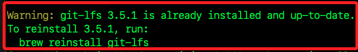
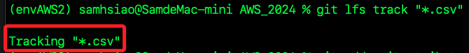
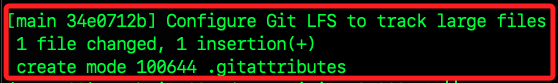

# 大型文件

_可在倉庫中啟用 Git Large File Storage (LFS) 來管理大型文件，這包含已在 GitHub 上建立的倉庫_

<br>

## 在現有倉庫啟用 Git LFS

1. 如果還未安裝 Git LFS，請先安裝。

    ```bash
    brew install git-lfs
    ```

<br>

2. 假如提示重新安裝則依照指示運行。

    ```bash
    brew reinstall git-lfs
    ```

    

<br>

3. 進入現有倉庫目錄；務必確認已定位在正確路徑。

    ```bash
    cd <正確路徑>
    ```

<br>

4. 在現有的倉庫中啟用 Git LFS。

    ```bash
    git lfs install
    ```

<br>

5. 指定需要使用 Git LFS 追蹤的文件類型，例如要追蹤 `.csv` 文件，可設置如下，這會在倉庫中生成或更新 `.gitattributes` 文件，以指定哪些類型的文件應該由 Git LFS 管理。

    ```bash
    git lfs track "*.csv"
    ```

    

<br>

6. 提交 `.gitattributes` 文件，以確保其他協作者在克隆這個倉庫時也能自動使用 Git LFS。

    ```bash
    git add .gitattributes
    git commit -m "Configure Git LFS to track large files"
    ```

    

<br>

## 重新加入並提交文件

_對於已經存在於倉庫並超過 GitHub 大小限制的文件，需要重新加入以讓 Git LFS 接管_

<br>

1. 從 Git 暫存區中移除大型文件，這不會刪除本地文件。

    ```bash
    git rm --cached path/to/largefile.csv
    ```

<br>

2. 使用 Git LFS 重新追蹤並提交文件。

    ```bash
    git add path/to/largefile.csv
    git commit -m "Add large file using Git LFS"
    ```

<br>

## 推送到遠端儲存庫

1. 將更改推送到 GitHub，Git LFS 會自動將這些大型文件上傳到 LFS 儲存空間。

    ```bash
    git push origin main
    ```

<br>

___

_END_