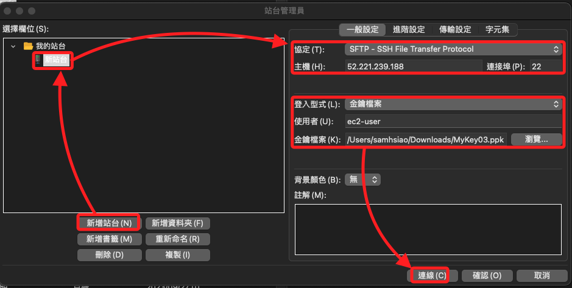
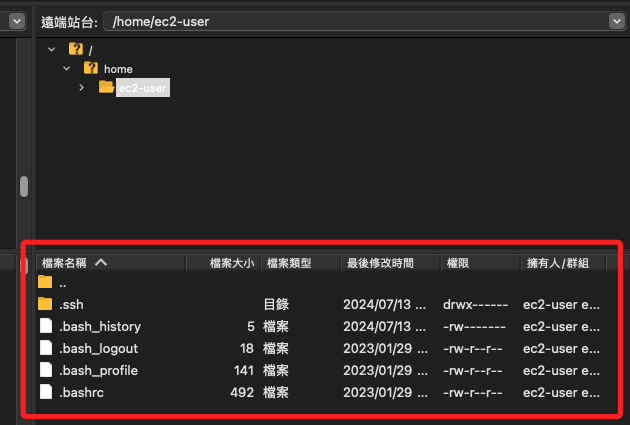

# 使用 `.ppk` 文件作為 SSH 金鑰

_使用 FileZilla 連接 EC2 實例_

<br>

## 載點

1. [FileZilla 載點](https://filezilla-project.org/download.php?platform=osx)

<br>

2. [PuTTY 載點](https://www.chiark.greenend.org.uk/~sgtatham/putty/latest.html)

<br>

## 手動轉換

_轉換 .pem 文件為 .ppk 文件_

<br>

1. 使用 `PuTTYgen` 工具，先安裝 [PuTTY](https://www.chiark.greenend.org.uk/~sgtatham/putty/latest.html)。

<br>

2. 打開 `PuTTYgen`，點擊 `Load`，選擇 `.pem` 文件；點擊 `Save private key` 將其保存為 `.ppk` 文件。

<br>

## 使用 FileZilla 使用

1. 進入 `File` 選單，選擇 `Site Manager`。

<br>

2. 點擊 `New Site`，設置以下參數。

    ```bash
    Protocol: SFTP - SSH File Transfer Protocol
    Host:  EC2 公共 IP 地址（例如：52.221.239.188）
    Port: 22
    Logon Type: Key file
    User: ec2-user（或適合 AMI 的用戶名，例如 `ubuntu`）
    Key file: 選擇 `.ppk` 文件
    ```

    

<br>

3. 完成後點擊 `Connect`，FZ 右側會顯示遠端電腦內容。

    

<br>

___

_END_