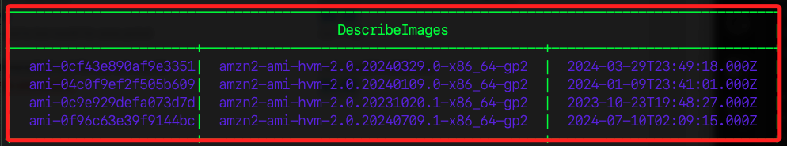
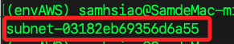
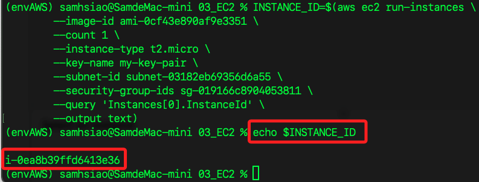
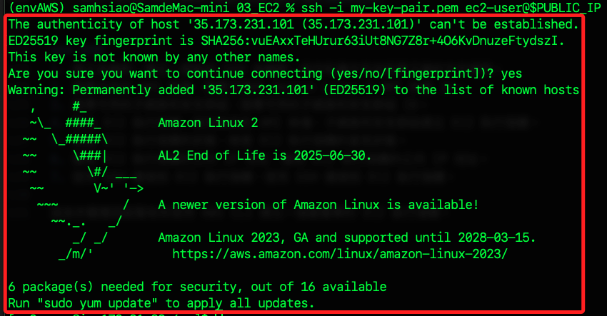
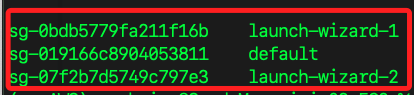

# 使用 AWS CLI 建立 EC2 執行個體

<br>

## 步驟

_以下所稱 `EC2` 除服務以外，指的是 `EC2 執行個體`，不再贅述_

<br>

1. 建立金鑰對，命名為 `my-key-pair`；這個文件會儲存在執行指令的路徑中。

    ```bash
    aws ec2 create-key-pair --key-name my-key-pair --query 'KeyMaterial' --output text > my-key-pair.pem
    ```

<br>

2. 變更金鑰文件權限；`400` 表示僅有擁有者可以 `讀`。

    ```bash
    chmod 400 my-key-pair.pem
    ```

<br>

3. 搜尋可用的 AMI 映像；AMI 就是 `Amazon Machine Image`，是指在 AWS 中查詢並選擇一個用於建立 EC2 的映像文件，其中包含啟動 EC2 所需的操作系統、應用程式和數據配置。

    ```bash
    aws ec2 describe-images --image-ids ami-0c9e929defa073d7d ami-04c0f9ef2f505b609 ami-0cf43e890af9e3351 ami-0f96c63e39f9144bc --query 'Images[*].[ImageId,Name,CreationDate]' --output table
    ```

    _輸出_

    

<br>

4. 搜尋可用的子網路；建立 EC2 時必須指定子網路，確保 EC2 部署在正確的網路環境中，具有適當的 IP 地址範圍和網路連通性。

    ```bash
    aws ec2 describe-subnets --query "Subnets[0].SubnetId" --output text
    ```

    _輸出_

    

<br>

5. 搜尋可用的安全群組；與子網路相同，用意是定義防火牆規則，確保只有授權的流量能夠進入或離開 EC2 執行個體，增強安全性。

    ```bash
    SG_ID=$(aws ec2 describe-security-groups --query "SecurityGroups[0].GroupId" --output text) && echo "Security Group ID: $SG_ID"
    ```

<br>

6. 對安全群組添加 SSH 流量的入站規則 `Inbound rules`。

    ```bash
    aws ec2 authorize-security-group-ingress --group-id $SG_ID --protocol tcp --port 22 --cidr 0.0.0.0/0
    ```

    _輸出_

    ```bash
    {
        "Return": true,
        "SecurityGroupRules": [
            {
                "SecurityGroupRuleId": "sgr-056433b90f3c26f02",
                "GroupId": "sg-019166c8904053811",
                "GroupOwnerId": "891377311393",
                "IsEgress": false,
                "IpProtocol": "tcp",
                "FromPort": 22,
                "ToPort": 22,
                "CidrIpv4": "0.0.0.0/0"
            }
        ]
    }
    ```

<br>

7. 建立 EC2 執行個體；參數 `--image-id` 使用查詢到的 AMI 映像 ID；參數 `--key-name` 指定要使用的金鑰對名稱；參數 `--subnet-id` 使用查詢到的子網路 ID；參數 `--security-group-ids` 使用查詢到的安全群組 ID；另外有幾個參數不用修改，參數 `--count 1` 指定要啟動的 EC2 執行個體數量是 `1`；參數 `--instance-type t2.micro` 指定建立 `t2.micro` 類型的 EC2；參數 `--query 'Instances[0].InstanceId'` 表示提取新建立的第一個 EC2 執行個體的 ID；參數 `--output text` 表示將輸出格式設置為純文本，去除多餘的格式信息，只保留需要的數據。

    ```bash
    INSTANCE_ID=$(aws ec2 run-instances \
        --image-id ami-0cf43e890af9e3351 \
        --count 1 \
        --instance-type t2.micro \
        --key-name my-key-pair \
        --subnet-id subnet-03182eb69356d6a55 \
        --security-group-ids sg-019166c8904053811 \
        --query 'Instances[0].InstanceId' \
        --output text)
    ```

<br>

8. 補充說明，上述指令運行後無輸出，這表明該命令成功建立了實例並將實例 ID 存儲在 INSTANCE_ID 變量中。要驗證實例是否成功建立並查看其 ID，可以透過 `echo` 指令輸出該變量。

    ```bash
    echo $INSTANCE_ID
    ```

    

<br>

8. 檢查 EC2 執行個體的狀態。

    ```bash
    aws ec2 describe-instances --instance-ids $INSTANCE_ID --query 'Reservations[0].Instances[0].State.Name' --output text
    ```

    _輸出_

    ```bash
    running
    ```

<br>

9. 查詢 EC2 執行個體的公共 IP 地址。

    ```bash
    PUBLIC_IP=$(aws ec2 describe-instances --instance-ids $INSTANCE_ID --query 'Reservations[0].Instances[0].PublicIpAddress' --output text) && echo $PUBLIC_IP
    ```

    輸出_

    ```bash
    35.173.231.101
    ```

<br>

10. 使用 SSH 連接到 EC2 執行個體。

    ```bash
    ssh -i my-key-pair.pem ec2-user@$PUBLIC_IP
    ```

    

<br>

## 刪除 EC2

1. 查詢並刪除 EC2 執行個體 ID。

    ```bash
    INSTANCE_ID=$(aws ec2 describe-instances --filters "Name=instance-state-name,Values=running" --query "Reservations[*].Instances[*].InstanceId" --output text) && aws ec2 terminate-instances --instance-ids $INSTANCE_ID
    ```

    _輸出_

    ```json
    {
        "TerminatingInstances": [
            {
                "CurrentState": {
                    "Code": 32,
                    "Name": "shutting-down"
                },
                "InstanceId": "i-0ea8b39ffd6413e36",
                "PreviousState": {
                    "Code": 16,
                    "Name": "running"
                }
            }
        ]
    }
    ```

<br>

2. 若需要更嚴謹地處理沒有找到的情況，可以添加判斷；這裡僅作示範，但這個操作實務上，這樣的情境並不存在。

    ```bash
    INSTANCE_ID=$(aws ec2 describe-instances --filters "Name=instance-state-name,Values=running" --query "Reservations[*].Instances[*].InstanceId" --output text)
    if [ -n "$INSTANCE_ID" ]; then
        aws ec2 terminate-instances --instance-ids $INSTANCE_ID
    else
        echo "No running instances found."
    fi
    ```

<br>

3. 查詢安全群組。

    ```bash
    aws ec2 describe-security-groups --query "SecurityGroups[*].[GroupId,GroupName]" --output text
    ```

    

<br>

4. 若需要刪除安全群組，可使用以下指令。

    ```bash
    SG_ID=<填入要刪除的群組 ID>
    aws ec2 delete-security-group --group-id $SG_ID
    ```

<br>

5. 查詢密鑰對。

    ```bash
    aws ec2 describe-key-pairs --query "KeyPairs[*].KeyName" --output text
    ```

<br>

6. 若有自定義的密鑰對也可進行刪除。

    ```bash
    KEY_NAME=<填入要刪除的密鑰對名稱>
    aws ec2 delete-key-pair --key-name $KEY_NAME
    ```

<br>

## 建立刪除 EC2 的自動化腳本

_雖然可以建立自動化腳本來復原環境，但這裡比較不建議這樣做，因為其中可能涉及使用了預設的相關實體如安全群組，錯誤刪除可能造成其他服務使用上的問題，以下腳本僅作示範。_

<br>

1. 建立自動化腳本，自訂名稱如 `auto_clean.sh`。

    ```bash
    touch auto_clean.sh
    ```

<br>

2. 編輯腳本。

    ```bash
    # 查詢並刪除 EC2 執行個體
    INSTANCE_ID=$(aws ec2 describe-instances --filters "Name=instance-state-name,Values=running" --query "Reservations[*].Instances[*].InstanceId" --output text)
    if [ -n "$INSTANCE_ID" ]; then
        echo "Terminating instance: $INSTANCE_ID"
        aws ec2 terminate-instances --instance-ids $INSTANCE_ID
    else
        echo "No running instances found."
    fi

    # 查詢並刪除安全群組
    SG_ID=$(aws ec2 describe-security-groups --query "SecurityGroups[?GroupName=='my-sg'].GroupId" --output text)
    if [ -n "$SG_ID" ]; then
        echo "Deleting security group: $SG_ID"
        aws ec2 delete-security-group --group-id $SG_ID
    else
        echo "No custom security groups found."
    fi

    # 查詢並刪除密鑰對
    KEY_NAME=$(aws ec2 describe-key-pairs --query "KeyPairs[?KeyName=='my-key-pair'].KeyName" --output text)
    if [ -n "$KEY_NAME" ]; then
        echo "Deleting key pair: $KEY_NAME"
        aws ec2 delete-key-pair --key-name $KEY_NAME
    else
        echo "No custom key pairs found."
    fi
    ```

<br>

3. 授權腳本。

    ```bash
    chmod +x auto_clean.sh
    ```

<br>

4. 運行腳本。

    ```bash
    ./auto_clean.sh
    ```

<br>

___

_END：以上完成 EC2 連線_