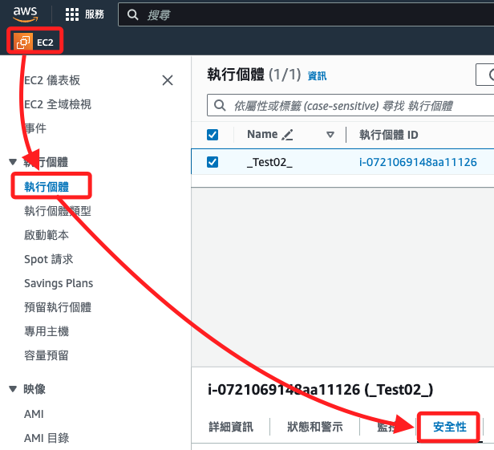
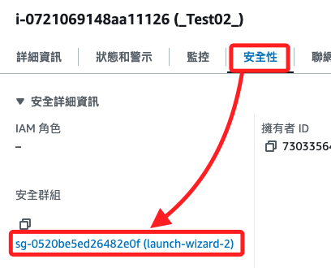
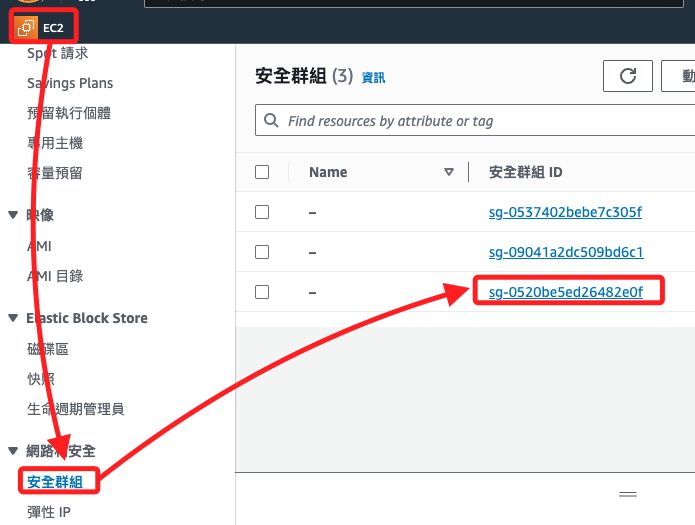
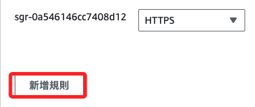
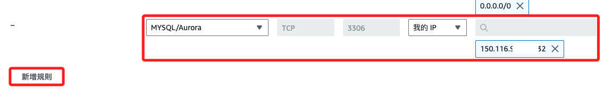
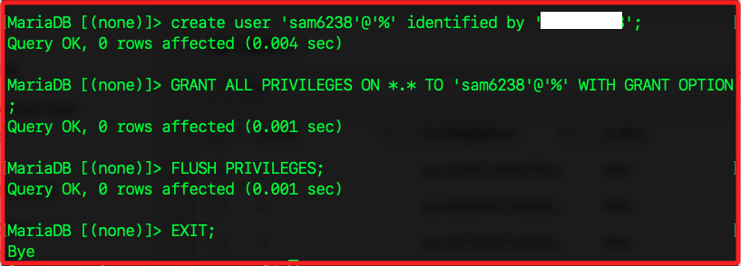
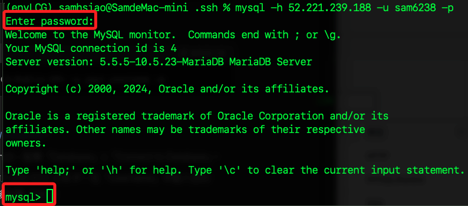
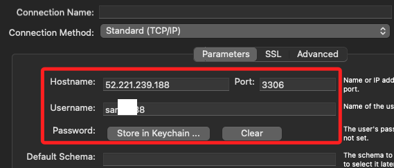

# MariaDB

_從本地連接到 EC2 上的 MariaDB_

<br>

## 配置 EC2 安全群組

1. 前往 EC2 控制台，選擇實體並查看 `安全性`。

    

<br>

2. 點擊進入安全群組。

    

<br>

3. 或是直接進入安全群組，選取對應的安全群組。

    

<br>

4. 點擊 `編輯傳入規則`。

    

<br>

5. 點擊左下角 `新增規則`。

    

<br>

6. 編輯內容如下：類型 `MySQL/Aurora`、協定 `TCP`、連接埠範圍 `3306`、來源 `我的 IP`，會自動帶入本地 IP。

    

<br>

7. 點擊右下角 `儲存規則`。

    

<br>

## 配置 MariaDB 允許遠程連接

_修改 MariaDB 配置以允許遠程連接_

<br>

1. SSH 連接到 EC2 實例後，編輯 MariaDB 配置文件。

    ```bash
    sudo nano /etc/my.cnf.d/mariadb-server.cnf
    ```

<br>

2. 找到 `bind-address` 配置並將其設置為 `0.0.0.0`，表示允許所有 IP 地址進行連接，預設是註解的，將註解取消即可。

    ```bash
    bind-address = 0.0.0.0
    ```

<br>

3. 存檔後重新啟動 MariaDB。

    ```bash
    sudo systemctl restart mariadb
    ```

<br>

## 建立遠端訪問權限

1. 為特定用戶設置遠程訪問權限，預設免密碼，所以看到輸入密碼提示時，直接按下 `ENTER` 即可。

    ```bash
    sudo mysql -u root -p
    ```

<br>

2. 執行指令建立用戶並授予權限。

    ```sql
    CREATE USER '自訂帳號'@'%' IDENTIFIED BY '自訂密碼';
    GRANT ALL PRIVILEGES ON *.* TO '自訂帳號'@'%' WITH GRANT OPTION;
    FLUSH PRIVILEGES;
    EXIT;
    ```

    

<br>

## 從本地連接到 MariaDB

_使用 MySQL 客戶端或圖形化工具 Workbench 進行連接_

1. 安裝 MySQL 客戶端。

    ```bash
    # 樹莓派
    sudo apt-get install mysql-client
    # MacOS
    brew install mysql-client
    ```

<br>

2. 連接到 MariaDB，會要求輸入密碼，然後就登入完成。

    ```bash
    mysql -h 52.221.239.188 -u sam6238 -p
    ```

    

<br>

## 使用 MySQL Workbench

1. 下載並安裝 [MySQL Workbench](https://dev.mysql.com/downloads/workbench/)。

<br>

2. 完成相關設置便可連線，這裡不贅述。

    

<br>

___

_END_