# Windows 虛擬機

_以下是在 Learner Lab 中運行的紀錄_

<br>

## 說明

1. 建立執行個體 `Launch instance`。

    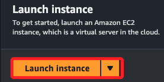

<br>

2. 自訂名稱如 `_MyWin_`，系統選擇 `Windows`，實例類型使用預設的 `t2.micro` 即可，這是個符合免費的方案 `Free tier eligible`。

    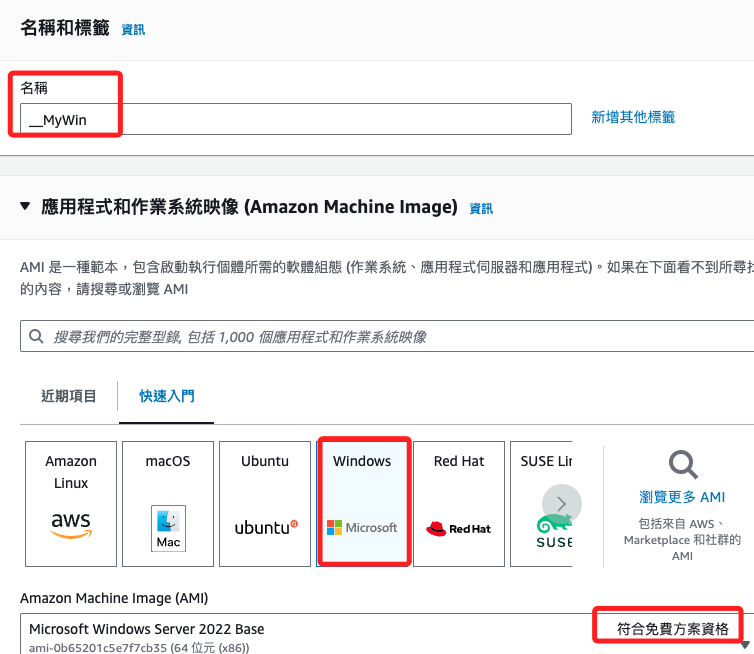

<br>

3. 基於測試，選擇前面步驟建立的金鑰即可；若無密鑰，可選擇 `Create key pair`，並任意命名如 `MyKey01`，建立後會自動下載 `.pem` 文件。

    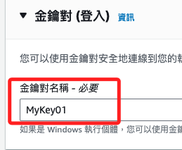

<br>

4. 勾選連線來源。

    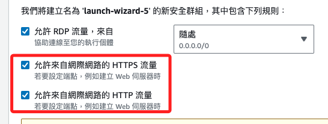

<br>

5. 特別要注意 `免費方案` 規則。

    ```bash
    免費方案： 第一年包含每月免費方案 AMI 的 750 小時 t2.micro (或者，在 t2.micro 不可用的區域中則為 t3.micro) 執行個體用量、每月 750 小時公共 IPv4 位址用量、30 GiB EBS 儲存、200 萬個輸入和輸出、1 GB 快照，以及 100 GB 網際網路頻寬。
    ```

<br>

6. 啟動。

    

<br>

7. 建立之後都要等候初始化完成。

    

<br>

## 取得密碼

1. 進入執行個體後，點擊 `動作`，選擇 `安全性`，點擊 `取得 Windows 密碼`。

    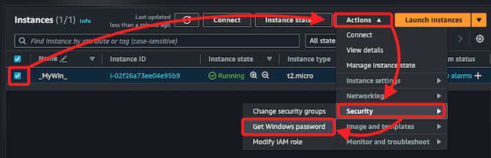

<br>

1. 點擊 `上傳私有金鑰檔案`，會看到載入 `.pem` 文件內容，然後點擊 `解密密碼`。

    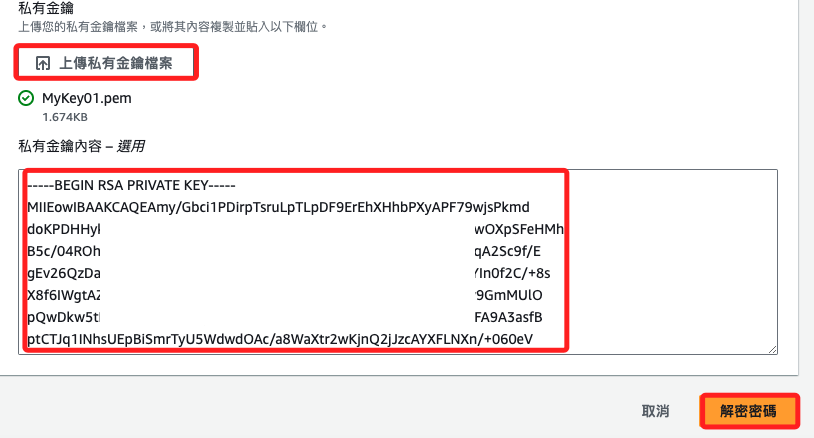

<br>

3. 複製解密的密碼，然後點擊 `好`。

    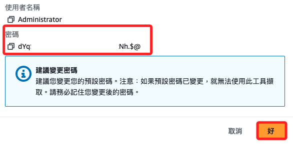

<br>

## 連線

1. 在執行個體中點擊 `連線`。

    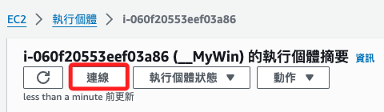

<br>

2. 連線類型按照預設選取 `使用 RDP 用戶端連線`，然後點擊 `下載遠端桌面檔`。

    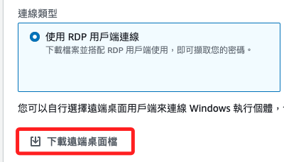

<br>

3. 會下載一個 `.rdp` 文件，在 Windows 中可以使用遠端桌面開啟。

    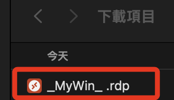

<br>

4. 在彈出視窗中點擊 `連線`。

    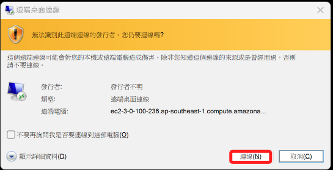

<br>

5. 輸入解密所取得的密碼，點擊 `確定`。

    

<br>

6. 可點擊 `不要再詢問`，然後點擊 `是`。

    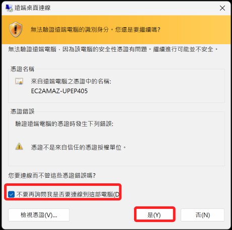

<br>

7. 接著便會進入這台電腦中，右上方會有浮水印顯示設備的資訊。

    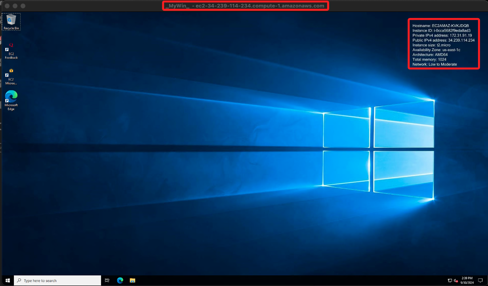

<br>

## MAC 使用 Remote Desktop

1. 使用遠端桌面軟體，其餘相同。

    

<br>

___

_END_