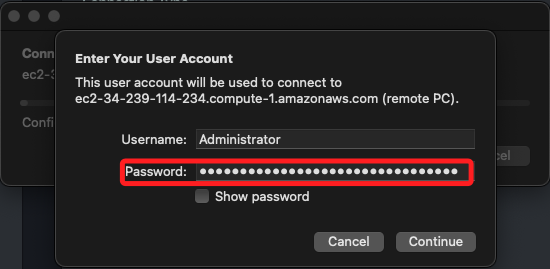

# Windows 虛擬機

_以下是在 Learner Lab 中運行的紀錄_

<br>

## 說明

1. 建立執行個體 `Launch instance`。

    

<br>

2. 自訂名稱如 `_MyWin_`，系統選擇 `Windows`，實例類型使用預設的 `t2.micro` 即可，這是個符合免費的方案 `Free tier eligible`。

    

<br>

3. 基於測試，選擇前面步驟建立的金鑰即可；若無密鑰，可選擇 `Create key pair`，並任意命名如 `MyKey01`，建立後會自動下載 `.pem` 文件；`RSA` 或 `ED25519` 僅是編碼方式不同，選哪一個皆可。

    

<br>

4. 勾選允許的連線來源，這是入站規則 `Inbound Rule`。

    

<br>

5. 特別注意，假如有描述 `免費方案` 的相關説明，要略作閱讀。

    ```bash
    免費方案： 第一年包含每月免費方案 AMI 的 750 小時 t2.micro (或者，在 t2.micro 不可用的區域中則為 t3.micro) 執行個體用量、每月 750 小時公共 IPv4 位址用量、30 GiB EBS 儲存、200 萬個輸入和輸出、1 GB 快照，以及 100 GB 網際網路頻寬。
    ```

<br>

6. 啟動。

    

<br>

7. 完成建立，等候初始化完成會顯示狀態為 `Running`。

    

<br>

## 取得密碼

1. 進入清單，選取 EC2 實例後，點擊下拉選單中的 `動作（Actions）`，選擇 `安全性`，點擊 `取得 Windows 密碼`。

    

<br>

2. 點擊 `上傳私有金鑰檔案`，會看到載入 `.pem` 文件內容，然後點擊 `解密密碼`；當上傳這個私鑰文件並點擊 `Decrypt password`，系統將使用這個私鑰來解密並顯示該 `Windows Instance` 的管理員密碼。

    

<br>

3. 複製解密的密碼，然後點擊 `好（OK）`。

    

<br>

## 連線

_先使用 AWS 預設的終端機測試連線_

<br>

1. 在執行個體中點擊 `連線`。

    

<br>

2. 切換到 `RDP client` 頁籤。

    

<br>

3. 連線類型按照預設選取 `Connect using RDP client`，然後點擊 `Download remote desktop file`。

    

<br>

4. 會下載一個 `.rdp` 文件；點擊後可使用遠端桌面連線實例。

    

<br>

5. 在彈出視窗中點擊 `連線`。

    

<br>

5. 輸入解密所取得的密碼，點擊 `確定`。

    

<br>

6. 可點擊 `不要再詢問`，然後點擊 `是`。

    

<br>

7. 接著便會進入這台電腦中，右上方會有浮水印顯示設備的資訊。

    

<br>

## MAC 使用 Remote Desktop

1. 使用遠端桌面軟體，其餘相同。

    

<br>

___

_END_