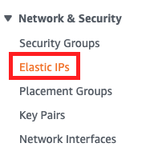
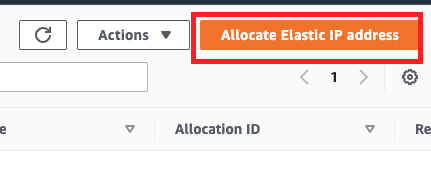
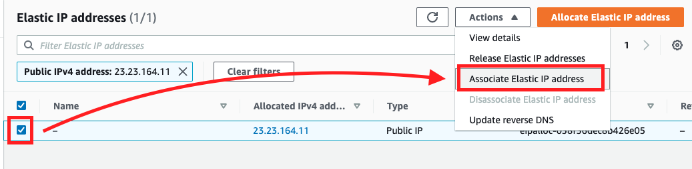
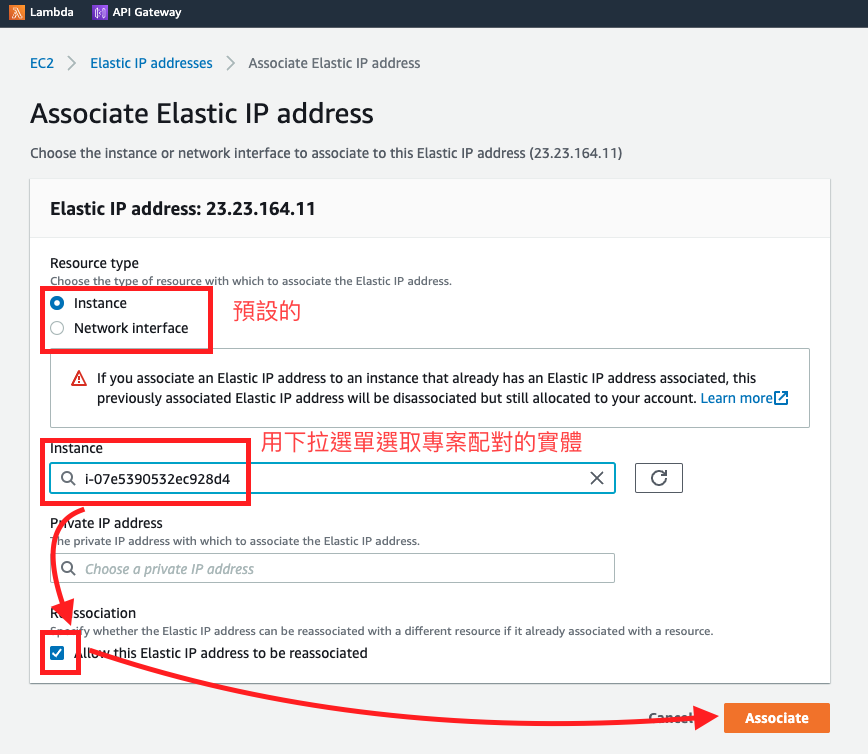

# AWS Elastic IP

_就是靜態的 IPv4 地址_

 

## 簡介

1. 靜態 IP 地址：與一般的公有 IP 地址不同，Elastic IP 地址是靜態的，不會變更，即使停止並啟動 EC2 實例。

 

2. 重綁定：可以將 Elastic IP 地址從一個 EC2 實例重新分配到另一個實例，從而保持您的應用程序的 IP 地址不變。

 

3. 故障轉移：如果實例發生故障，可以快速將 Elastic IP 地址重新綁定到另一個正在運行的實例，實現故障轉移和快速恢復。

 

4. 收費模型：當 Elastic IP 地址未與任何運行中的實例關聯時，會產生小額費用。當它關聯到運行中的實例時，則無需額外付費。

 

5. 用法場景：適用於需要靜態 IP 地址的場景，例如網站託管、應用程序伺服器、需要固定 IP 的外部訪問服務等。

 

## 建立服務

1. 左側功能選單中，在 `網路和安全` 選項下的 `彈性 IP Elastic IP`。

    

 

2. 點擊右上角的 `配置彈性 IP 地址`。

    

 

3. 這部分不用變動，直接 `配置 Allocate`。

    

 

4. 勾選建立的 Elastic IP，然後展開右上角的 `動作` 下拉選單，選取 `與彈性 IP 地址建立關聯`。

    

 

5. 資源類型使用預設勾選好的 `執行個體`，點擊 `執行個體` 對話框會展開並選取要關聯的個體，接著勾選左下角的 `允許為此彈性 IP 地址重新建立關聯`，然後點擊右下角的 `建立關聯`。

    

 

___

_END_