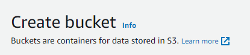
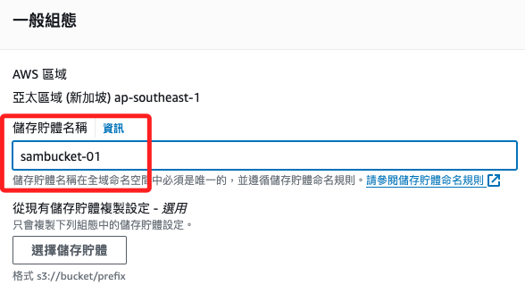
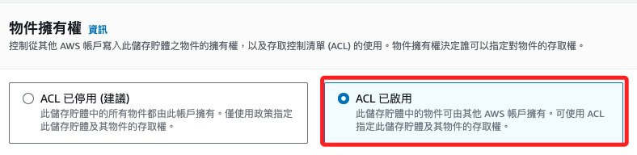
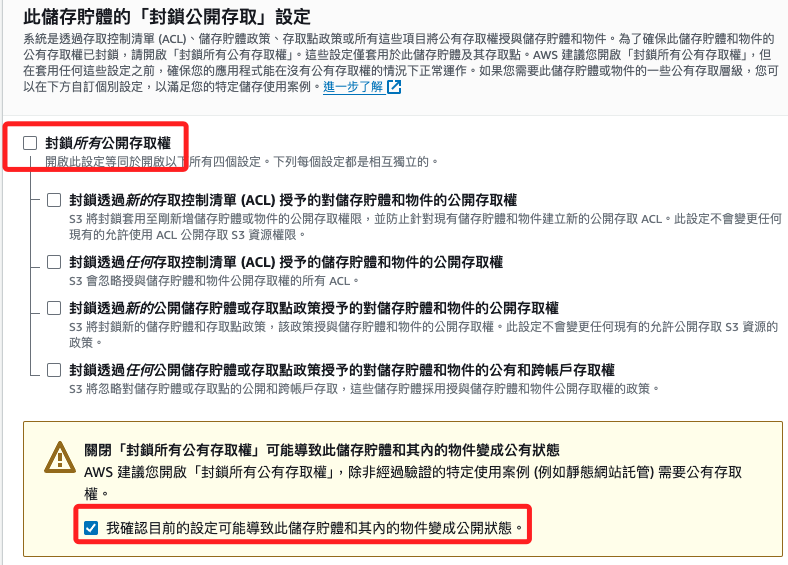
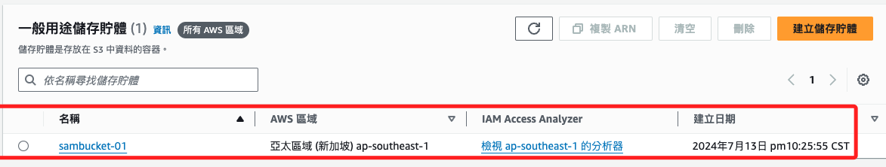

# Bucket

 

## 步驟

1. 點擊 `建立儲存體`。

    

 

2. 使用預設名稱 `sambucket-01`；這個命名在全域命名空間中必須是唯一的。

    

 

3. 將 ACL 啟用。

    

 

4. 取消勾選 `封鎖所有公開存取權`，並勾選 `我確認`。

    

 

5. 其他預設，完成後點擊右下方的 `建立儲存體`

    

 

6. 完成顯示如下。

    

 

___

_END_