# Bucket

 

## 建立

1. 點擊 `建立儲存體`。

    

 

2. 使用預設名稱 `sambucket-01`；這個命名在全域命名空間中必須是唯一的。

    

 

3. 將 ACL 啟用。

    

 

4. 取消勾選 `封鎖所有公開存取權`，並勾選 `我確認`。

    

 

5. 其他預設，完成後點擊右下方的 `建立儲存體`

    

 

6. 完成顯示如下。

    

 

## 上傳

1. 從名稱點擊進入。

    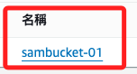

 

2. 點擊右上角的 `上傳 Upload`。

    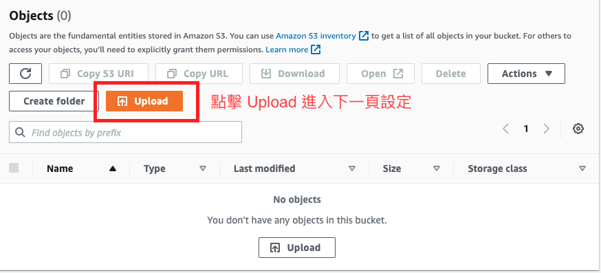

 

3. 點擊 `新增檔案`，從本地找任一檔案示範即可。

    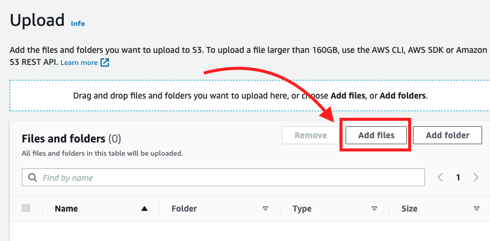

 

4. 這個檔案的目的地就是 s3。 

    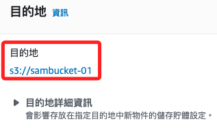

 

5. 點擊右下角的 `上傳`。

    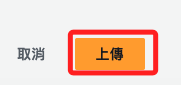

 

6. 回到列表便可看到該上傳的檔案。

    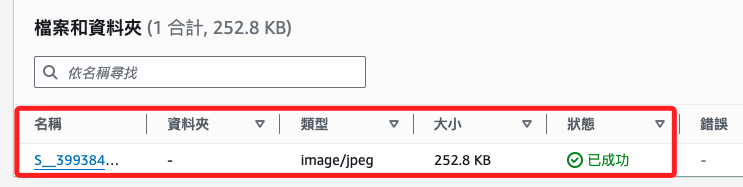

 

7. 從名稱點擊進入，可看到文件的URL。

    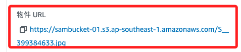

 

8. 在瀏覽器訪問會顯示存取被拒絕。

    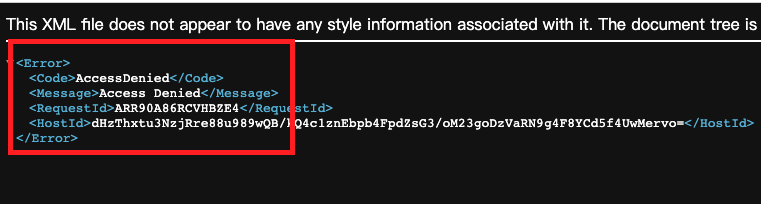

 

## 編輯權限

1. 切換到 `許可` 頁籤，點擊 `編輯`。

    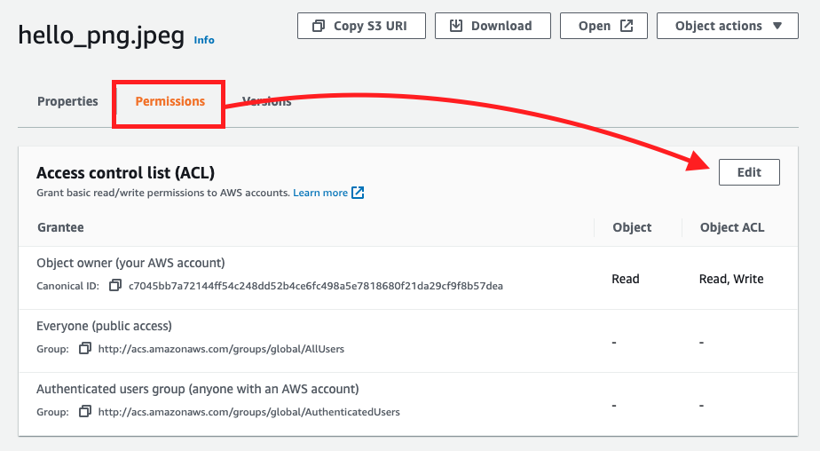

 

2. 將 `每個人` 的 `讀取` 勾選。

    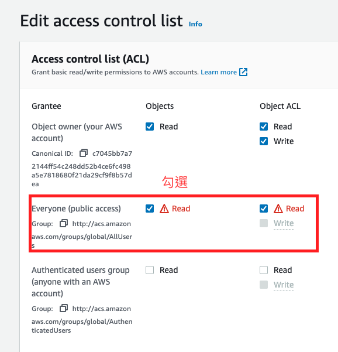

 

3. 勾選 `我了解`。

    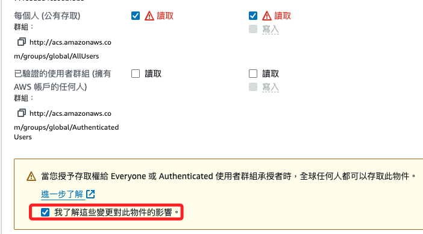

 

4. 點擊右下角的 `儲存變更`。

    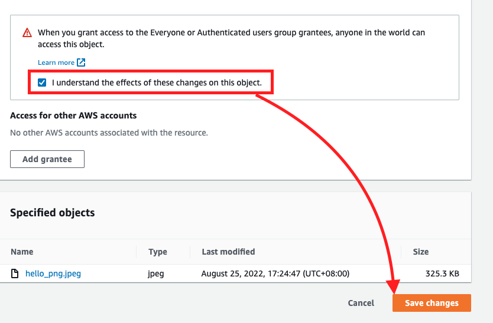

 

5. 再進行一次訪問。

    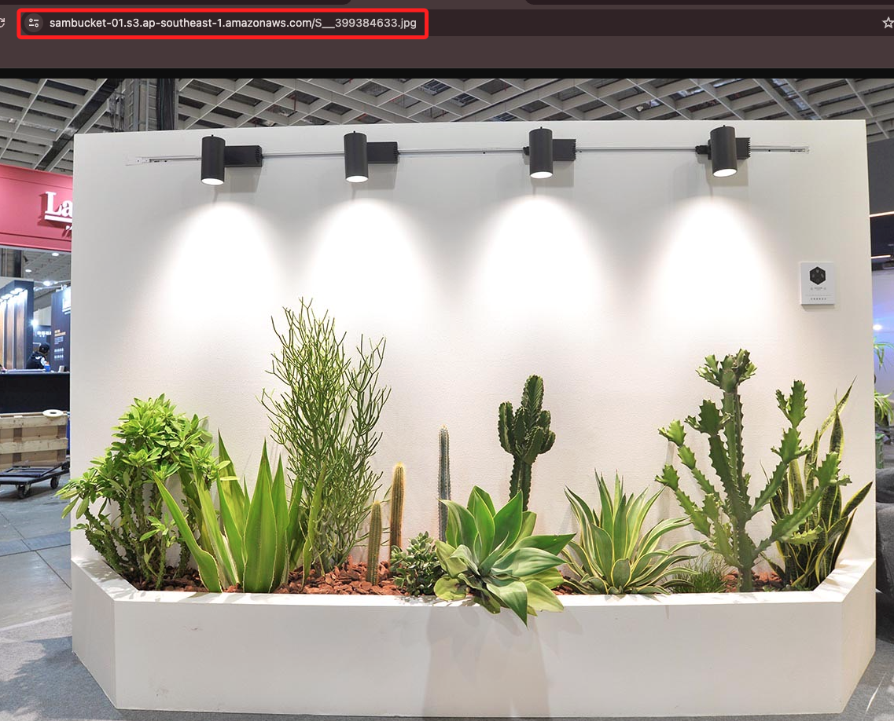

 

___

_END_