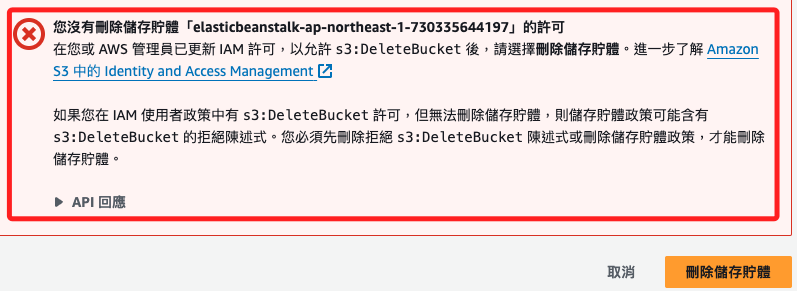
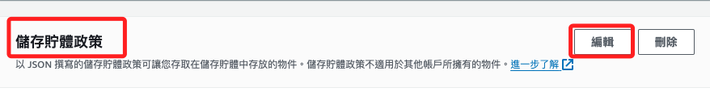
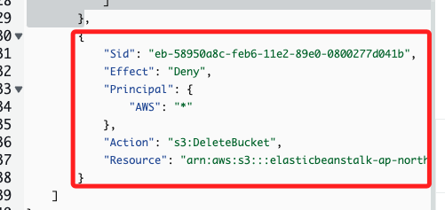
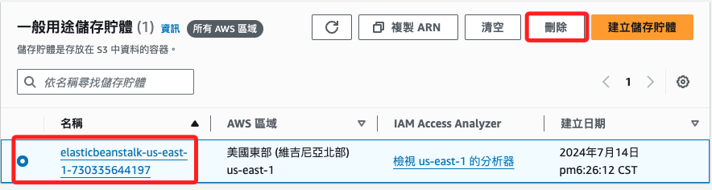

# 錯誤排除

 

## 權限

1. 刪除時出現。

    

 

2. 切換到 Buckets 的 `許可` 頁籤，編輯 `儲存貯體政策`。

    

 

3. 把 `Deny` 區塊全部刪除，點擊右下角 `儲存變更`。

    

 

4. 延續前一點，既然已經是要山除這個 Buckets，索性將全部內容刪除也無妨，這樣就肯定不會有其他 `錯誤`。

 

5. 選取 Buckets，然後點擊 `刪除`，依照畫面指示即可。

    

 

___

_END_