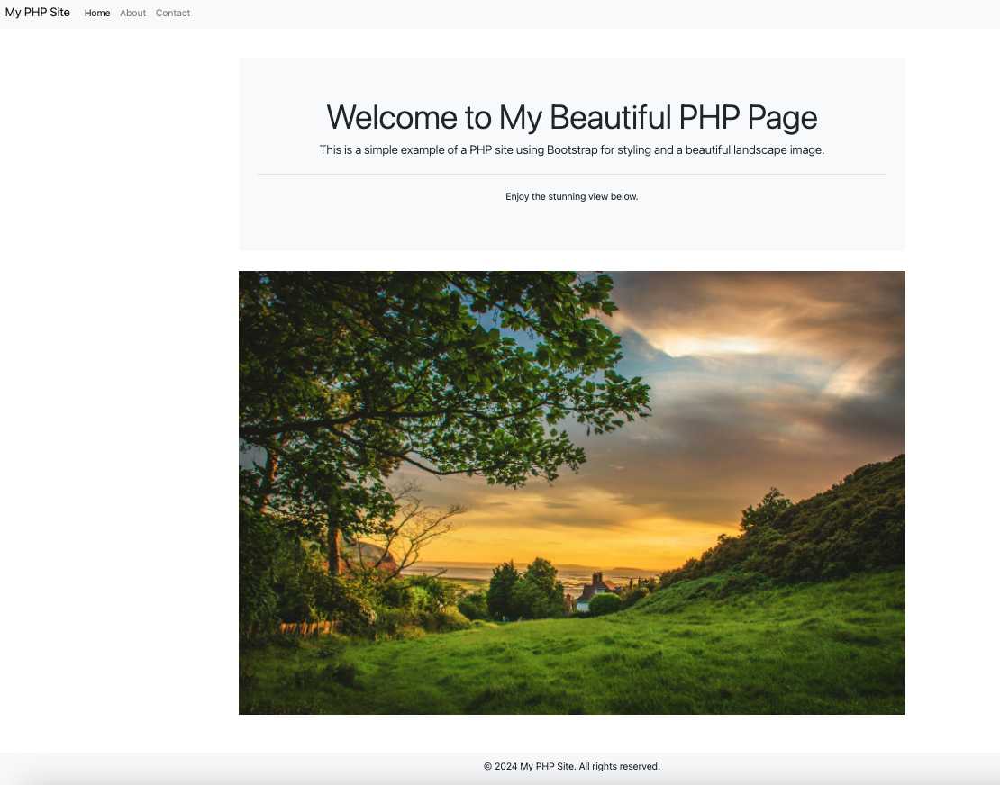

# 建立簡易 PHP Web

<br>

## 準備工作

1. 確認 PHP 是否安裝。

    ```bash
    php -v
    ```

<br>

2. 若沒安裝，使用 Homebrew 進行安裝。

    ```bash
    brew install php
    ```

<br>

## 建立專案

1. 建立專案資料夾。

    ```bash
    cd ~/Desktop && mkdir _MyPHP_Web_ && cd _MyPHP_Web_
    ```

<br>

2. 建立 PHP 腳本。

    ```bash
    touch index.php
    ```

<br>

3. 複製一張風景相片 `landscape.jpg` 到專案根目錄內。

    

<br>

4. 編輯專案腳本。

    ```php
    <!DOCTYPE html>
    <html lang="en">

    <head>
        <meta charset="UTF-8">
        <meta name="viewport" content="width=device-width, initial-scale=1.0">
        <title>Beautiful PHP Page</title>
        <link rel="stylesheet" href="https://stackpath.bootstrapcdn.com/bootstrap/4.3.1/css/bootstrap.min.css">
        <style>
            body {
                margin: 0;
                padding: 0;
                box-sizing: border-box;
            }

            .navbar {
                margin-bottom: 20px;
            }

            .jumbotron {
                text-align: center;
                background-color: #f8f9fa;
            }

            .img-fluid {
                max-width: 100%;
                height: auto;
            }

            .footer {
                text-align: center;
                padding: 10px 0;
                background-color: #f8f9fa;
                position: fixed;
                width: 100%;
                bottom: 0;
            }
        </style>
    </head>

    <body>

        <nav class="navbar navbar-expand-lg navbar-light bg-light">
            <a class="navbar-brand" href="#">My PHP Site</a>
            <button class="navbar-toggler" type="button" data-toggle="collapse" data-target="#navbarNav" aria-controls="navbarNav" aria-expanded="false" aria-label="Toggle navigation">
                <span class="navbar-toggler-icon"></span>
            </button>
            <div class="collapse navbar-collapse" id="navbarNav">
                <ul class="navbar-nav">
                    <li class="nav-item active">
                        <a class="nav-link" href="#">Home <span class="sr-only">(current)</span></a>
                    </li>
                    <li class="nav-item">
                        <a class="nav-link" href="#">About</a>
                    </li>
                    <li class="nav-item">
                        <a class="nav-link" href="#">Contact</a>
                    </li>
                </ul>
            </div>
        </nav>

        <div class="container mt-5">
            <div class="jumbotron">
                <h1 class="display-4">Welcome to My Beautiful PHP Page</h1>
                <p class="lead">This is a simple example of a PHP site using Bootstrap for styling and a beautiful landscape image.</p>
                <hr class="my-4">
                <p>Enjoy the stunning view below.</p>
            </div>
            <div class="text-center">
                
            </div>
        </div>

        <div class="footer">
            <p>&copy; 2024 My PHP Site. All rights reserved.</p>
        </div>

        <script src="https://code.jquery.com/jquery-3.3.1.slim.min.js"></script>
        <script src="https://cdnjs.cloudflare.com/ajax/libs/popper.js/1.14.7/umd/popper.min.js"></script>
        <script src="https://stackpath.bootstrapcdn.com/bootstrap/4.3.1/js/bootstrap.min.js"></script>
    </body>

    </html>
    ```

<br>

5. 在專案根目錄開啟終端機，並啟動站台。

    ```bash
    php -S localhost:8000
    ```

<br>

6. 打開瀏覽器進行訪問。

    ```bash
    http://localhost:8000
    ```

<br>

7. 網站樣貌。

    

<br>

___

_END_