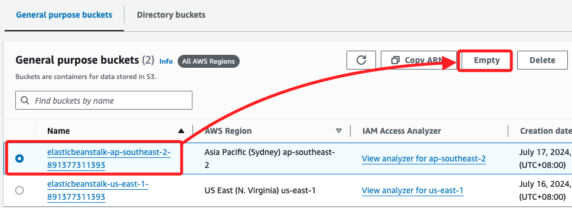
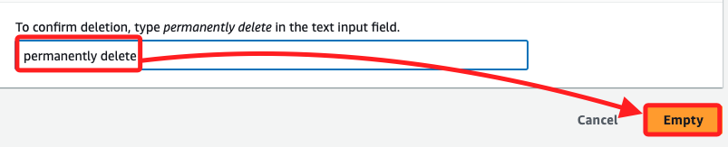
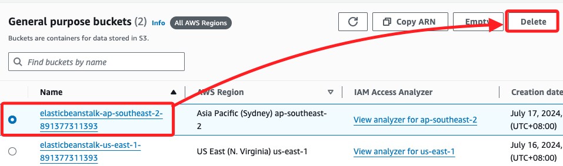
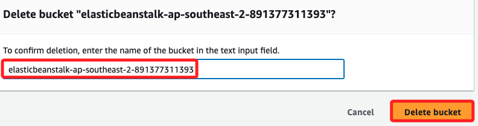

# 刪除 Bucket

 

## 步驟

1. 刪除之前須先清空 Bucket。

    

 

2. 輸入永久刪除 `permanently delete`，然後點擊 `Empty`。

    

 

3. 這時便可以進行 `Delete`。

    

 

4. 依據指引輸入 Bucket 的名稱，然後點擊 `Delete bucket`。

    

 

5. 若是對非空的 Bucket 進行刪除，會提示進行 `Empty bucket`。

    

 

6. 也可進入儲存對象內查看內容，以選取方式進行刪除。

    

 

___

_END_