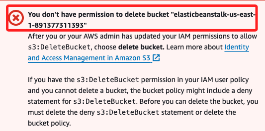
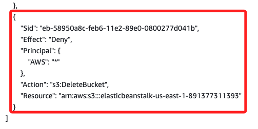

# 無法刪除

<br>

## 說明

1. 嘗試刪除 S3 Bucket 時，收到錯誤訊息  _You don't have permission to delete bucket_，這表示目前的 IAM 許可權限不足。

    

<br>

2. 可能是 IAM 使用者或角色缺少 `s3:DeleteBucket` 許可權。這表示在您的 IAM 使用者政策中沒有授予刪除 Bucket 的權限，解決方法是添加 `s3:DeleteBucket` 許可權。

<br>

3. 如果 Bucket 的策略包含拒絕 `s3:DeleteBucket` 的聲明，那即便擁有權限仍無法刪除該 Bucket，解決方法是修改或刪除 Bucket 策略中的拒絕聲明。這可以通過 AWS 管理控制台或 AWS CLI 完成。

<br>

## 檢查並更新 IAM 使用者策略

_這裡是使用 root 權限，所以不存在使用者權限問題，僅作一般性說明_

<br>

1. 登入 `IAM` 服務，在左側選單中選擇 `Users` 或 `Roles`，添加或更新策略，確保包含以下內容。

    ```json
    {
        "Effect": "Allow",
        "Action": "s3:DeleteBucket",
        "Resource": "arn:aws:s3:::your-bucket-name"
    }
    ```

<br>

## 檢查並更新 S3 Bucket 策略

1. 登入 `S3` 服務，對於要刪除的 Bucket，進入 `Permissions` 標籤頁。

    

<br>

2. 向下滑動到 `Bucket Policy` 部分，查看是否有 `Deny` 的 `s3:DeleteBucket` 聲明，如果存在，刪除或修改該策略；如下截圖，這個策略段落明確地拒絕任何 AWS Principal 對該 Bucket 執行 `s3:DeleteBucket` 操作。

    

<br>

3. 點擊 `Bucket policy` 右側的 `Edit`，將整段策略聲明刪除即可。

    

<br>

4. 編輯完成後，點擊右下角的 `Save changes` 即可。

    

<br>

## 使用 AWS CLI 刪除 S3 Bucket

1. 安裝 AWS CLI，可參考 [官方安裝指南](https://docs.aws.amazon.com/cli/latest/userguide/getting-started-install.html)。

<br>

2. 查詢當前配置。

    ```bash
    aws configure list
    ```

    

<br>

3. 重新配置。

    ```bash
    aws configure
    ```

    

<br>

4. 刪除 Bucket 中的所有物件。

    ```bash
    aws s3 rm s3://<輸入 Bucket 名稱> --recursive
    ```

<br>

5. 刪除指定 Bucket。

    ```bash
    aws s3api delete-bucket --bucket <輸入 Bucket 名稱> --region <輸入區域>
    ```

<br>

___

_END_