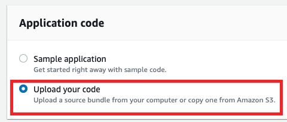
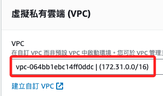
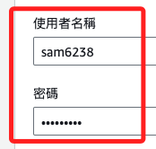

# Elastic Beanstalk

<br>

## 概述

1. AWS Elastic Beanstalk 是一個簡化部署和管理應用程序的服務，開發者只需上傳代碼，Elastic Beanstalk 會自動處理容量佈建、負載均衡、縮放以及應用程序的健康狀態監控。

<br>

2. 支援多種編程語言和應用程序平台，如 Java、.NET、Node.js、Python、Ruby、PHP、Go 和 Docker。

<br>

## 應用

1. 部署和測試 Web 應用程序。

<br>

2. 部署基於微服務架構的應用程序。

<br>

## 收費

_Elastic Beanstalk 本身不收取額外費用，但您需要支付所使用的 AWS 資源費用_


<br>

1. EC2：計算資源的使用費。

<br>

2. S3：存儲資源的使用費。

<br>

3. Elastic Load Balancing：負載均衡器的使用費。

<br>

4. RDS：數據庫資源的使用費。

## 實作

1. 先編輯一個腳本待用。

    ```bash
    cd ~/Downloads && touch index.php && code index.php
    ```

<br>

2. 編輯內容如下。

    ```html
    <html>
        <head>
            <title>PHP Test</title>
        </head>
        <body>
            <?php echo '<p>PHP 測試腳本</p>'; ?>
        </body>
    </html>
    ```

<br>

3. 壓縮檔案並顯示檢查。

    ```bash
    zip index.zip index.php && ls -l index.zip
    ```

    

<br>

4. 點擊右上角的 `建立應用程式`。

    

<br>

5. 自訂名稱 `_PHP_Demo_`。

    

<br>

6. `平台` 選擇 `PHP`，其餘使用自動選取的即可。

    

<br>

7. 上傳程式碼。

    

<br>

8. 選擇從 `本機檔案` 上傳。

    

<br>

9. 選取前面步驟壓縮的 `.zip` 檔案。

    

<br>

10. 自訂版本標籤 `v01`。

    

<br>

11. 使用 `預設組態 Presets`。

    

<br>

12. 下一步。

    

<br>

13. 在 `服務存取`設定，選擇 `建立和使用新的服務角色`，選擇 EC2 金鑰組，然後 `下一步`。

    

<br>

14. 虛擬私有雲端 VPC 有一個選項可選。

    

<br>

15. 在 `執行個體設定`中，啟用公用 IP，並選擇子網路 `ap-southeast-1a`。

    

<br>

16. 資料庫選 1b、1c。

    

<br>

17. 既然選了資料庫，應該就得啟用。

    

<br>

18. 設定使用者名稱、密碼。

    

<br>

19. 點擊三次 `下一步`。

    

<br>

20. 點擊 `提交`。

    

<br>

21. 接著顯示啟動環境，要等幾分鐘。

    

<br>

## 完成後