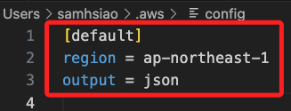
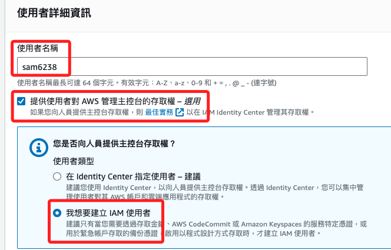
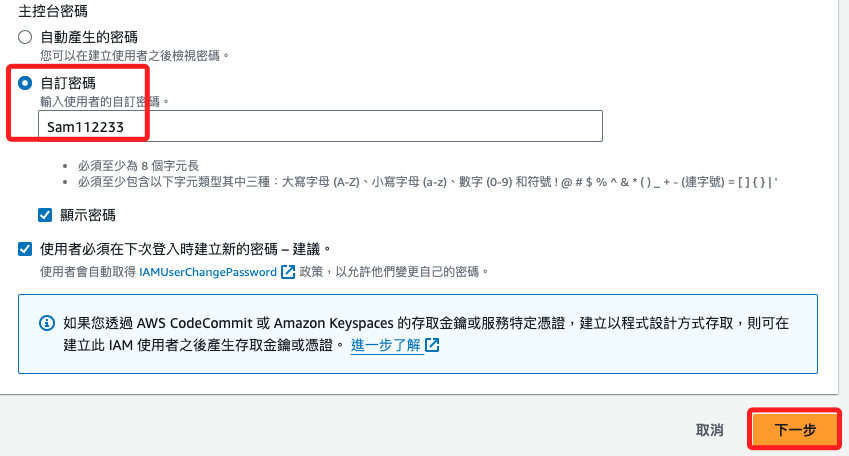
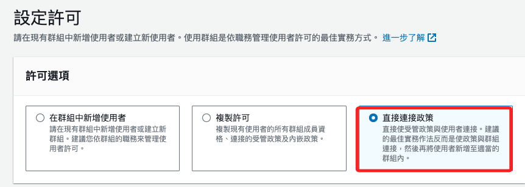
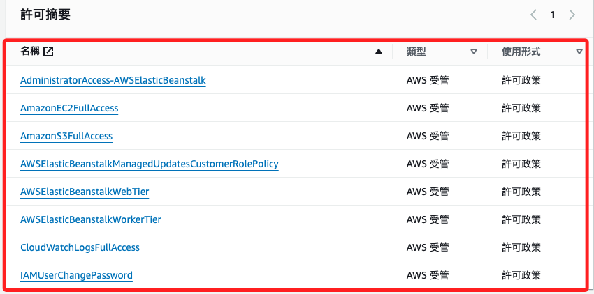
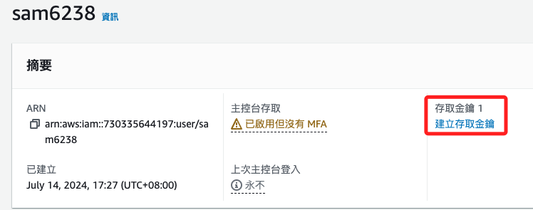
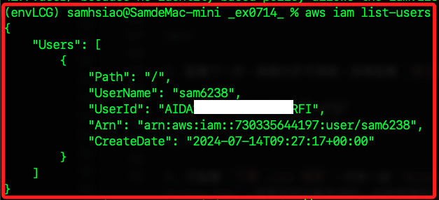
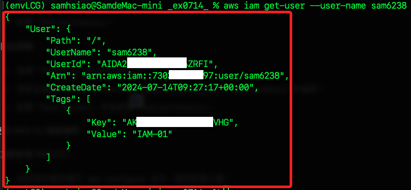
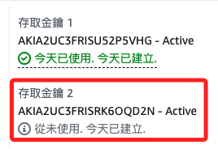

# AWS CLI

<br>

## 權限與配置文件

1. 查看密鑰文件，可使用 `ls`、`cat`檢查，或使用 VSCode 直接編輯。

    ```bash
    ls ~/.aws/credentials
    ```

    

<br>

2. 查看配置。

    ```bash
    cat ~/.aws/config
    ```

    

<br>

3. 使用 AWS CLI 命令來顯示當前配置。

    ```bash
    aws configure list
    ```

    

<br>

## 建立使用者

1. 建立使用者。

    

<br>

2. 使用者名稱、勾選提供存取權、更換為建立 IAM 使用者。

    

<br>

3. 自訂密碼，點擊下一步。

    

<br>

## 設定取可

1. 切換到 `直接連接政策`。

    

<br>

2. 添加可能需要的政策 `AmazonS3FullAccess`、`AmazonEC2FullAccess`、`CloudWatchLogsFullAccess`、`AdministratorAccess-AWSElasticBeanstalk`、`AWSElasticBeanstalkManagedUpdatesCustomerRolePolicy`、`AWSElasticBeanstalkWebTier`、`AWSElasticBeanstalkWorkerTier`；其餘視狀況添加，例如要查詢權限 `IAMReadOnlyAccess`、授予全面的 IAM 管理權限 `IAMFullAccess`。

<br>

3. 點擊下一步，會顯示許可摘要，接著點擊 `建立使用者`。

    

<br>

4. 可點擊 `下載 .csv 檔案`，內有一組 `Access key ID` 跟 `Secret access key`，這是系統自動生成的，允許該使用者通過 AWS CLI、API 或 SDK 訪問 AWS 資源；特別注意，這組密鑰之後將無法從面板中再次查看。

    

<br>

5. 也可以在使用者的面板中，點擊 `建立存取金鑰` 來重新建立。

    

<br>

6. 選擇 `CLI`，勾選 `同意` 之後點擊 `下一步`。

    

<br>

## 其他指令

1. 重新配置。

    ```bash
    rm -rf ~/.aws/credentials ~/.aws/config
    aws configure
    ```

<br>

2. 查詢所有 IAM 使用者。

    ```bash
    aws iam list-users
    ```

    

<br>

3. 查詢特定使用者的信息。

    ```bash
    aws iam get-user --user-name <指定使用者名稱>
    ```

    

<br>

4. 列出指定使用者的所有存取金鑰的 ID 及其狀態。

    ```bash
    aws iam list-access-keys --user-name <指定使用者名稱>
    ```

<br>

5. 創建新的存取金鑰，要特別記錄好，這只會出現一次，也無法下載 `.csv`。

    ```bash
    aws iam create-access-key --user-name <指定使用者名稱>
    ```

    

<br>

6. 刪除存取金鑰；無效或忘記密鑰的金鑰可進行刪除。

    ```bash
    aws iam delete-access-key --user-name <指定使用者名稱> --access-key-id <access-key-id>
    ```

<br>

7. 停用存取金鑰。

    ```bash
    aws iam update-access-key --user-name <指定使用者名稱> --access-key-id <access-key-id> --status Inactive
    ```

    

<br>

8. 重新啟用存取金鑰。

    ```bash
    aws iam update-access-key --user-name <指定使用者名稱> --access-key-id <access-key-id> --status Active
    ```

<br>

9. 附加管理政策到使用者。

    ```bash
    aws iam attach-user-policy --user-name <指定使用者名稱> --policy-arn arn:aws:iam::aws:policy/<政策名稱>
    ```

    _如附加 `AdministratorAccess` 政策_

    ```bash
    aws iam attach-user-policy --user-name <指定使用者名稱> --policy-arn arn:aws:iam::aws:policy/AdministratorAccess
    ```

<br>

10. 移除管理政策。

    ```bash
    aws iam detach-user-policy --user-name <指定使用者名稱> --policy-arn arn:aws:iam::aws:policy/<政策名稱>
    ```

<br>

11. 列出使用者附加的所有政策。

    ```bash
    aws iam list-attached-user-policies --user-name <指定使用者名稱>
    ```

<br>

___

_END_